# 一、位运算符

- 左移：<<
  
  - a << b，等价于 a * 2的b次方
  - 底层原理：a的补码整体往左移动，左边截断b位，右边补b个0
  - 可能出现符号位改变，0变1,1变0

- 右移：>>
  
  - a >> b，等价于 a / 2的b次方，呈现向下取整的效果
  - 底层原理：a的补码整体往右移动，右边截断b位，左边补b个0或1，原来最高位是0继续0，原来最高位是1继续补1
  - 不会出现改变符号位

- 无符号右移：>>>
  
  - 正数的>>> 和 >> 相同
  - 负数>>>的底层原理：a的补码整体往右移动，右边截断b位，左边补b个0,
  - 无论是正数还是负数，无符号右移完之后都是正数

- 按位与：&
  
  - a & b 底层原理：将a和b的补码对齐，逐位计算，1 & 1 为 1，其余为0

- 按位或：|
  
  - a | b 底层原理：将a和b的补码对齐，逐位计算，0 | 0 为 0，其余为1

- 按位异或：^
  
  - a ^ b 底层原理：将a和b的补码对齐，逐位计算，相同为0，不同为1

- 按位取反：~
  
  - ~a 底层原理：将a的补码所有位，包括符号位，全部取反，0变1,1变0
  - 注意，这里的区分规则 与 原码和反码转换不同，因为原码和反码的取反是不动符号位

### 1.2 跳转语句

|      | break                      | continue       | return   |
| ---- | -------------------------- | -------------- | -------- |
| 使用位置 | switch-case，循环结构           | 循环结构           | 方法体中任意位置 |
| 作用   | 用于结束/跳出当前的switch-case或循环结构 | 用于跳过本次循环体剩下的语句 | 用于结束当前方法 |

#### 案例1

```java
public class TestBreakContinueReturn {
    public static void main(String[] args) {
        for (int i = 1; i <= 5; i++) {
            System.out.println("i=" + i + ",(1)");
            if (i == 3) {
                continue;//跳过i==3这次的(2)语句
            }
            System.out.println("i=" + i + ",(2)");
        }
        System.out.println("(3)");
    }
}

```

#### 案例2

```java
public class TestBreakContinueReturn2 {
    public static void main(String[] args) {
        for (int i = 1; i <= 5; i++) {
            System.out.println("i=" + i + ",(1)");
            if (i == 3) {
                break;//当i==3时直接结束for循环
            }
            System.out.println("i=" + i + ",(2)");
        }
        System.out.println("(3)");
    }
}

```

#### 案例3

```java
public class TestBreakContinueReturn3 {
    public static void main(String[] args) {
        for (int i = 1; i <= 5; i++) {
            System.out.println("i=" + i + ",(1)");
            if (i == 3) {
               return;
            }
            System.out.println("i=" + i + ",(2)");
        }
        System.out.println("(3)");
    }
}

```

# 二、数组（`非常重要`）

## 2.1 基本概念（会区分）

数组的标志性符号：[]

数组(array)是用来管理一组相同数据类型的变量/数据的容器/结构。这组相同数据类型的变量，使用一个统一的名称，称为`数组名`。为了区分数组中的每一个数据/变量，我们需要引入索引/编号/下标/下脚标，我个人比较习惯叫`下标(index)`。下标从[0]开始。这组数的总个数，称为`数组的长度`，用`数组名.length`来表示。结合来看，下标的范围是：[0,  数组名.length-1]，如果下标不在这个范围内，会发生`ArrayIndexOutOfBoundsException数组下标越界异常`。数组的每一个数据称为`元素`（element）。

`数组的遍历`，即挨个访问元素的操作，通常使用循环来完成，理论上可以使用for，while ，do -while，习惯上用for最多。

## 2.2 数组的声明和初始化（会用）

数组的声明格式:

```java
元素的类型[] 数组名;
```

初始化：确定数组的长度和数组的元素。它有两种方式：

1、静态初始化

```java
元素的类型[] 数组名 = {元素1，元素2， 元素3};//推荐
```

特别说明一下，当声明和静态初始化不在一个语句完成时，=右边需要加new 元素的类型[]。

```java
元素的类型[] 数组名;
 数组名 = new 元素的类型[]{元素1，元素2， 元素3}; //了解
```

2、动态初始化

```java
元素的类型[] 数组名 = new 元素的类型[长度值]; //确定了数组的长度，元素此时是默认值
```

| 元素的数据类型 | 默认值                  |
| ------- | -------------------- |
| byte    | 0                    |
| short   | 0                    |
| int     | 0                    |
| long    | 0L                   |
| float   | 0.0F                 |
| double  | 0.0                  |
| char    | 编码值为0的空字符，或 '\u0000' |
| boolean | false                |
| String  | null                 |

## 2.3 数组的内存分析（理解即可）


数组名中记录的数组的首地址

数组的元素地址计算方式： 首地址 + 每一个元素的宽度 * 下标

- 以int[] 类型为例，假设首地址0x6666

- 取第1个元素：0x6666 + 4 * 0 = 0x6666

- 取第2个元素：0x6666 + 4 * 1 = 0x666a
  
  


## 2.4 1个数组还是2个数组（会分析）

### 1、两个数组变量指向同一个数组对象


### 2、两个数组变量分别执行不同的数组对象


### 3、一个数组变量先后指向不同的数组对象


## 2.5 二维数组

### 2.5.1 概念

```java
一维数组的标记是[]

二维数组的标记是[][]
```

- 一维数组的作用是用来管理一组相同数据类型的数据。
  - 例如：{89, 96, 85, 74, 65}
  - 例如：{"Monday","Tuesday","Wednesday","Thursday","Friday","Saturday","Sunday"}
- 二维数组的作用是用来管理多组相同数据类型的数据。
  - 例如：{  {89, 96, 85, 74, 65}, {10,20,30} , { 1,2,3,4,5,8} }
    
    

## 2.5.2  声明和初始化（会基本使用即可）

### 1、静态初始化

```java
元素的类型[][] 数组名 = {{元素1，元素2， 元素3, 元素4},{元素1，元素2},{元素1，元素2， 元素3}};//推荐，每一组的元素个数可以不同
```

```java
public class TestArrayInArray {
    public static void main(String[] args) {
        /*
        存储咱们班3组同学的成绩
         */
        int[][] scores = {{89, 85, 86, 75}, {99, 98, 93, 92, 91}, {63, 76}};
        /*
        scores[0] 是一个一维数组  {89, 85, 86, 75}
        scores[1] 也是一个一维数组  {99, 98, 93, 92, 91}
        scores[2] 也是一个一维数组  {63, 76}

          */
        //System.out.println(scores);//[[I@776ec8df，它是二维数组的首地址，有两个[

        //遍历二维数组
/*        for (int i = 0; i < scores.length; i++) {
            System.out.println(scores[i]);//[I@4eec7777 它是一维数组的首地址，有一个[
        }*/

        /*
        scores.length 是3，代表有3组，把每一组看成一个整体，二维数组也相当于是一维数组，只不过此时它的元素也是数组。
        scores[0].length 是4
        scores[1].length 是5
        scores[2].length 是2
         */
        for (int i = 0; i < scores.length; i++) {
            //scores[i]是一维数组，它的长度是scores[i].length
            for(int j=0; j<scores[i].length; j++){
                System.out.print(scores[i][j]+" ");
            }
            System.out.println();
        }
    }
}

```

### 2、动态初始化之规则的矩阵

每一行的元素个数是相同的

```java
元素的类型[][] 数组名 = new 元素的类型[总行数][每一行的元素个数];
```

```java
public class TestArrayInArray2 {
    public static void main(String[] args) {
        /*
        存储：
            1 1 1 1 1
            2 2 2 2 2
            3 3 3 3 3
         */
        int[][] arr = new int[3][5];

        /*
        等价于下面这个写法
        int[][] arr = new int[3][];
        arr[0] = new int[5];
        arr[1] = new int[5];
        arr[2] = new int[5];

        */

        //[3]代表有3组，[5]代表每一组有5个元素
        for (int i = 0; i < arr.length; i++) {
            for (int j = 0; j < arr[i].length; j++) {
                arr[i][j] = i+1;
                System.out.print(arr[i][j]+" ");
            }
            System.out.println();
        }
    }
}

```

```java
public class TestArrayInArray3 {
    public static void main(String[] args) {
        /*
        随机产生3组[0,100)之间的整数，每一组都要5个元素
         */
        int[][] arr = new int[3][5];

        for (int i = 0; i < arr.length; i++) {
            for (int j = 0; j < arr[i].length; j++) {
                arr[i][j] = (int)(Math.random()*100);
                System.out.print(arr[i][j]+" ");
            }
            System.out.println();
        }
    }
}

```

### 3、动态初始化之不规则的二维表

每一行的元素个数是不一定相同的。

```java
import java.util.Scanner;

public class TestArrayInArray4 {
    public static void main(String[] args) {
        /*
        第1个小组有5个人
        第2个小组有3个人
        第3个小组有4个人
         */
        int[][] arr = new int[3][];
        //这里只确定了一共有3行/组，但是没有确定每一组有几个人
        arr[0] = new int[5];
        //这句代码的作用是确定第1组有5个人
        //如果是数组名后面[]中有数字，代表下标，例如：arr[0]，这个[0]是下标
        //如果是数据类型后面[]中有数字，代表长度，例如：int[3]，这个[3]是长度
        arr[1] = new int[3];
        arr[2] = new int[4];
        //以上3句代码不能少，少了就会发生NullPointerException空指针异常

        Scanner input = new Scanner(System.in);

        for (int i = 0; i < arr.length; i++) {
            for (int j = 0; j < arr[i].length; j++) {
                System.out.print("请输入第" + (i+1)+ "组第" + (j+1) +"个同学的成绩：");
                arr[i][j] = input.nextInt();
            }
        }

        for (int i = 0; i < arr.length; i++) {
            for (int j = 0; j < arr[i].length; j++) {
                System.out.print(arr[i][j]+" ");
            }
            System.out.println();
        }


        input.close();
    }
}

```


## 2.5.3 二维数组内存分析


# 三、一维数组的算法（续）

## 2.1 在数组中查找最大值、最小值

### 1、数组是静态初始化的（掌握，必选）

```java
public class TestArrayMax {
    public static void main(String[] args) {
        int[] arr = {5, 6, 2, 7, 8, 1, 3};

        //故事：猴子掰最大的玉米
        //思路：
        //（1）先假设第1个元素是最大的
        int max = arr[0];

        //（2）用后面的元素与max比较，有比max大的，就替换max变量的值
        //这里i从1开始，表示元素的查找范围是[1, arr.length-1]，把[0]排除了
        for(int i=1; i<arr.length; i++){
            if(arr[i] > max){
                max = arr[i];
            }
        }
        System.out.println("max = " + max);
    }
}

```

```java
public class TestArrayMin {
    public static void main(String[] args) {
        int[] arr = {5, 6, 2, 7, 8, 1, 3};

        //故事：猴子掰最小的玉米
        //思路：
        //（1）先假设第1个元素是最小的
        int min = arr[0];

        //（2）用后面的元素与min比较，有比min小的，就替换min变量的值
        //这里i从1开始，表示元素的查找范围是[1, arr.length-1]，把[0]排除了
        for(int i=1; i<arr.length; i++){
            if(arr[i] < min){
                min = arr[i];
            }
        }
        System.out.println("min = " + min);
    }
}

```

### 2、数组是动态初始化（拓展，可选）

```java
public class TestArrayMax4 {
    public static void main(String[] args) {
        //元素是随机产生的,(-100,0]
        int[] arr = new int[10];//写完这句数组里面的元素是默认值，int类型的默认值是0

        //解决方案一：先产生所有的随机数
        for (int i = 0; i < arr.length; i++) {
            arr[i] = -(int) (Math.random() * 100);
            System.out.print(arr[i] + " ");
        }
        //到这里为止，元素值已经是确定的了

        int max = arr[0];//这一行代码 max =第1个元素的值
        for (int i = 0; i < arr.length; i++) {
            if(arr[i] > max){
                max = arr[i];
            }
        }
        System.out.println("max = " + max);
    }
}

```

```java
public class TestArrayMax5 {
    public static void main(String[] args) {
        //元素是随机产生的,
        int[] arr = new int[10];//写完这句数组里面的元素是默认值，int类型的默认值是0

        //解决方案二：产生随机数的同时，就找最大值
        int max = 0;//随便初始化一个
        for (int i = 0; i < arr.length; i++) {
//            arr[i] = -(int) (Math.random() * 100);
            arr[i] = (int) (Math.random() * 100);
            System.out.print(arr[i] + " ");

            if(i==0){//第1个元素的时候
                max = arr[0];//把max修改为第1个元素
            }else if(arr[i] > max){//不是第一个元素，让它与max比大小
                max = arr[i];
            }
        }

        System.out.println("max = " + max);
    }
}

```


## 2.2 在数组中查找最值及其下标

### 1、元素不重复（掌握，必选）

两种写法，选择一种来熟悉和掌握

```java
public class TestArrayMaxIndex {
    public static void main(String[] args) {
        int[] arr = {5, 6, 2, 7, 8, 1, 3};

        //定义两个变量，一个代表最大值，一个代表最大值的下标
        int max = arr[0];//max是最大值
        int index = 0; //index是下标
        for (int i = 0; i < arr.length; i++) {
            if(arr[i] > max){
                max = arr[i];
                index = i;
            }
        }
        System.out.println("max = " + max);
        System.out.println("index = [" + index +"]");
        System.out.println("第" + (index+1) +"个最大");
    }
}

```

```java
public class TestArrayMaxIndex2 {
    public static void main(String[] args) {
        int[] arr = {5, 6, 2, 7, 8, 1, 3};

        //定义1个变量
        int index = 0; //index是下标，最大值的下班
        for (int i = 0; i < arr.length; i++) {
            if(arr[i] > arr[index]){
                index = i;
            }
        }
        System.out.println("max = " + arr[index]);
        System.out.println("index = [" + index +"]");
        System.out.println("第" + (index+1) +"个最大");
    }
}

```


### 2、元素重复（拓展，可选）

```java
public class TestArrayMaxIndex3 {
    public static void main(String[] args) {
        int[] arr = {5, 6, 8, 7, 8, 9, 3, 9};

        /*
        方案一：（1）先找出最大值（2）再遍历数组，看哪些元素与最大值相同，打印它们的下标
         */
        int max = arr[0];
        for (int i = 0; i < arr.length; i++) {
            if(arr[i] > max){
                max = arr[i];
            }
        }
        System.out.println("max = " + max);

        //看哪些元素、


        与最大值相同，打印它们的下标
        System.out.println("最大值的下标有：");
        for (int i = 0; i < arr.length; i++) {
            if(arr[i] == max){
                System.out.print("[" + i +"] ");
            }
        }
    }
}

```

```java
public class TestArrayMaxIndex4 {
    public static void main(String[] args) {
        int[] arr = {5, 6, 8, 7, 8, 9, 3, 9};

        /*
        方案二：
        (1)假设max表示最大值，初始化为arr[0]
        (2)假设maxIndexStr表示最大值的下标，它是String，初始化为"0"

         */
        int max = arr[0];
        String maxIndexStr = "0";
        for (int i = 0; i < arr.length; i++) {
            if(arr[i] > max){
                max = arr[i];
                maxIndexStr = i + "";
            }else if(arr[i] == max){
                maxIndexStr += "," + i;
            }
        }
        System.out.println("max = " + max);
        System.out.println("maxIndexStr = [" + maxIndexStr+"]");
    }
}

```


## 2.3 在数组查找目标值

### 1、顺序查找（掌握，必选）

```java
import java.util.Scanner;

public class TestArrayOrderFind {
    public static void main(String[] args) {
        int[] arr = {5, 6, 2, 7, 8, 1, 3};

        //从键盘输入一个整数，看它在不在数组中
        Scanner input = new Scanner(System.in);

        System.out.print("请输入一个整数：");
        int target = input.nextInt();//7  or  9

        //用target与数组的元素“一一比较”，确定是否存在
        boolean flag = false;//假设它不存在，flag是一个标记值，false代表不存在，true代表存在
        for (int i = 0; i < arr.length; i++) {
            if(arr[i] == target){
                flag = true;
                break;
            }
        }

       if(flag){// if(flag==true){
            System.out.println("找到了");
        }else{
            System.out.println("没找到");
        }

        input.close();
    }
}

```

思考题：如果数组是有序的，例如：从小到大，那么上面的顺序查找可以优化吗？

```java
import java.util.Scanner;

public class TestArrayOrderFind2 {
    public static void main(String[] args) {
        int[] arr = {2, 4, 6, 8, 12, 24};//数组是有序的情况下

        //从键盘输入一个整数，看它在不在数组中
        Scanner input = new Scanner(System.in);

        System.out.print("请输入一个整数：");
        int target = input.nextInt();//7  or  8

        //用target与数组的元素“一一比较”，确定是否存在
        boolean flag = false;//假设它不存在，flag是一个标记值，false代表不存在，true代表存在
        for (int i = 0; i < arr.length; i++) {
            if (arr[i] == target) {//找到目标
                flag = true;
                break;
            }else if(arr[i] > target){//提前确定不存在
                break;
            }
        }

        if (flag) {// if(flag==true){
            System.out.println("找到了");
        } else {
            System.out.println("没找到");
        }

        input.close();
    }
}

```


### 2、二分查找（拓展，可选）

前提：有序


结论：

- 顺序查找时间复杂度是O(n)
- 二分查找时间复杂度是O(logn)

```java
import java.util.Scanner;

public class TestBinarySearch {
    public static void main(String[] args) {
        int[] arr = {2, 4, 6, 8, 12, 24};//数组是有序的情况下

        Scanner input = new Scanner(System.in);

        System.out.print("请输入要查找的目标值：");
        int target = input.nextInt();

        //无序数组不能用以下二分查找
        int index = -1;//初始值是-1，因为正常下标不会是-1
        int left = 0;//第一个元素的下标
        int right = arr.length - 1;//最后一个元素的下标
        //left ,right, mid，index都是下标
        while(left <= right){//当left > right就需要结束
            int mid = left + (right-left)/2; //或者  mid = (left + right)/2;
            if(target == arr[mid]){
                index = mid;
                break;
            }else if(target > arr[mid]){//去右边
                //修改左边界
                left = mid + 1;
            }else{//target < arr[mid] 去左边
                //修改右边界
                right = mid - 1;
            }
        }

        if(index == -1){
            System.out.println("不存在");
        }else{
            System.out.println("存在");
        }
        input.close();
    }
}

```


## 2.4 数组反转

```java
public class TestArrayReverse {
    public static void main(String[] args) {
        int[] arr = {5, 6, 7, 2, 1};
        //反转后 {1,2,7,6,5}

        System.out.print("交换之前：");
        for (int i = 0; i < arr.length; i++) {
            System.out.print(arr[i] + " ");
        }
        System.out.println();

        //方案一：对称位置的元素交换
        for(int left = 0,right = arr.length-1; left < right; left++,right--){
            //arr[left] ~ arr[right] 交换
            int temp = arr[left];
            arr[left] = arr[right];
            arr[right] = temp;
        }

        System.out.print("交换之后：");
        for (int i = 0; i < arr.length; i++) {
            System.out.print(arr[i] + " ");
        }
        System.out.println();

    }
}

```

```java
public class TestArrayReverse2 {
    public static void main(String[] args) {
        int[] arr = {5, 6, 7, 2, 1};
        //反转后 {1,2,7,6,5}

        System.out.print("交换之前：");
        for (int i = 0; i < arr.length; i++) {
            System.out.print(arr[i] + " ");
        }
        System.out.println();

        //方案二：定义一个新数组
        int[] newArr = new int[arr.length];
        //把arr数组的元素  倒序 放到newArr中
        for (int i = 0; i < arr.length; i++) {
            newArr[arr.length-1-i] = arr[i];
        }
        arr = newArr;

        System.out.print("交换之后：");
        for (int i = 0; i < arr.length; i++) {
            System.out.print(arr[i] + " ");
        }
        System.out.println();

    }
}
```


## 2.5 数组的排序

#### 1、冒泡排序（掌握，必选）

```java
public class TestBubbleSort2 {
    public static void main(String[] args) {
        int[] arr = {2, 8, 6, 3, 1,7,4,3,2};

        for(int i=1; i<arr.length; i++) {//代表一共有几轮
            //为什么-i？因为每一轮比上一轮少一个元素参与
            for (int j = 0; j < arr.length - i; j++) {
                if (arr[j] > arr[j + 1]) {
                    int temp = arr[j];
                    arr[j] = arr[j + 1];
                    arr[j + 1] = temp;
                }
            }
        }

        for (int i = 0; i < arr.length; i++) {
            System.out.print(arr[i]+" ");
        }
        System.out.println();

    }
}

```

冒泡排序的推导过程：


```java
public class TestBubbleSort {
    public static void main(String[] args) {
        int[] arr = {2, 8, 6, 3, 1};

        /*
        第一轮：[0] ~ [4]
        [0] ~ [1]
        [1] ~ [2]
        [2] ~ [3]
        [3] ~ [4]
        j=0,1,2,3,     j+1=1,2,3,4
         */
        for (int j = 0; j < arr.length - 1; j++) {
            if(arr[j] > arr[j+1]){
                int temp = arr[j];
                arr[j] = arr[j+1];
                arr[j+1] = temp;
            }
        }

        System.out.println("第一轮结束：");
        for (int j = 0; j < arr.length; j++) {
            System.out.print(arr[j]+" ");
        }
        System.out.println();

        /*
        第二轮：[0] ~ [3]
        [0] ~ [1]
        [1] ~ [2]
        [2] ~ [3]
        j=0,1,2      j+1=1,2,3
         */
        for (int j = 0; j < arr.length - 2; j++) {
            if(arr[j] > arr[j+1]){
                int temp = arr[j];
                arr[j] = arr[j+1];
                arr[j+1] = temp;
            }
        }
        System.out.println("第二轮结束：");
        for (int j = 0; j < arr.length; j++) {
            System.out.print(arr[j]+" ");
        }
        System.out.println();

       /*
        第三轮：[0] ~ [2]
        [0] ~ [1]
        [1] ~ [2]
        j=0,1,      j+1=1,2
         */
        for (int j = 0; j < arr.length - 3; j++) {
            if(arr[j] > arr[j+1]){
                int temp = arr[j];
                arr[j] = arr[j+1];
                arr[j+1] = temp;
            }
        }
        System.out.println("第三轮结束：");
        for (int j = 0; j < arr.length; j++) {
            System.out.print(arr[j]+" ");
        }
        System.out.println();

        /*
        第四轮：[0] ~ [1]
        [0] ~ [1]
        j=0 ,    j+1=1
         */
        for (int j = 0; j < arr.length - 4; j++) {
            if(arr[j] > arr[j+1]){
                int temp = arr[j];
                arr[j] = arr[j+1];
                arr[j+1] = temp;
            }
        }
        System.out.println("第四轮结束：");
        for (int j = 0; j < arr.length; j++) {
            System.out.print(arr[j]+" ");
        }
        System.out.println();
    }
}

```

思考题：能不能优化冒泡排序的代码？

```java
public class TestBubbleSort3 {
    public static void main(String[] args) {
        int[] arr = {1,2,3,5,4};

        /*
        思考：如果提前已经排好序了，没必要非得执行n-1轮？
        换一个问题：如何通过代码检测数组已经排序好？
        之所以冒泡排序这里i = 1，是因为便于内循环减去i正好是还需要排序的元素的长度
        这样的话j + 1就正好可以放在需要的位置
         */

        for(int i=1; i<arr.length; i++) {
            boolean flag = true;//true代表已经排好序了
            for (int j = 0; j < arr.length - i; j++) {
                if (arr[j] > arr[j + 1]) {
                    int temp = arr[j];
                    arr[j] = arr[j + 1];
                    arr[j + 1] = temp;

                    flag = false;//可能还未排好序
                }
            }

            if(flag){
                break;//结束外循环
            }
        }

        for (int i = 0; i < arr.length; i++) {
            System.out.print(arr[i]+" ");
        }
        System.out.println();
    }
}
```


#### 2、选择排序（拓展，可选）

```java
public class TestSelectSort {
    public static void main(String[] args) {
        int[] arr = {5, 6, 3, 4, 1};
//这里实现将最大或者最小的值通过排序放到指定位置，实现的原因就是外层循环的i,i = 0，的时候，最小值就放在第一个元素
        //外循环控制几轮，n个元素，需要n-1
        //arr.length=5, i=0,1,2,3
        for(int i=0; i<arr.length-1; i++){
            //查找本轮的最小值及其下标
            int min = arr[i];//本轮第1个元素
            int index = i;

            //后面的元素与min比较
            for(int j=i+1; j<arr.length; j++){
                if(arr[j] < min){
                    min = arr[j];
                    index = j;
                }
            }

            //看一下本轮最小值在不在[i]的位置
            if(index != i){
                //交换arr[i] 与 arr[index]位置的元素
                int temp = arr[i];
                arr[i] = arr[index];
                arr[index] = temp;
            }
        }

        System.out.println("排序后：");
        for (int i = 0; i < arr.length; i++) {
            System.out.print(arr[i]+" ");
        }
    }
}
```


## 2.6 数组的扩容（拓展，可选）

数组的特点：一旦长度确定，就无法更改了。

数组扩容的思路：再创建一个更大的数组，然后把原来数组中的元素搬过去（复制过去）

```java
import java.util.Scanner;

public class TestArrayGrow {
    public static void main(String[] args) {
        //一开始，数组的长度为5，从键盘输入整数放到数组中，不断输入，直到输入0为止
        int[] arr = new int[5];

        Scanner input = new Scanner(System.in);

        int count = 0;//输入的数字的个数
        while(true){
            System.out.print("请输入整数：");
            int num = input.nextInt();

            if(num == 0){
                break;
            }else{
                //放到数组中
                arr[count] = num;
                count++;

                //扩容
                if(count >= arr.length){
                    //再创建一个更大的数组
//                    int[] newArr = new int[arr.length+1];//扩1个位置
//                    int[] newArr = new int[arr.length*2];//2倍扩容
//                    int[] newArr = new int[(int)(arr.length*1.5)];//1.5倍
//                    int[] newArr = new int[arr.length + arr.length/2];//1.5倍
                    int[] newArr = new int[arr.length + (arr.length>>1)];//1.5倍

                    //把数组原来的元素copy到新数组中
                    for(int i=0; i<arr.length; i++){
                        newArr[i] = arr[i];
                    }

                    //让arr指向新数组
                    arr = newArr;
                }
            }
        }


        input.close();
    }
}
```


## 2.7 数组元素的插入（拓展，可选）

```java
import java.util.Scanner;

public class TestArrayInsert {
    public static void main(String[] args) {
        int[] arr = {10, 20, 30, 40, 50};

        //从键盘输入1个整数，插入到arr数组的[1]位置
        //（1）先扩容
        int[] newArr = new int[arr.length+1];//扩1个位置
        for(int i=0; i<arr.length; i++){//原样复制元素
            newArr[i] = arr[i];
        }
        arr = newArr;//抛弃旧数组，选用新数组

        //(2)把[1]位置及其后面的元素往右移动
        /*
        [4] -> [5]
        [3] -> [4]
        [2] -> [3]
        [1] -> [2]
         */
        for(int i=arr.length-1; i>1; i--){
            //arr[后面] = arr[前面];
            arr[i] = arr[i-1];
        }


        //（3）在[1]插入新元素
        Scanner input = new Scanner(System.in);
        System.out.print("请输入新元素：");
        int newNum = input.nextInt();

        arr[1] = newNum;

        input.close();

        //（4）遍历数组
        System.out.println("插入新元素之后：");
        for (int i = 0; i < arr.length; i++) {
            System.out.print(arr[i]+" ");
        }
    }
}
```

## 2.8 数组元素的删除（拓展，可选）

```java
public class TestArrayDelete {
    public static void main(String[] args) {
        int[] arr = {10, 20, 30, 40, 50};

        //删除元素20，并且要保证剩下的元素仍然是连续存储
        //(1)把[1]位置及其后面的元素往前移动
        /*
        [2] -> [1]
        [3] -> [2]
        [4] -> [3]
         */
        //arr.length=5,  i=1,2,3
        for(int i=1; i<arr.length-1; i++){
//            arr[前面] = arr[后面];
            arr[i] = arr[i+1];
        }

        //(2)把末尾位置置0
        arr[arr.length-1] = 0;

        System.out.println("删除20元素后：");
        for (int i = 0; i < arr.length; i++) {
            System.out.print(arr[i]+" ");
        }

    }
}

```

# 四、方法

## 1.1 方法的概念

在Java中方法用method表示，在其他语言中习惯叫函数（function）。

方法的定义：代表`一个`，`独立的`,`可复用的`，`功能`。

```java
System.out.println(xx);  //println是一个方法，它完成打印xx到控制台，且换行。
Math.random();  //random()是一个方法，它完成了 随机产生1个[0,1)的double值给你。

Scanner input = new Scanner(System.in);
String str = input.next();  //next()是一个方法，它完成了 从控制台读取一个字符串的功能。
int num = input.nextInt();  //nextInt()是一个方法，它完成了 从控制台读取一个int值的功能。

public static void main(String[] args) 的main是一个方法，称为主方法，它作为Java程序的入口，由JVM自动调用。
```


## 1.2 方法的声明和调用

### 1.2.1 原则

- 方法必须先声明后使用
- 方法不调用不执行，调用一次执行一次


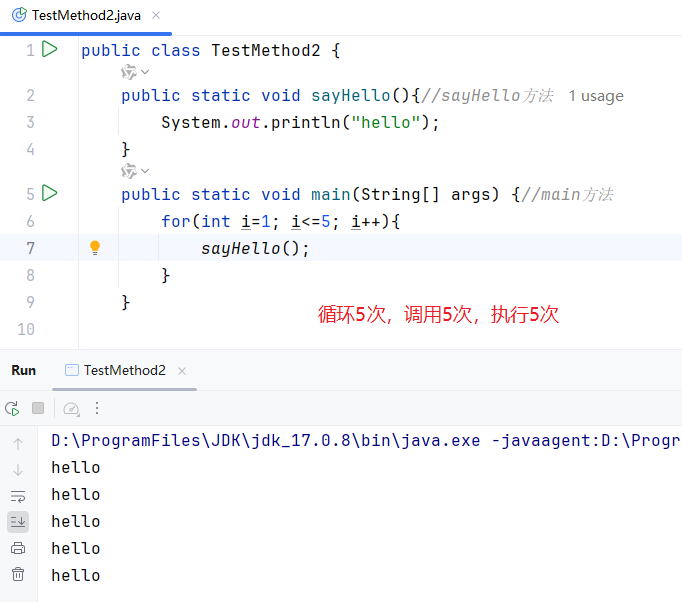

### 1.2.2 方法的声明（必须掌握5个部分叫什么）

位置要求：方法必须定义/声明在类中，方法外

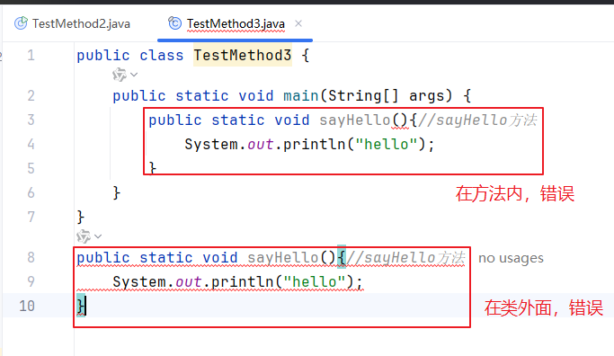

声明的格式：

```java
public class 类名{
    【①修饰符】 ②返回值类型  ③方法名(【④形参列表】){
        ⑤方法体语句;
    }
}

//【】表示可选
```

初期学习方法，方法由5个部分组成。

- 【①修饰符】：今天的方法暂时都是public static，public代表公共的，任意位置可见，static代表静态的，不需要new对象就可以调用这个方法。
- ②返回值类型：代表这个方法的功能执行完之后，是否需要给调用者返回一个结果。
- - 如果需要，就要说明这个结果的类型，它可以是8种基本数据类型或引用数据类型（Sstring类、数组等）。只要是非void，那么方法体中就必须有一个语句 return 结果; 否则代码编译不通过，报错。
  - 如果不需要，就用void表示。
- ③方法名：一个标识符而已。遵循小驼峰命名法，从第二个单词开始首字母大写。见名知意，即方法名能代表方法功能的意思。
- ⑤方法体语句：完成方法功能的语句。
- 【④形参列表】：它们其实就是一组变量，只不过这组变量的值需要在调用的时候由实参来赋值。如果这个方法完成功能的时候不需要额外的数据，那么形参列表可以省略。

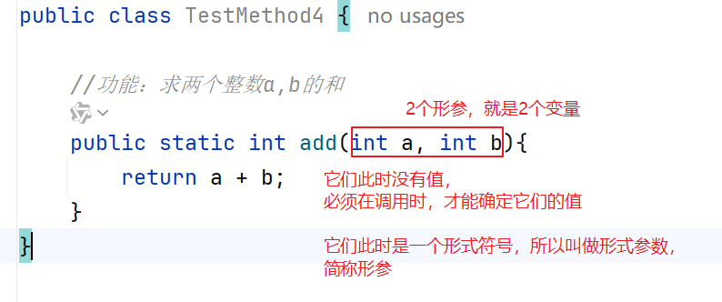

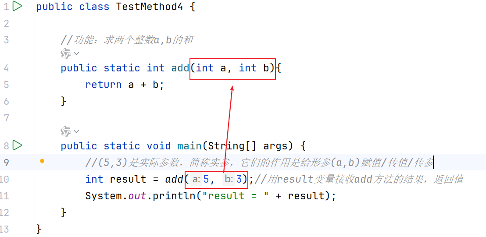

## 1.3 方法调用过程内存分析（理解）

### 1.3.1 过程说明

入栈：当方法被调用执行时，JVM会给这个方法在“栈”内存开辟一块`独立的`内存空间，用于存储这个方法的局部变量等信息。

出栈：当这个方法调用结束，JVM会`自动释放`这个方法占用的`栈内存`空间。

栈：先进后出

### 1.3.2 案例1

```java
public class TestMethodMemory {
    public static void main(String[] args) {
        int a = 1;
        int b = 2;
        add(a,b);
        int result = add(a, b);
        System.out.println("result = " + result);
    }

    public static int add(int a, int b){
        int sum = a + b;
        return sum;
    }
}

```

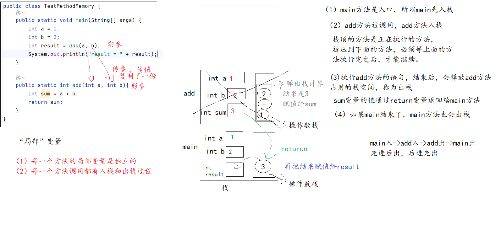


### 1.3.2 案例2

```java
public class TestMethodMemory2 {
    public static void main(String[] args) {
        int[] nums = {1, 2, 3, 4};
        reverse(nums);
        for (int i = 0; i < nums.length; i++) {
            System.out.print(nums[i]+" ");
        }
    }
    //实现了数组的反转
    public static void reverse(int[] arr){
        for(int left=0,right=arr.length-1; left<right; left++,right--){
            int temp = arr[left];
            arr[left] = arr[right];
            arr[right] = temp;
        }
    }
}

```


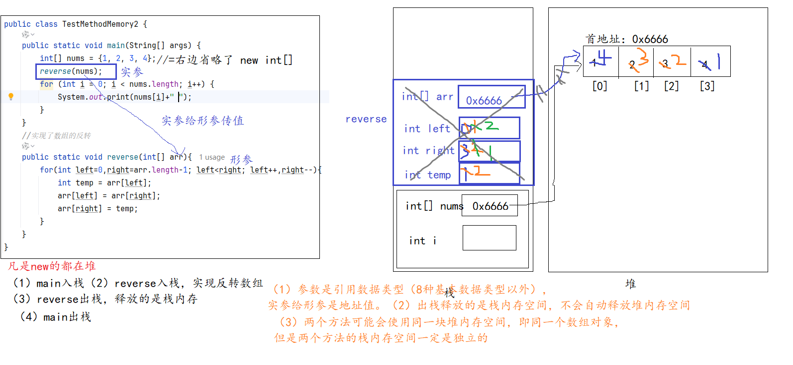

## 1.6 方法的参数传递机制

### 1.6.1 实参给形参传值

- 形参：形式参数
- 实参：实际参数

实参是负责给形参传值，要求实参的类型、个数、顺序 与形参要一一对应。


### 1.6.2 形参的修改是不是会影响实参（理解，会分析代码题即可）

#### 1、参数是基本数据类型

结论：参数是基本数据类型时，实参把数据值copy给形参之后，它们就没关系了。形参无论怎么修改，都与实参无关。

```java
public class TestParamDemo1 {
    public static void main(String[] args) {
        int x = 1;
        int y = 2;
        System.out.println("x = " + x +"，y = " + y );
        swap(x,y);
        System.out.println("x = " + x +"，y = " + y );
    }

    public static void swap(int a, int b){
        int temp = a;
        a = b;
        b = temp;
    }
}

```

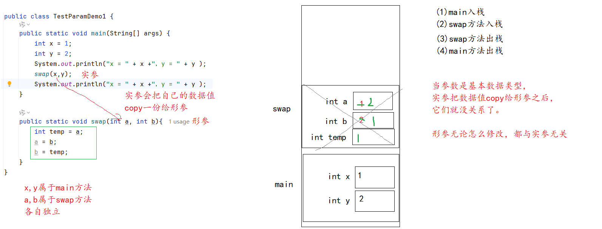

```java
public class TestParamDemo2 {
    public static void main(String[] args) {
        int x= 1;
        System.out.println("x = " + x);
        change(x);
        System.out.println("x = " + x);
    }

    public static void change(int a){
        ++a;
        a=100;
    }
}

```


#### 2、参数是引用数据类型

Java的类，数组等都是引用数据类型，这里用数组演示。

实参给形参的是`首地址的副本`，意味着形参和实参指向同一个对象，所以形参的修改会影响实参。

```java
public class TestParamDemo3 {
    public static void main(String[] args) {
        int[] nums = {10,20,30,40,50};
        print(nums);
        swap(nums,0,4);
        print(nums);
    }

    //功能：交换arr数组中 arr[left]与arr[right]的元素
    public static void swap(int[] arr, int left, int right){
        int temp = arr[left];
        arr[left] = arr[right];
        arr[right] = temp;
    }

    public static void print(int[] arr){
        for (int i = 0; i < arr.length; i++) {
            System.out.print(arr[i] +" ");
        }
        System.out.println();
    }
}

```

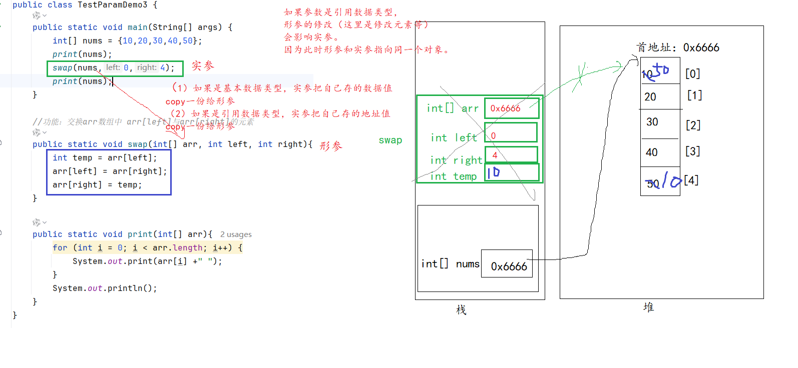

### 1.6.3 形参指向新对象

结论：一旦形参指向新对象，与原来的实参无关了。

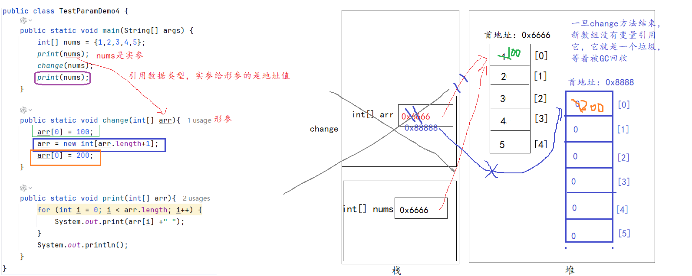


```java
public class TestParamDemo4 {
    public static void main(String[] args) {
        int[] nums = {1,2,3,4,5};
        print(nums);//1,2,3,4,5
        change(nums);
        print(nums);
        //100,2,3,4,5
    }

    public static void change(int[] arr){
        arr[0] = 100;
        arr = new int[arr.length+1];//让形参指向新的数组对象，接下来arr的任何操作与实参无关了
        arr[0] = 200;
    }

    public static void print(int[] arr){
        for (int i = 0; i < arr.length; i++) {
            System.out.print(arr[i] +" ");
        }
        System.out.println();
    }
}
```

如果要拿到新数组，就必须返回新数组。

```java
public class TestParamDemo4_2 {
    public static void main(String[] args) {
        int[] nums = {1,2,3,4,5};
        print(nums);//1,2,3,4,5
        nums = change(nums);//接收新数组的首地址
        print(nums);
        //100,2,3,4,5
    }

    public static int[] change(int[] arr){
        arr[0] = 100;
        arr = new int[arr.length+1];//让形参指向新的数组对象，接下来arr的任何操作与实参无关了
        arr[0] = 200;
        return arr;//返回新的数组的首地址
    }

    public static void print(int[] arr){
        for (int i = 0; i < arr.length; i++) {
            System.out.print(arr[i] +" ");
        }
        System.out.println();
    }
}

```

## 1.7 方法的重载(Overload)（掌握，概念要会背）

1、方法的重载：在同一个类中，出现两个方法的`名称相同`，`形参列表不同`，这样的形式称为方法的重载。方法重载与修饰符、返回值类型、方法体无关。

形参列表不同：可以是`个数不同`，`类型不同`，`顺序不同`，不看形参名

2、为什么要重载？

- 方法名见名知意，如果两个方法的功能是相同的，那么它的名称就应该一样
  
  

3、重载方法的调用原则

- 先找实参的个数、类型、顺序与形参`完全匹配`的，如果找到了，就可以确定了
- 如果没找到完全匹配的，要找可以`兼容`的，大的类型可以兼容小的类型，例如double可以兼容int

```java
public class TestOverload {
    public static void main(String[] args) {
        //把光标放到调用方法的()里面，按快捷键Ctrl + p
        System.out.println(max(4,6));
        System.out.println(max(4.0,6.0));
        System.out.println(max(4,5,2));

        System.out.println(max(4,6.0));
//        System.out.println(max(4.0,6.0,7.0));//找不到最匹配的，也找不到可以兼容的，就报错了
    }

    //求两个整数的最大值
    public static int max(int a, int b) {
        return a > b ? a : b;
    }

    //求3个整数的最大值
    public static int max(int a, int b, int c) {
        int max = a > b ? a : b;
        return max > c ? max : c;
    }

    //求两个小数的最大值
    public static double max(double a, double b) {
        return a > b ? a : b;
    }
}
```


## 1.8 可变参数（会用即可）

可变参数是指参数的个数不确定，可以是0~n个参数值。

可变参数的标记符号：...

可变参数的使用方式，用使用数组的方式使用它即可。

|            | 可变参数                        | 数组类型   |
| ---------- | --------------------------- | ------ |
| 形式（以int为例） | int...                      | int[]  |
| 调用时        | 可以传入0~n个元素，也可以直接传入数组        | 只能传入数组 |
| 限制         | 一个方法最多只能有1个可变参数，而且必须是最后一个形参 | 没有限制   |

```java
public class TestVarParam {
    public static void main(String[] args) {
        System.out.println(add(1,2,3,4,5,6));
        System.out.println(add(1,2));
        System.out.println(add(1));
        System.out.println(add());

        int[] arr = {10,20,30,40,50};
        System.out.println(add(arr));
    }

    //定义一个方法，用于求任意个整数的和
    public static int add(int... nums){
        int sum = 0;
        for (int i = 0; i < nums.length; i++) {
            sum += nums[i];
        }
        return sum;
    }

/*    public static void test(int... nums, int... args){//错误，一个方法不能有2个可变参数

    }*/
}

```

```java
public class TestVarParam3 {
    public static void main(String[] args) {
        System.out.println(concat("[","]","-","hello","world","java","atguigu"));
        System.out.println(concat("","","-","hello","world","java","atguigu"));
        System.out.println(concat("","",",","hello","world","java","atguigu"));
        System.out.println(concat("[","]",","));
    }

    //实现拼接n个字符串，拼接的时候可以指定开头的符号，结尾的符号，中间连接的符号
    //hello  world  java   atguigu
    //[hello,world,java,atguigu]
    //hello-world-java-atguigu
    public static String concat(String start, String end, String middle, String... args){
        String str = start;

        for (int i = 0; i < args.length; i++) {
            if(i==0){
                str += args[i];
            }else{
                str += middle + args[i];
            }
        }

        str += end;
        return str;
    }
}
```


## 1.9 递归调用

1、递归调用的概念：一个方法自己调用自己。

2、递归调用要注意：必须有出口。意思是满足xxx条件递归，不满足xx条件不递归。如果无条件递归，就会发生StackOverflowError。


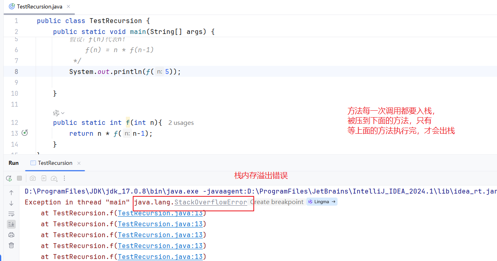

```java
public class TestRecursion {
    public static void main(String[] args) {
        //求n!
        /*
        假设：f(n)代表n!
            f(n) = n * f(n-1)
         */
        System.out.println(f(5));
        System.out.println(loop(5));

    }

    public static int f(int n){
        if(n>1) {
            return n * f(n - 1);//自己调用自己就叫递归
        }
        return 1;
    }

    public static int loop(int n){//用循环代替递归
        int result = 1;
        for(int i=n; i>=1; i--){
            result *= i;
        }
        return result;
    }
}

```


# 五、面向对象的基本概念

1、什么是对象

对象是指这类事物的一个`具体`的个体，实体。

2、类与对象的关系

类是创建对象的模板，设计图。比喻：造汽车，先有汽车的设计图。设计图中体现了这里车的所有特征/构造/结构和功能。

对象是具体的实例，个体。比喻：对象是具体的一辆车，能开的车。

## 1.3 如何声明类和创建对象？

先有类还是先有对象？

从需求分析/设计项目的角度：先观察对象，才能总结有哪些类？

从代码实现的角度来说：先声明类，后创建对象。

### 1、声明类的格式（必须掌握）

```java
【修饰符】 class 类名{

}
```

暂时今天类的修饰符只写public。public的类有一个要求，类名与xx.java的源文件名必须一致。

类名：见名知意。遵循大驼峰命名法，即每一个单词首字母大写。

```java
public class Student {
}

```

### 2、创建对象的格式（必须掌握）

```java
类名 对象名 = new 类名();
```

new是用来创建实例对象的关键字，实际意义是在堆中开辟一块内存用于存储对象的信息。例如：创建数组对象时，在堆中开辟一块空间，用来存储数组的元素。

```java
public class TestStudent {//主类，包含主方法的类
    public static void main(String[] args) {
        Student s1 = new Student();
        Student s2 = new Student();
        Student s3 = new Student();

        System.out.println(s1);//Student@4eec7777
        System.out.println(s2);//Student@3b07d329
        System.out.println(s3);//Student@41629346
        //s1,s2,s3都是引用数据类型的变量，s1,s2,s3中都是存储对象的首地址。
        //这一点与数组一样

        int[] arr = {1,2,3,4};
        System.out.println(arr);//[I@404b9385
    }
}

```

Student是一个类，也是一种数据类型，称为类类型。它与String是一样的。只不过String是JRE核心类库中已经提前写好的类，Student是咱们自己写的类。同理，数组类型，例如：int[]，String[]，double[]也是数据类型，是数组类型。它们统统都是引用数据类型。

## 1.4 包（认识，会创建即可）

### 1.4.1 包的作用

- 可以通过不同的文件夹/包帮我们管理众多的类，分门别类进行管理，便于后期的维护
- 可以避免类的重名，有了包之后，类的全名称就是包.类名
- 包结合权限修饰符（public，protected，缺省，private等）来限定类或成员可见性范围。关于权限修饰符后面再讲。
  
  

### 1.4.2 如何声明包？

```java
package 包名;
```

- 这句代码必须在源文件的首行。
- 包名的命名规范：所有单词都小写，单词直接使用.分割。习惯上用公司域名倒置的写法，例如：com.atguigu.xxx

在IDEA中这样操作：

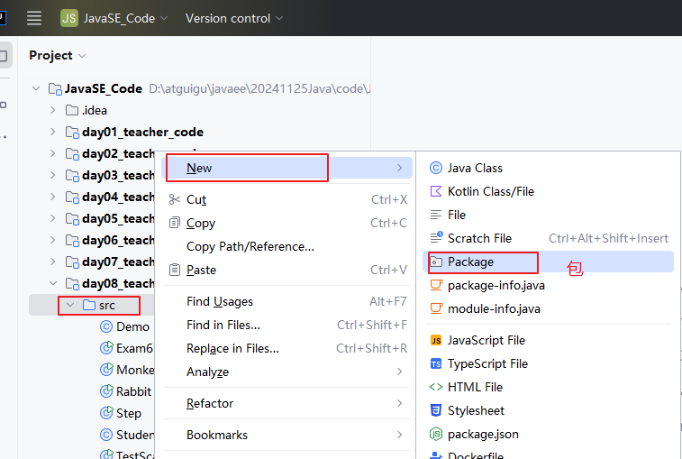


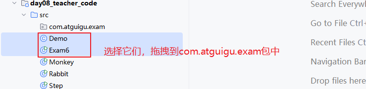

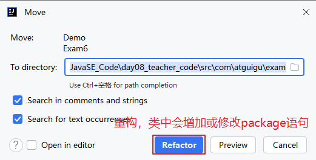

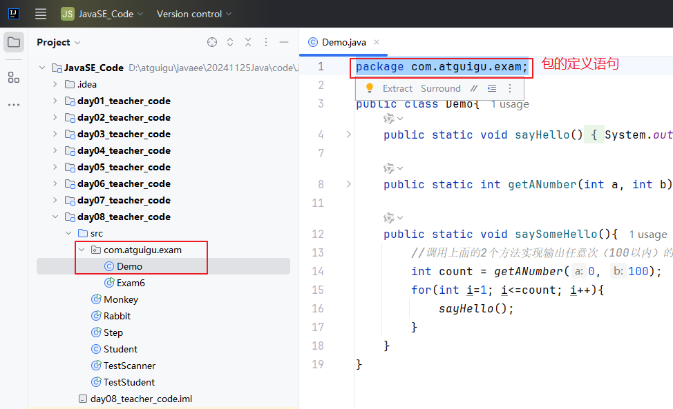

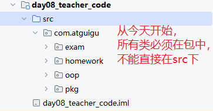

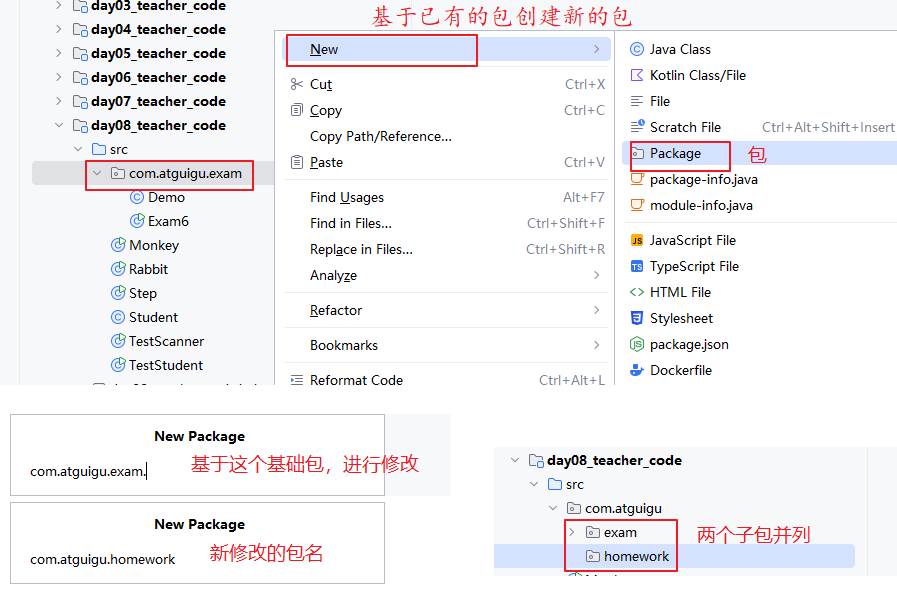

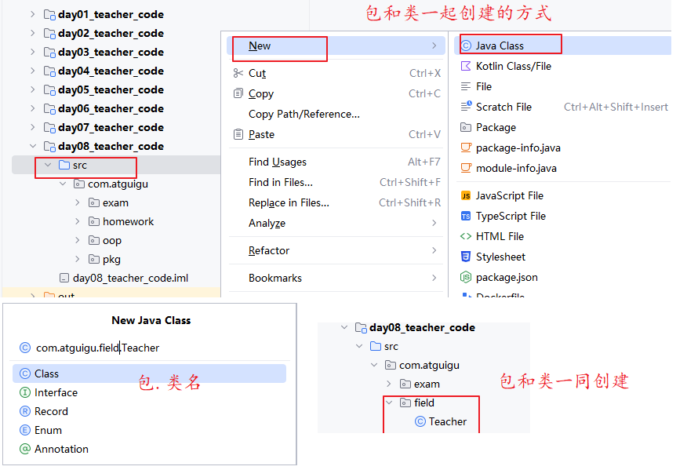

### 1.4.3 如何跨包使用类

- 如果是同一个包，类之间互相使用，不需要import
- 如果是跨包（不同包），类之间互相使用，必须import 或 使用类的全名称
- 只有public修饰的类才能跨包使用
- java.lang包的类，在任意地方使用都不需要导包，例如：String，Math，System 它们都是java.lang包的类

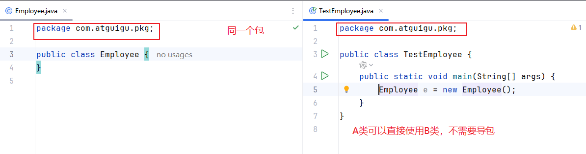

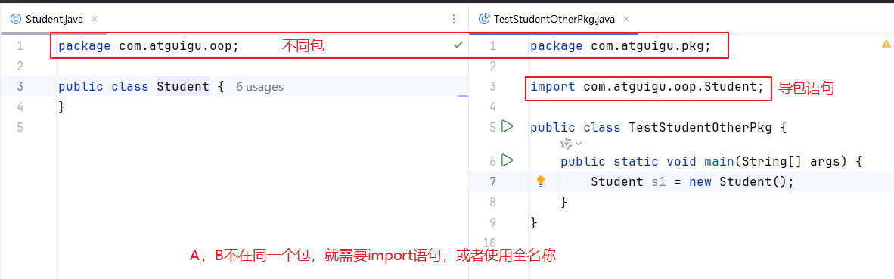

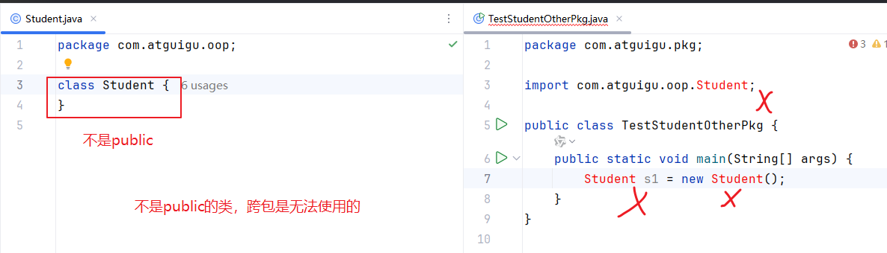

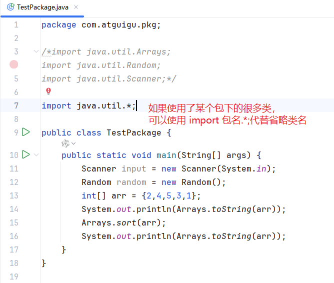

```java
package com.atguigu.pkg;

import java.util.Arrays;
import java.util.Date;
import java.util.Random;
import java.util.Scanner;

public class TestPackage {
    public static void main(String[] args) {
        Scanner input = new Scanner(System.in);
        Random random = new Random();
        int[] arr = {2,4,5,3,1};
        System.out.println(Arrays.toString(arr));
        Arrays.sort(arr);
        System.out.println(Arrays.toString(arr));

        /*
        使用不同包的，同名词的类
        java.util.Date类
        java.sql.Date类
        如果两个类都要用，只能一个是import，一个是全名称。或者两个都全名称。
         */
        Date d = new Date();
        java.sql.Date d2 = new java.sql.Date(2024,12,3);
    }
}

```


## 1.5 类的成员之一：成员变量（必须掌握）

### 1.5.1 成员变量的声明格式

```java
【修饰符】 class 类名{
    【修饰符】 数据类型 变量名;
}
```

成员变量的声明位置：类中方法外。

如果把变量定义/声明到方法里面，那就是局部变量，不是成员变量。

【修饰符】：暂时都是public


### 1.5.2 成员变量的分类

#### 1、静态变量

静态变量不依赖于对象，不属于对象，属于类。跨类使用它，建议通过“类名.静态变量”。也可以通过“对象.静态变量”。

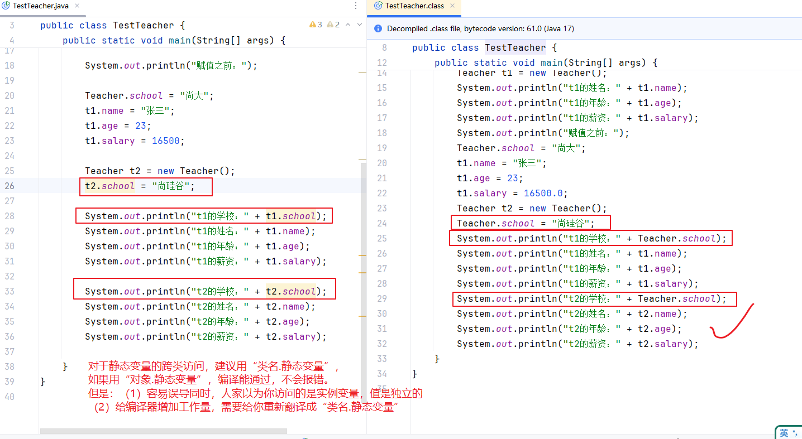

#### 2、实例变量/非静态成员变量

实例变量依赖于对象，属于对象。跨类使用它，必须通过“对象.实例变量”。


### 1.5.3 成员变量的特点

#### 1、成员变量有默认值

| 类型                 | 默认值      |
| ------------------ | -------- |
| byte               | 0        |
| short              | 0        |
| int                | 0        |
| long               | 0L       |
| float              | 0.0F     |
| double             | 0.0      |
| char               | '\u0000' |
| boolean            | false    |
| String等类、数组等引用数据类型 | null     |

#### 2、是否共享性特点

`静态变量`的值是**所有对象**`共享的`，因为它属于类，而类是创建对象模板，所以即使用类创建对象后通过对象访问static变量进行修改，也是对其他用这个类创建对象的这个值的修改，因为这是**共享的**。

`实例变量`的值是每一个对象`独立的`，因为它属于某个对象。

> 问：成员变量该不该加static？
> 
> 原则：看这个成员变量的值是不是所有对象共享的，只存一份的，如果是，就应该是静态的，否则就不能是静态的。


### 1.5.4 示例代码

```java
package com.atguigu.field;

public class Teacher {
    //静态变量，静态成员变量，学校名是所有老师共享的
    public static String school;

    //实例变量，非静态成员变量，姓名、年龄、薪资是每一个老师独立的
    public String name;//姓名
    public int age;//年龄
    public double salary;//薪资
}
```

```java
package com.atguigu.field;

public class TestTeacher {
    public static void main(String[] args) {
//        System.out.println("姓名：" + name);//错误，name在Teacher类中
       // System.out.println("姓名：" + Teacher.name);//错误，因为name没有static

        System.out.println("学校：" + Teacher.school);//null

        Teacher t1 = new Teacher();//创建对象，创建实例
        System.out.println("t1的姓名：" + t1.name);//null
        System.out.println("t1的年龄：" + t1.age);//0
        System.out.println("t1的薪资：" + t1.salary);//0.0

//        int a;//局部变量
//        System.out.println("a = " + a);//报错，因为a没有初始化

        System.out.println("赋值之前：");

        Teacher.school = "尚大";
        t1.name = "张三";
        t1.age = 23;
        t1.salary = 16500;

        Teacher t2 = new Teacher();
        t2.school = "尚硅谷";//推荐用 Teacher.school = "尚硅谷";

        System.out.println("t1的学校：" + t1.school);//推荐用 Teacher.school
        System.out.println("t1的姓名：" + t1.name);
        System.out.println("t1的年龄：" + t1.age);
        System.out.println("t1的薪资：" + t1.salary);

        System.out.println("t2的学校：" + t2.school);//推荐用 Teacher.school
        System.out.println("t2的姓名：" + t2.name);
        System.out.println("t2的年龄：" + t2.age);
        System.out.println("t2的薪资：" + t2.salary);

    }
}

```

```java
package com.atguigu.field;

public class Chinese {//中国人
    //国家名是所有中国人共享的，所以是静态的
    private static String country;

    //每一个中国人的名字是独立的，所以是非静态的
    private String name;
}

```

```java
package com.atguigu.field;

public class Account {//银行账号
    //银行利率是大家统一的，所以是静态的
    private static double rate;//利率

    //余额是每个人不同的，所以是非静态的
    private double balance;//余额
}

```


### 1.5.5 引用数据类型的成员变量

```java
package com.atguigu.field;

public class Husband {//丈夫
    //以下是两个引用数据类型的实例变量
    public String name;
    public Wife wife;
}

```

```java
package com.atguigu.field;

public class Wife {//妻子
    //以下是两个引用数据类型的实例变量
    public String name;
    public Husband husband;
}

```

```java
package com.atguigu.field;

public class TestHusbandWife {//主类，测试类
    public static void main(String[] args) {
        Husband h = new Husband();
        h.name = "张三";

        Wife w = new Wife();
        w.name = "翠花";

        h.wife = w;//给h.wife变量赋值一个Wife类型的对象
        w.husband = h;

        System.out.println("丈夫的姓名：" + h.name +"，他妻子的姓名：" + h.wife.name);
        System.out.println("妻子的姓名：" + w.name +"，她的丈夫的姓名：" + w.husband.name);
    }
}

```

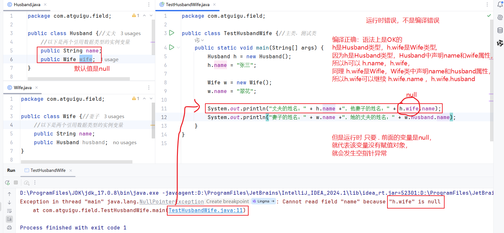


### 1.5.6 成员变量的内存分析

#### 1、实例变量的内存分析

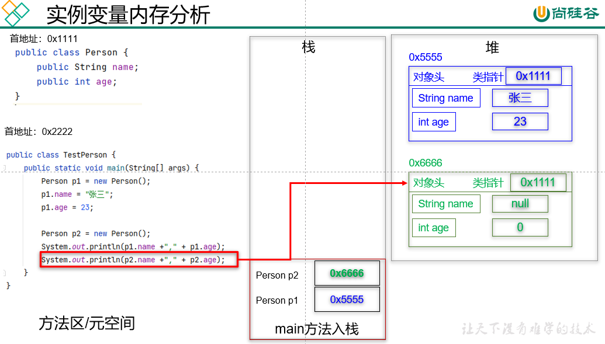

#### 2、静态变量与实例变量的内存分析

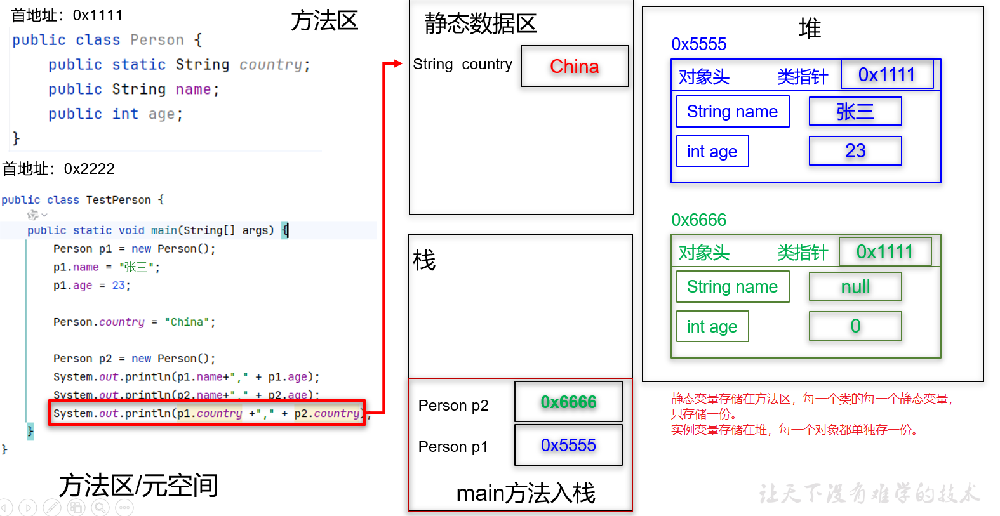

#### 3、引用数据类型成员变量的内存分析

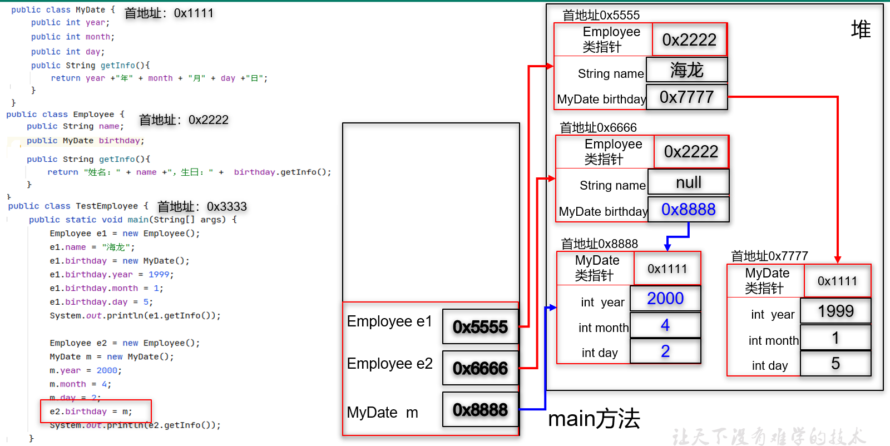


### 1.5.7 静态变量与实例变量的区别

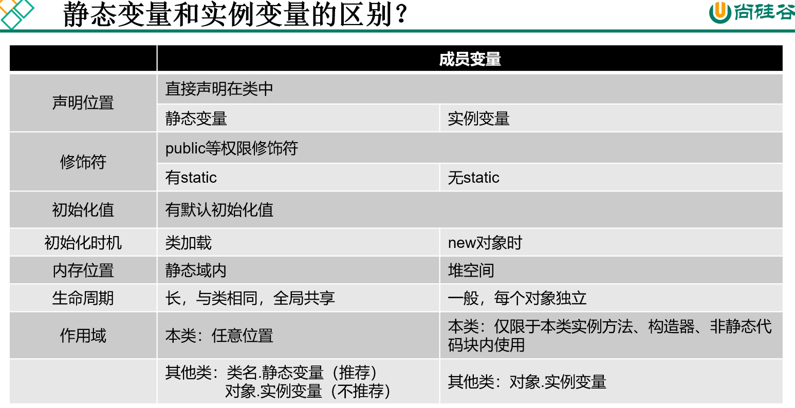

### 1.6.2成员方法的分类

#### 1、静态方法

在一个类中，**`静态方法`**只能访问本类的静态成员，包括静态变量和静态方法。

#### 2、实例方法/非静态方法

实例方法中可以访问本类中的所有成员，包括本类的静态成员

#### 3、this指向

在 Java 中，`this` 是一个关键字，本质上是一个**引用（指针）**，用于指向**当前对象**—— 即当前正在执行的方法所属的对象。它的核心作用是区分对象的成员变量与局部变量，以及简化对象内部的方法调用。

`this` 始终指向**调用当前方法的那个对象**。

- 当通过对象调用非静态方法时，`this` 就指向这个对象本身。
- 在构造方法中，`this` 指向正在被创建的对象。

静态方法中没有this，因为静态方法属于类，不依赖对象存在。且this不能为 null，也不能被赋值（它的指向由 JVM 自动决定，无法手动修改）

### 1.6.6 实例方法调用内存分析

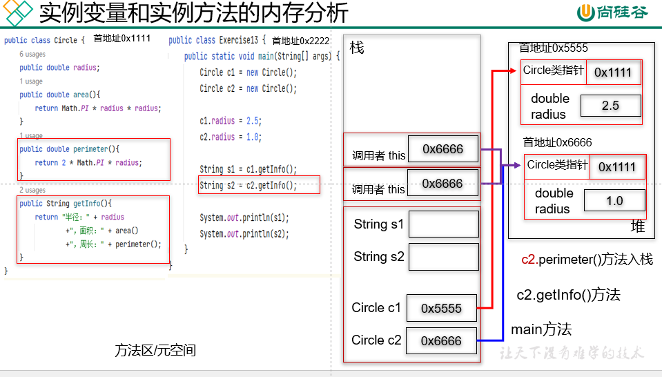


### 1.6.7 静态变量、实例变量、局部变量的区别

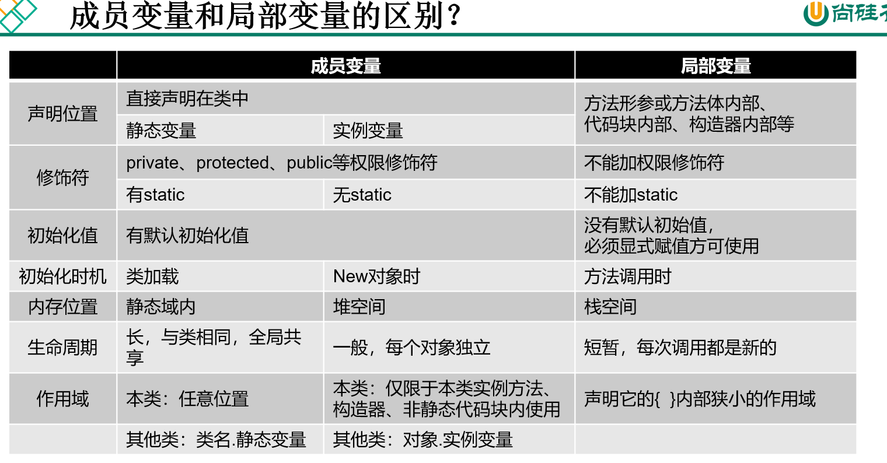

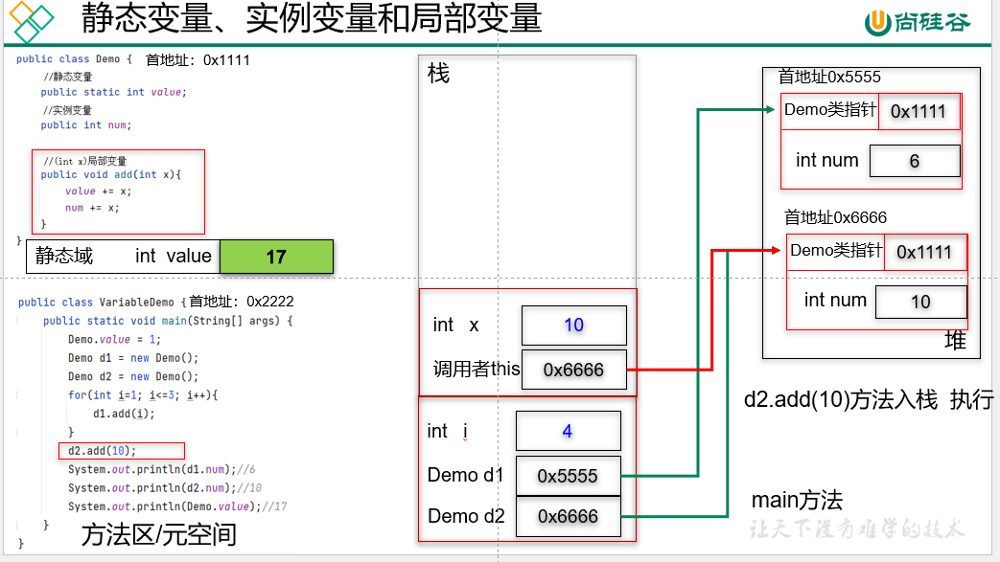

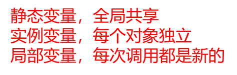


# 六、面向对象构造器和封装

2.1 构造器有什么用

构造器的作用是为实例对象的实例变量初始化。在new对象的时候用。


## 2.2 构造器长什么样？

- 构造器的名称`必须`与所在的类名完全一致，包括大小写。
- 构造器`没有返回值类型`。不写void，也不写int，String等类型。一旦你写了返回值类型，它就是普通方法。
  
  

## 2.3 构造器有什么特点或要求？

- 所有类都有构造器
- 如果一个类没有手动编写构造器，那么编译器会给你自动添加一个默认的无参构造。
- 但是如果我们手动编写了构造器，那么编译器就不会再给你添加任何构造器了。
- 构造器可以重载。构造器有时候也叫做构造方法，或构造函数。
- 构造器的修饰符只能是public、protected、缺省、private，不能加其他修饰符（static，final，abstract等）
  
  


## 2.4 构造器如何快速的创建？Alt + Insert


```java
package com.atguigu.constructor;

public class Student {
    public String name;
    public int age;

    //自动生成构造器的快捷键 Alt + Insert，部分同学可能需要同时按Fn
    public Student() {//无参构造
    }

    public Student(String name, int age) {//有参构造
        this.name = name;
        this.age = age;
    }

    public String getInfo(){
        return "姓名：" + name +"，年龄：" + age;
    }
}

```

```java
package com.atguigu.constructor;

public class TestStudent {
    public static void main(String[] args) {
        //调用Student类的无参构造创建Student对象
        Student s1 = new Student();
        System.out.println(s1.getInfo());

        //调用Student类的有参构造创建Student对象
        Student s2 = new Student("张三",23);
        System.out.println(s2.getInfo());
    }
}

```

## 4、面向对象的基本特征之一：封装（必须掌握）

### 3.1 为什么要封装？

生活中，快递为什么有包装盒/包装袋？

- 私密性：保护隐私
- 安全性：避免损坏
- 方便运输
- ......

Java中的类及其成员，也需要封装：

- 广义的封装概念：边界感，
  - 例如：把一类事物的共同特征封装到一个类中，把一个完整的功能封装到一个方法中。
  - 组件之间的封装，例如：项目中用到第三方的支付功能，微信、支付宝、银行等，只能调用对方开放的接口，无法获取内部的实现细节。
- 狭义的封装：对类或成员加权限修饰符，控制它们的可见性范围
  - 隐藏实现细节，便于使用
  - 安全

```java
package com.atguigu.constructor;

public class Student {
    private String name;//属性私有化
    private int age;//属性私有化

    public Student() {//无参构造
    }

    public Student(String name, int age) {//有参构造
        this.name = name;
        this.age = age;
    }

    public void setAge(int age){
        if(age >= 18 && age<=35) {
            this.age = age;
        }else{
            System.out.println("年龄不合法！");
        }
    }

    public String getInfo(){
        return "姓名：" + name +"，年龄：" + age;
    }
}

```

```java
package com.atguigu.constructor;

public class TestStudent {
    public static void main(String[] args) {
        //调用Student类的无参构造创建Student对象
        Student s1 = new Student();
        System.out.println(s1.getInfo());

        //调用Student类的有参构造创建Student对象
        Student s2 = new Student("张三",23);
        System.out.println(s2.getInfo());

        //s2.age = -18;//不安全
        s2.setAge(-18);//安全
        System.out.println(s2.getInfo());

        s2.setAge(30);//安全
        System.out.println(s2.getInfo());
    }
}

```


### 3.2 四种权限修饰符

对类或成员加权限修饰符，控制它们的可见性范围。

|         | private（私有的） | 缺省（不写） | protected（受保护） | public（公共的） |
| ------- | ------------ | ------ | -------------- | ----------- |
| 本类      | √            | √      | √              | √           |
| 本包其他类   | ×            | √      | √              | √           |
| 其他包的子类  | ×            | ×      | √              | √           |
| 其他包的非子类 | ×            | ×      | ×              | √           |

#### 演示1

本类中所有权限修饰符都可见。

```java
package com.atguigu.one;

public class Father {
    private int a;
    int b;
    protected int c;
    public int d;

    public void test(){
        System.out.println("a = " + a);
        System.out.println("b = " + b);
        System.out.println("c = " + c);
        System.out.println("d = " + d);
    }
}
```


#### 演示2

- 本包的其他类中，除了private，其他权限修饰符都可见。

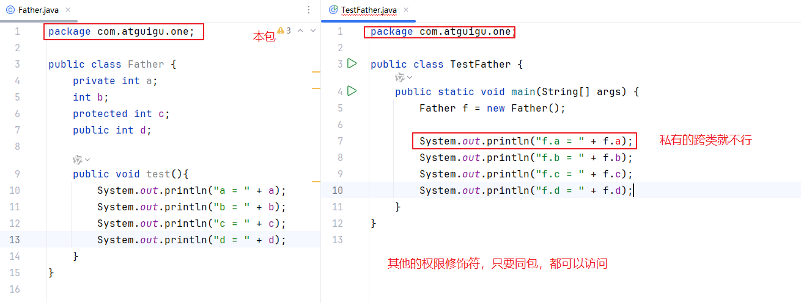

```java
package com.atguigu.one;

public class TestFather {
    public static void main(String[] args) {
        Father f = new Father();

//        System.out.println("f.a = " + f.a); //a在Father类中是私有的
        System.out.println("f.b = " + f.b);
        System.out.println("f.c = " + f.c);
        System.out.println("f.d = " + f.d);
    }
}

```


#### 演示2

A类和B类，B类与A类没有父子类关系的话，B类和A类不同包，那么B类只能用A类public的成员。

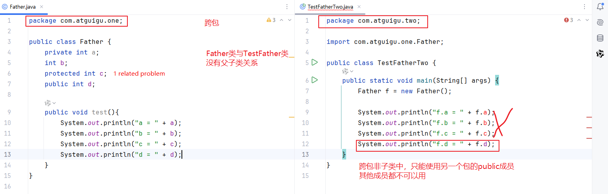

```java
package com.atguigu.two;

import com.atguigu.one.Father;

public class TestFatherTwo {
    public static void main(String[] args) {
        Father f = new Father();

//        System.out.println("f.a = " + f.a);//a在Father类中是private私有的
//        System.out.println("f.b = " + f.b);//b在Father类中是缺省的，默认的
//        System.out.println("f.c = " + f.c);//c在Father类中是protected受保护的
        System.out.println("f.d = " + f.d);
    }
}

```


#### 演示3

A类和B类，B类与A类有父子类关系，B类和A类不同包，那么B类可以用A类public和protected的成员。

私有的和缺省的成员，跨包就不可见。

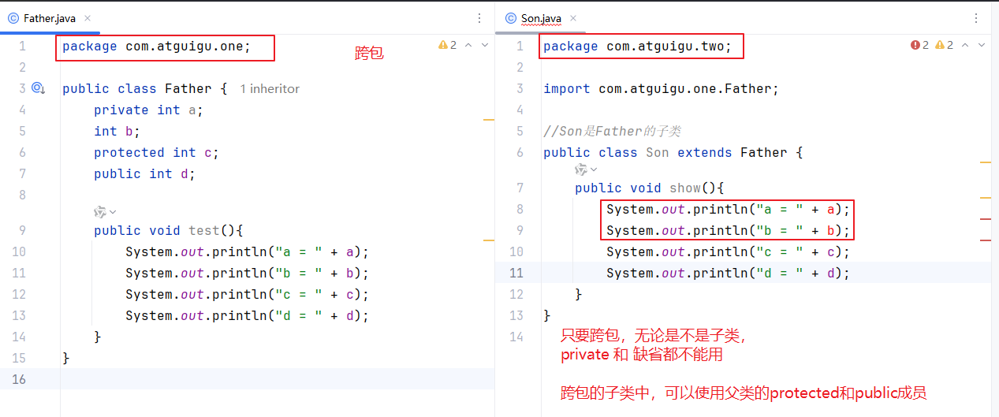

```java
package com.atguigu.two;

import com.atguigu.one.Father;

//Son是Father的子类
public class Son extends Father {
    public void show(){
//        System.out.println("a = " + a);//a在Father类中是private私有的
//        System.out.println("b = " + b);//b在Father类中是缺省的，默认的
        System.out.println("c = " + c);
        System.out.println("d = " + d);
    }
}
```


## 3.3 get/set方法

- set方法：修改某个或某些属性的值
  - 如果是静态变量的set方法，那么出现局部变量与静态变量重名时，通过“类名.静态变量”进行区分
  - 如果是实例变量的set方法，那么出现局部变量与实例变量重名时，通过“this.实例变量”进行区分
- get方法：获取某个或某些属性的值
  - 如果某个属性的类型是boolean，那么它的get方法，一般以is开头。

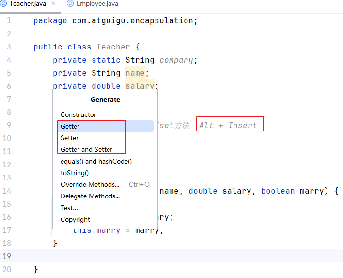

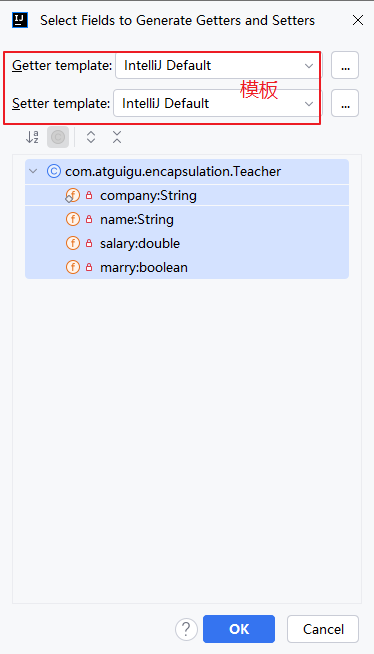

> 问：有构造器，和get/set会不会冲突？
> 
> 答：构造器在new对象`时`，赋初始值。
> 
> ​        set方法在new对象`后`，用于修改属性的值。
> 
> ​        get方法在new对象`后`，用于获取某个属性的值。

### 演示代码1：手动编写

```java
package com.atguigu.encapsulation;

public class Employee {
    private static String company;
    private String name;
    private double salary;
    private boolean marry;

    public Employee() {
    }

    public Employee(String name, double salary) {
        this.name = name;
        this.salary = salary;
    }

    //set方法的作用：供类外面，修饰某个/某些属性的值
    public void setName(String name){
        this.name = name;
    }
    public void setSalary(double salary){
        this.salary = salary;
    }
    public void setMarry(boolean marry){
        this.marry = marry;
    }
    public static void setCompany(String company){
        Employee.company = company;
    }
    //这种set一般是可选
    public void setInfo(String name, double salary){
        this.name = name;
        this.salary = salary;
    }

    //get方法的作用：供类外面，获取某个/某些属性的值
    public String getName(){
        return name;
    }
    public double getSalary(){
        return salary;
    }
    public boolean isMarry(){
        return marry;
    }
    public static String getCompany(){
        return company;
    }
    public String getInfo(){
        return "姓名：" + name +"，薪资：" + salary;
    }
}

```

```java
package com.atguigu.encapsulation;

public class TestEmployee {
    public static void main(String[] args) {
        Employee e1 = new Employee();//无参构造
        Employee e2 = new Employee("小孙", 30000);

        //跨类，无法直接使用对方的私有成员
        //System.out.println("姓名：" + e1.name +"，薪资：" + e1.salary);
        System.out.println("姓名：" + e1.getName() +"，薪资：" + e1.getSalary());
        System.out.println(e1.getInfo());

        System.out.println(e2.getInfo());

        //跨类，无法直接使用对方的私有成员
//        e1.name ="老马";
//        e1.salary = 18000;
        e1.setName("老马");
        e1.setSalary(18000);
        System.out.println(e1.getInfo());

    }
}

```

### 演示代码2：快捷键生成

```java
package com.atguigu.encapsulation;

public class Teacher {
    private static String company;
    private String name;
    private double salary;
    private boolean marry;

    //用快捷键生成构造器、get/set方法  Alt + Insert
    public Teacher() {
    }

    public Teacher(String name, double salary, boolean marry) {
        this.name = name;
        this.salary = salary;
        this.marry = marry;
    }

    public static String getCompany() {
        return company;
    }

    public static void setCompany(String company) {
        Teacher.company = company;
    }

    public String getName() {
        return name;
    }

    public void setName(String name) {
        this.name = name;
    }

    public double getSalary() {
        return salary;
    }

    public void setSalary(double salary) {
        this.salary = salary;
    }

    public boolean isMarry() {
        return marry;
    }

    public void setMarry(boolean marry) {
        this.marry = marry;
    }

    public String getInfo() {
        return "Teacher{" +
                "name='" + name + '\'' +
                ", salary=" + salary +
                ", marry=" + marry +
                '}';
    }
}

```

## 3.4 练习题

```java
package com.atguigu.exer2;

public class Triangle {//三角形类
    private double a;
    private double b;
    private double c;
    //a,b,c没有明确赋值的时候，默认值就是0

    //构造器，用快捷键生成
    //构造器的调用或使用，只有1个位置，就是new后面
    public Triangle() {
    }

    public Triangle(double a, double b, double c) {
/*        if (a <= 0 || b <= 0 || c <= 0 || a + b <= c || b + c <= a || a + c <= b) {
            System.out.println(a + "," + b + "," + c + "的值无法构成三角形");
        }else {
            this.a = a;
            this.b = b;
            this.c = c;
        }*/
        //if-else是双分支条件判断，只会二选一执行

        if (a <= 0 || b <= 0 || c <= 0 || a + b <= c || b + c <= a || a + c <= b) {
            System.out.println(a + "," + b + "," + c + "的值无法构成三角形");
            return; //在这里只是提前结束构造器的执行
        }
        this.a = a;
        this.b = b;
        this.c = c;

        /*if (a <= 0 || b <= 0 || c <= 0 || a + b <= c || b + c <= a || a + c <= b) {
            //抛出一个异常对象
            throw new IllegalArgumentException(a + "," + b + "," + c + "的值无法构成三角形");
        }
        this.a = a;
        this.b = b;
        this.c = c;*/
    }

    public double getA() {
        return a;
    }

/*    public void setA(double a) {
        this.a = a;
    }*/

    public double getB() {
        return b;
    }

/*    public void setB(double b) {
        this.b = b;
    }*/

    public double getC() {
        return c;
    }

/*    public void setC(double c) {
        this.c = c;
    }*/

    public void setBase(double a, double b, double c){
        if (a <= 0 || b <= 0 || c <= 0 || a + b <= c || b + c <= a || a + c <= b) {
            System.out.println(a + "," + b + "," + c + "的值无法构成三角形");
            return; //在这里只是提前结束构造器的执行
        }
        this.a = a;
        this.b = b;
        this.c = c;
    }

    public double area(){
        double p = (a+b+c)/2;
        return Math.sqrt(p * (p-a) * (p-b) * (p-c));
    }
    public double perimeter(){
        return a+b+c;
    }


    public String getInfo(){
        return  "三边：" +a + "," + b + "," + c +"，面积：" + area() +"，周长：" + perimeter();
    }

}

```

```java
package com.atguigu.exer2;

public class TestTriangle {
    public static void main(String[] args) {
        Triangle t1 = new Triangle();
 /*       t1.setA(3);
        t1.setB(4);
        t1.setC(3);*/
        t1.setBase(3,4,3);
        System.out.println(t1.getInfo());

        Triangle t2 = new Triangle(3,4,5);
        System.out.println(t2.getInfo());

        Triangle t3 = new Triangle(1,1,5);
        System.out.println(t3.getInfo());

        Triangle t4 = new Triangle();
/*        t4.setA(3);
        t4.setB(4);
        t4.setC(1);*/
        t4.setBase(3,4,1);
        System.out.println(t4.getInfo());
    }
}
```


## 四、标准Javabean（会使用快捷键）

bean：豆。

Java：产咖啡的印尼的爪哇岛。

Javabean：咖啡豆，Java类。

什么是标准Javabean？

- 属性私有化
- 提供无参构造器。有参构造可选。因为后期Java对象的创建通常都是交给Spring等框架，而这些框架默认都是用无参构造创建对象。
- 提供合适的get/set方法
- 重写（关于重写的概念我们在继承部分讲解）equals和hashCode（hashCode方法前期没用，等到后面讲哈希表的时候再说），toString方法

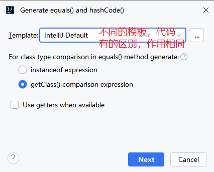

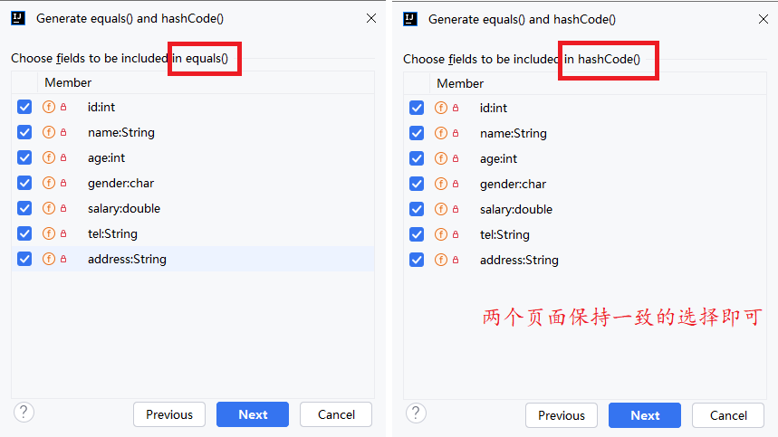

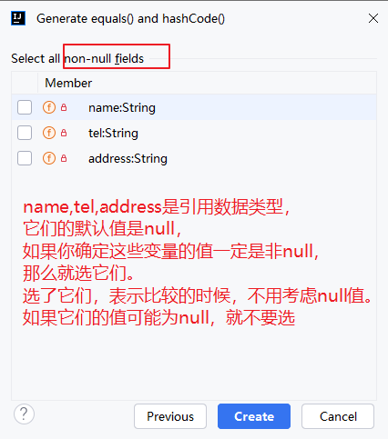

同一个类的构造器之间互相调用问题？

- this()：调用本类的无参构造
- this(实参列表)：调用本类的有参构造

它们都必须在构造器的首行。

```java
package com.atguigu.bean;

import java.util.Objects;

/*
什么是标准Javabean？

- 属性私有化
- 提供无参构造器。有参构造可选。因为后期Java对象的创建通常都是交给Spring等框架，而这些框架默认都是用无参构造创建对象。
- 提供合适的get/set方法
- 重写（关于重写的概念我们在继承部分讲解）equals和hashCode，toString方法

 */
public class Employee {
    private int id;
    private String name;
    private int age;
    private char gender;
    private double salary;
    private String tel;
    private String address;

    public Employee() {
        System.out.println("一个新员工入职");
    }

    public Employee(int id, String name, int age) {
        this();//调用本类的其他构造器，调用无参构造
        this.id = id;
        this.name = name;
        this.age = age;
    }

    public Employee(int id, String name, int age, char gender, double salary, String tel, String address) {
//        this.id = id;
//        this.name = name;
//        this.age = age;
        this(id,name,age);//调用本类的其他构造器，调用有参构造
        this.gender = gender;
        this.salary = salary;
        this.tel = tel;
        this.address = address;
    }

    public int getId() {
        return id;
    }

    public void setId(int id) {
        this.id = id;
    }

    public String getName() {
        return name;
    }

    public void setName(String name) {
        this.name = name;
    }

    public int getAge() {
        return age;
    }

    public void setAge(int age) {
        this.age = age;
    }

    public char getGender() {
        return gender;
    }

    public void setGender(char gender) {
        this.gender = gender;
    }

    public double getSalary() {
        return salary;
    }

    public void setSalary(double salary) {
        this.salary = salary;
    }

    public String getTel() {
        return tel;
    }

    public void setTel(String tel) {
        this.tel = tel;
    }

    public String getAddress() {
        return address;
    }

    public void setAddress(String address) {
        this.address = address;
    }

    public String toString() {
        return "Employee{" +
                "id=" + id +
                ", name='" + name + '\'' +
                ", age=" + age +
                ", gender=" + gender +
                ", salary=" + salary +
                ", tel='" + tel + '\'' +
                ", address='" + address + '\'' +
                '}';
    }

    //equals方法的内部实现，可以先忽略，
    //作用要明确，用于比较两个Employee对象的属性值是不是相同
    @Override
    public boolean equals(Object o) {
        if (this == o) return true;
        if (o == null || getClass() != o.getClass()) return false;

        Employee employee = (Employee) o;
        return id == employee.id && age == employee.age && gender == employee.gender && Double.compare(salary, employee.salary) == 0 && Objects.equals(name, employee.name) && Objects.equals(tel, employee.tel) && Objects.equals(address, employee.address);
    }

    //hashCode()今天先放着，不管它
    @Override
    public int hashCode() {
        int result = id;
        result = 31 * result + Objects.hashCode(name);
        result = 31 * result + age;
        result = 31 * result + gender;
        result = 31 * result + Double.hashCode(salary);
        result = 31 * result + Objects.hashCode(tel);
        result = 31 * result + Objects.hashCode(address);
        return result;
    }
}

```

```java
package com.atguigu.bean;

public class TestEmployee {
    public static void main(String[] args) {
        Employee e1 = new Employee();
        Employee e2 = new Employee(2,"熊二",25);
        Employee e3 = new Employee(3,"张三",23,'男',15000,"10086","北京");


        //toString()作用等价于原来的getInfo()
        //但是它比getInfo()方便，打印对象时，不用手动调用，它会自动调用
/*        System.out.println(e1.toString());
        System.out.println(e2.toString());
        System.out.println(e3.toString());*/
        System.out.println(e1);//如果没有写toString方法，那么打印的是地址值
        System.out.println(e2);
        System.out.println(e3);

        Employee e4 = new Employee(2,"熊二",25);
        System.out.println(e2 == e4);//false
        //e2和e4是地址值，这里比较的是两个对象的地址值
        System.out.println(e2.equals(e4));//比较两个对象是否相等  false
        //默认情况下，equals等价于 ==
        //如果不想让equals方法等价于==，就必须重写
        System.out.println(e1.equals(e2));//false
    }
}

```

# 七、对象数组

## 1、什么是对象数组

把对象存到数组中，这样的数组就称为对象数组。其实，它和普通的数组是一样的，只是因为对象数组使用起来相对复杂一点。

## 2、如何声明和使用

```java
元素的类型[] 数组名; //此时元素的类型是类类型，例如：Student，Rectangle，String等
```

静态初始化：

```java
元素的类型[] 数组名 = {对象1，对象2，对象3};
```

动态初始化：

```java
元素的类型[] 数组名 = new 元素的类型[长度];
```

数组的遍历：

```java
for(int i=0; i<数组名.length; i++){
    数组名[i]是元素，此时元素是对象
}
```

```java
package com.atguigu.array;

public class Rectangle {//矩形
    //属性私有化
    private double length;
    private double width;

    public Rectangle() {
    }

    public Rectangle(double length, double width) {
        this.length = length;
        this.width = width;
    }

    public double getLength() {
        return length;
    }

    public void setLength(double length) {
        this.length = length;
    }

    public double getWidth() {
        return width;
    }

    public void setWidth(double width) {
        this.width = width;
    }

    public double area(){
        return length * width;
    }
    public double perimeter(){
        return 2 * (length + width);
    }

    //接下来先忽略equals和hashCode方法
    public String toString() {
        return "Rectangle{" +
                "length=" + length +
                ", width=" + width +
                ", area = " + area() +
                ", perimeter = " + perimeter() +
                '}';
    }
}

```

```java
package com.atguigu.array;

public class TestRectangle {
    public static void main(String[] args) {
        //创建5个矩形对象，放到数组中统一管理
//        int[] arr = {1,2,3,4,5};
/*        int[] nums = new int[5];
        for (int i = 0; i < nums.length; i++) {
            System.out.println(nums[i]);
        }*/

//        Rectangle[] arr = {new Rectangle(5,3),new Rectangle(6,1)};

        Rectangle[] arr = new Rectangle[5];
        //此时我创建了一个数组，准备放5个矩形对象
        //此时arr数组的元素是什么值？5个null
        arr[0] = new Rectangle(5,3);
        arr[1] = new Rectangle(6,1);
        arr[2] = new Rectangle(4,2);
        arr[3] = new Rectangle(7,4);
        arr[4] = new Rectangle(6,2);

        //此时arr数组的元素是什么值？
        //如果重写了toString方法，打印元素看到的是5个矩形对象的信息
        //如果没有重写toString方法，打印元素看到的是5个地址值
        for (int i = 0; i < arr.length; i++) {
            System.out.println(arr[i]);
            //打印元素，会自动调用对象的toString()
        }

        System.out.println("排序：");
        //按照矩形对象的面积从小到大排序
        for(int i=1; i<arr.length; i++){
            for(int j=0; j<arr.length-i; j++){
               // if(arr[j] > arr[j+1]){//此时arr[j]是对象，arr[j]里面存储的是地址值，地址值是无法比较大小的
                if(arr[j].area() > arr[j+1].area()){
                   Rectangle  temp = arr[j];
                    arr[j] = arr[j+1];
                    arr[j+1] = temp;
                }
            }
        }

        for (int i = 0; i < arr.length; i++) {
            System.out.println(arr[i]);
            //打印元素，会自动调用对象的toString()
        }

    }
}

```

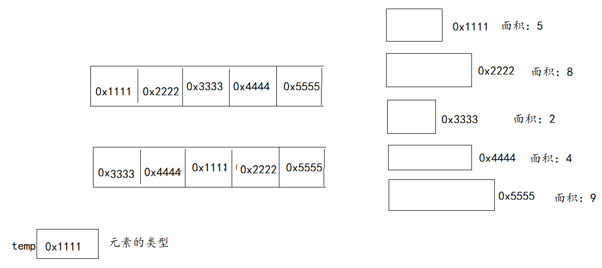

## 3、对象数组的内存分析

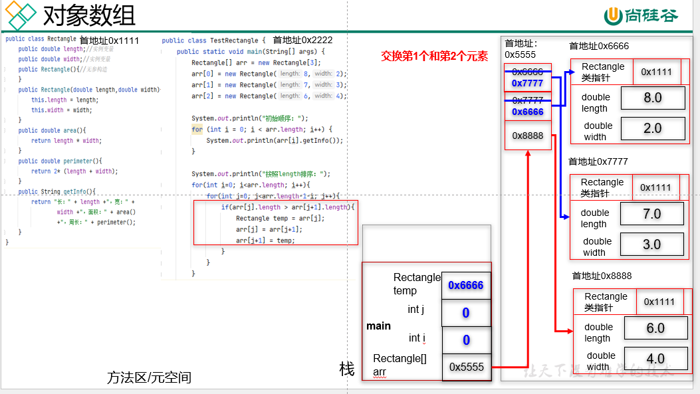


## 4、练习题

```java
package com.atguigu.exer3;

public class Student {
    //这是两个属性，实例变量，非静态成员变量
    private String name;
    private int score;

    //无参构造
    public Student() {
    }

    //有参构造
    public Student(String name, int score) {
        this.name = name;
        this.score = score;
    }

    //get和set
    //get返回属性值
    //set修改属性值
    public String getName() {
        return name;
    }

    public void setName(String name) {
        this.name = name;
    }

    public int getScore() {
        return score;
    }

    public void setScore(int score) {
        this.score = score;
    }

    //getInfo返回整个学生对象的信息
    public String getInfo(){
        return "姓名：" + name +"，成绩：" + score;
    }
}

```

```java
package com.atguigu.exer3;

import java.util.Scanner;

public class TestStudent {
    public static void main(String[] args) {
        //先创建长度为3的数组，类型是Student[]
        Student[] arr = new Student[3];//此时元素是3个null

        //键盘输入3个学生对象
        Scanner input = new Scanner(System.in);

        for (int i = 0; i < arr.length; i++) {
            System.out.print("请输入第" + (i+1) +"个学生的姓名：");
            String name = input.next();

            System.out.print("请输入第" + (i+1) +"个学生的成绩：");
            int score = input.nextInt();

            //把上面输入的姓名和成绩放到学生对象中
//            arr[i] = new Student(name,score);//方式一
            //方式二
            arr[i] = new Student();
            arr[i].setName(name);
            arr[i].setScore(score);
        }

        //遍历输出3个学生对象的信息
        for (int i = 0; i < arr.length; i++) {
            System.out.println(arr[i].getInfo());
        }

        //排序
        System.out.println("按照成绩从高到低排序：");
        for(int i=1; i<arr.length; i++){
            for(int j=0; j<arr.length-i; j++){
                if(arr[j].getScore() < arr[j+1].getScore()){
                    Student temp = arr[j];
                    arr[j] = arr[j+1];
                    arr[j+1] = temp;
                }
            }
        }
        for (int i = 0; i < arr.length; i++) {
            System.out.println(arr[i].getInfo());
        }

        input.close();
    }
}

```

### 数组中删除元素后其他元素前移

```java
/*删除后面客户的工作原理 ：

  假设数组中有n个客户（count = n），要删除第k个客户（k可以是任何位置，包括最后一个）
  循环 for(int i = k; i < count; i++) 会从第k个位置开始，将所有后面的元素前移一位
  当k等于count（删除最后一个客户）时，循环条件不满足（i = k 不小于 count），循环体不  会执行
  然后我们将最后一个元素设为null（ arr[count - 1] = null ）
  最后更新count--，表示客户数量减少了一个
*/
    public static boolean deleteCustomer(int id){
        if (id < 1 || id > count){
            System.out.println("不存在该用户！");
            return false;
        }
// 将后面的元素前移
    for(int i = id; i < arr.length; i++){
        arr[i - 1] = arr[i];
    }
    // 最后一个元素设为null
    arr[length- 1] = null;
    // 更新客户数量
    //count--;  这是因为的的案例中用了count作为计数器计算数组中元素个数
    return true;
    }
```

# 八、面向对象的基本特征之二：继承

## 3.1 什么是继承？

Java中为什么要有继承的设计呢？

* 代码的复用性：子类可以`复用`父类的代码

* 代码的扩展性：子类可以`重写`父类的方法或`扩展`父类没有的成员

* ###### 表示事物之间的is-a关系。例如：Student类继承Person类，Student is a Person.学生类是人类的一个分支。

  

## 3.2 如何继承？（重要）

```java
【修饰符】 class 父类{
    
}
```

```java
【修饰符】 class 子类 extends 父类{//子类是从父类中延伸出来的新的分类，更具体的分类
    
}
```

父类：SuperClass，称为父类或超类 ，基类。

子类：SubClass，称为子类或派生类。

## 3.3 继承的特点或要求（重要）

1、Java中只允许`单继承`。比喻：每一个子类只有1个亲生父亲。

2、但是Java中支持`多层继承`。比喻：代代相传。你的父亲仍然有父亲。爷爷的特征到孙子类仍然是保留的。

3、Java中一个父类可以同时有多个子类。比喻：支持多胎。支持家族兴旺。

4、父类的所有成员变量、成员方法都会继承到子类中。`但是`，父类中私有的成员变量、成员方法，在子类中`不能直接`使用，可以间接使用。

5、父类的`构造器不会继承`到子类中。`但是`，子类的构造器中又`必须调用`父类的构造器。因为子类继承了父类声明的所有成员变量，那么创建子类对象时就需要为这些成员变量初始化，而为这些成员变量初始化的代码已经在父类的构造器中写过了，可以不用重复编写这些代码了，直接调用它们即可。

- super()：表示调用父类的无参构造。这句代码可以省略。
- super(实参列表)：明确表示调用父类的有参构造。这句代码不能省略，一旦省略，就表示调用无参构造了。
- 它们必须在子类构造器的首行。

### 案例一：子类直接用父类的成员

```java
package com.atguigu.inherited;

public class Person {
    public String name;
    public int age;

    public String getPersonInfo(){
        return "姓名：" + name + "，年龄：" + age;
    }
}

```

```java
package com.atguigu.inherited;

public class Student extends Person{

    public int score;//成绩

    public String getStudentInfo(){
        return "姓名：" + name + "，年龄：" + age +"，成绩：" + score;
        //直接使用父类非private的属性
    }
}

```

```java
package com.atguigu.inherited;

public class Student extends Person{

    public int score;//成绩

    public String getStudentInfo(){
        return getPersonInfo() +"，成绩：" + score;
        //间接使用父类非private的方法
    }
}
```

### 案例二：子类间接使用父类的成员

```java
package com.atguigu.inherited;

public class Person {
    private String name;
    private int age;

    public String getPersonInfo(){
        return "姓名：" + name + "，年龄：" + age;
    }
}

```

```java
package com.atguigu.inherited;

public class Student extends Person{

    public int score;//成绩

    public String getStudentInfo(){
        //return "姓名：" + name + "，年龄：" + age +"，成绩：" + score;
        //报错，因为name和age此时在父类Person中是private
        return getPersonInfo() +"，成绩：" + score;
        //直接调用父类的方法，从而间接使用父类的私有属性
    }
}
```

## 3.4 方法的重写（重要）

### 1、什么是方法的重写？

方法的重写（Override）是指子类覆盖/重写/覆写父类的某个方法。因为子类会继承父类的所有方法，但是某些方法的方法体功能实现不适用于子类，那么子类就可以重新实现它。

### 2、如何重写方法？

- 修饰符：
  - 权限修饰符：public、protected、缺省、private，其中private的方法是不能被重写的。并且子类重写时，方法的权限修饰符必须`大于等于`父类被重写方法的权限修饰符。
    - 父类被重写方法是public，子类这个方法只能是public。
    - 父类被重写方法是protected，子类这个方法可以是public，protected
    - 父类被重写方法是缺省，子类这个方法可以是public，protected，缺省
  - 其他修饰符：static，静态方法不能被重写。

- 返回值类型：
  - void和基本数据类型：子类必须保持一致
  - 引用数据类型：子类重写时，方法的返回值类型可以是`小于等于`它
    - 例如父类被重写方法的返回值类型是Person，那么子类重写方法的返回值类型可以是Person，也可以是Student

- 方法名：`必须完全相同`
- 形参列表：`必须完全相同`，这里相同是指类型、个数、顺序。不包括形参名。
- 方法体：子类重写就是为了重新实现方法体，根据功能的需求来。

### 3、如何调用父类被重写的方法？

super.父类被重写方法


### 4、方法重载与重写的区别

|            | 方法的重载         | 方法的重写                                             |
| ---------- | ------------------ | ------------------------------------------------------ |
| 位置       | 同一个类 或 父子类 | 父子类                                                 |
| 英文单词   | Overload           | Override                                               |
| 修饰符     | 不看               | 不能重写private和static的方法。权限修饰符必须满足 >=   |
| 返回值类型 | 不看               | void和基本数据类型：必须相同<br />引用数据类型：满足<= |
| 方法名     | 必须相同           | 必须相同                                               |
| `形参列表` | `必须不同`         | `必须相同`                                             |

### 5、示例代码

```java
package com.atguigu.inherited;

public class Employee {
    private String name;
    private double salary;//薪资

    public Employee() {
    }

    public Employee(String name, double salary) {
        this.name = name;
        this.salary = salary;
    }

    public String getName() {
        return name;
    }

    public void setName(String name) {
        this.name = name;
    }

    public double getSalary() {
        return salary;
    }

    public void setSalary(double salary) {
        this.salary = salary;
    }


    public String getInfo() {
       return "姓名：" + name + "，薪资：" + salary;
    }
}

```

```java
package com.atguigu.inherited;

public class Manager extends Employee{
    private double bonus;//奖金

    public Manager() {
    }

    public Manager(String name, double salary, double bonus) {
        super(name, salary);
        this.bonus = bonus;
    }

    public double getBonus() {
        return bonus;
    }

    public void setBonus(double bonus) {
        this.bonus = bonus;
    }

    public String  getInfo(){
      // return "姓名：" + getName() + "，薪资：" + getSalary() + "，奖金：" + bonus;
       return super.getInfo() + "，奖金：" + bonus;
       //通过super关键字，调用父类被重写的方法
    }
}

```

```java
package com.atguigu.inherited;

public class TestManager {
    public static void main(String[] args) {
        Manager m = new Manager("老马",18000,20000);
        System.out.println(m.getInfo());
    }
}

```

## 3.5 根父类（知道它）


Object是java.lang包下的一个类，它是所有Java类的根，老祖宗。我们称为根父类。


Object类的方法，所有子类都会继承，即所有子类都有这些方法。但是，对于toString，equals和hashCode方法来说，子类通常都会重写。


```java
package com.atguigu.inherited;

public class Rectangle {//它没有继承任何类，默认继承的是Object
    private double length;
    private double width;

    public Rectangle() {
        super();//调用父类Object的无参构造
    }

    public Rectangle(double length, double width) {
        super();//调用父类Object的无参构造，在子类有参构造器中，也可以调用父类的无参构造
        this.length = length;
        this.width = width;
    }

    public double getLength() {
        return length;
    }

    public void setLength(double length) {
        this.length = length;
    }

    public double getWidth() {
        return width;
    }

    public void setWidth(double width) {
        this.width = width;
    }

    //重写equals，hashCode，toString
    //快捷键Alt + Insert 或 Ctrl + O
    @Override  //这个是注解。它是用于标记以下方法是重写的意思，它会告诉编译器，让编译器对该方法做严格的格式检查，看它是否满足重写的要求
               //但是，如果你本身没有违反重写的要求，@Override可以去掉。
                //加或不加@Override它，不影响重写的本质。只是格式检查是不是彻底的问题。
                //建议重写方法上保留它。
    public boolean equals(Object o) {
        if (this == o) return true;
        if (o == null || getClass() != o.getClass()) return false;

        Rectangle rectangle = (Rectangle) o;
        return Double.compare(length, rectangle.length) == 0 && Double.compare(width, rectangle.width) == 0;
    }

    @Override
    public int hashCode() {
        int result = Double.hashCode(length);
        result = 31 * result + Double.hashCode(width);
        return result;
    }

    @Override
    public String toString() {
        return "Rectangle{" +
                "length=" + length +
                ", width=" + width +
                '}';
    }
}

```


## 3.6 特殊关键字

### 3.6.1 native（了解）

native修饰的方法，称为本地方法，或内置的方法，它是内置在JVM相关的底层代码中，通过C/C++语言实现的，不是用Java语言实现。在Java层面看不到它的方法体。


本地方法的执行会自动调用本地方法库。本地方法的执行会在本地方法栈中开辟独立的内存空间。Java虚拟机中的栈空间分为两块：虚拟机栈（服务于Java的方法）和本地方法栈（服务于C/C++的函数）。

> 提示：native的方法，虽然看不到它的源码，但是（1）在Java中可以正常调用。（2）如果子类继承了本地方法，只要它不是private，不是static，不是final，子类可以对它用Java代码进行重写。即本地方法在使用层面，把它当成普通的方法即可。


### 3.6.2 final（重要）

final：最终。

在Java中，它是修饰符，可以用于修饰：类、方法、变量。

|      | 修饰符类                         | 修饰符方法                         | 修饰变量                           |
| ---- | -------------------------------- | ---------------------------------- | ---------------------------------- |
| 作用 | 这个类不能被继承（比喻：太监类） | 这样的方法不能被重写（可以被继承） | 这样的变量称为常量，值不能被修改。 |
| 举例 | String，Math，System等           | Object类中的getClass()             |                                    |

> 对于final修饰变量来说：
>
> （1）final可以修饰局部变量，可以修饰静态变量，可以修饰实例变量
>
> （2）静态变量 + final 建议大写，其他的变量加final一般不大写
>
> （3）静态变量和实例变量  + final之后，它们都没有set方法，可以有get方法
>
> （4）实例变量 + final，可以在变量后面直接写 = 值，也可以在构造器中进行初始化。

#### 案例1：final类


#### 案例2：final的方法


```java
package com.atguigu.keyword;

import com.atguigu.inherited.Student;

public class TestObject {
    public static void main(String[] args) {
        //Object类中有一个方法 getClass()，这个方法是用于返回对象的运行时类型
        String str = "hello";
        Student s = new Student();

        System.out.println(str.getClass());//getClass方法是从Object继承的
        //class java.lang.String
        System.out.println(s.getClass());//getClass方法是从Object继承的
        //class com.atguigu.inherited.Student
    }
}

```

#### 案例3：final的变量

```java
package com.atguigu.keyword;

public class Triangle {//三角形类
    //修改单词大小写的快捷键：Ctrl + Shift + U
    public static final String SHAPE_NAME = "三角形";
    //习惯上，大家只对静态的常量 写大写，
    //局部常量和实例常量一般不大写。
    
/*    private final double a = 1;
    private final double b = 1;
    private final double c = 1;*/
    private final double a;
    private final double b;
    private final double c;

    //通过构造器对a,b,c进行赋值
    public Triangle(double a, double b, double c) {
        this.a = a;
        this.b = b;
        this.c = c;
    }

    //此时无参构造中就不能空着了，必须给final的实例变量一个初始值
    public Triangle() {
        this.a = 1;
        this.b = 1;
        this.c = 1;
    }

    @Override
    public String toString() {
        return "Triangle{" +
                "a=" + a +
                ", b=" + b +
                ", c=" + c +
                '}';
    }
}

```

```java
package com.atguigu.keyword;

public class TestVariable {
    public static void main(String[] args) {
        final int a = 1;//局部变量a前面加final
//        a = 2;//不可以重新赋值
//        a++;//不可以修改值

        System.out.println(Triangle.SHAPE_NAME);
//        Triangle.SHAPE_NAME = "四角形";//不能重新赋值
        Triangle t1 = new Triangle(3,4,5);
        Triangle t2 = new Triangle(6,6,6);
        System.out.println(t1);
        System.out.println(t2);

        Triangle t3 = new Triangle();
        System.out.println(t3);

        System.out.println(Math.PI);
        System.out.println(Integer.MAX_VALUE);
        System.out.println(Integer.MIN_VALUE);
    }
}

```


## 3.7 练习题

### 3.7.1 题1

```java
package com.atguigu.exer;

/*
1、下面的代码声明了2个类，一个是TestOther测试类，一个是Other类
2、Other类有一个属性/成员变量/实例变量，它是int类型的，所以i的默认值是0
3、程序运行的入口是main方法
（1） Other o = new Other();
创建了1个Other类的对象，此时o对象的实例变量/属性值i 是默认值0
（2）new TestOther().addOne(o);
这里为什么要new TestOther()的目的是什么？
因为addOne是“非静态的”方法，而main是“静态的”，同一个类中，静态方法是不能直接调用非静态方法的。
addOne()方法的参数是引用数据类型，实参o给形参o是地址值，相当于两个o指向同一个Other类的对象，
那么它们操作的i是同一个i
（3）public void addOne(final Other o)
这里加final的影响是，不让形参o指向新对象
 */
public class TestOther {
    public static void main(String[] args) {
        Other o = new Other();
        new TestOther().addOne(o);
        System.out.println(o.i);
    }

    public void addOne(final Other o){
//        o = new Other();//错误的，因为o是final，不可以修改值。
        o.i++;
    }
}

class Other{
    public int i;//如果在i的前面加final，那么i的值就不允许修改了，i++就错了
}
```


### 3.7.2 题2

```java
package com.atguigu.exer;

public class Person{
    public Person(){//构造器，无参构造器
        System.out.println("this is a Person.");
    }
}
```

```java
package com.atguigu.exer;

/*
（1）Teacher是Person的子类，Teacher类继承了Person类
（2）Teacher类声明了一个私有的属性/实例变量/成员变量 叫做name，这里直接初始化为"tom“
（3）Teacher也有一个无参构造，手动调用了父类的无参构造
 super();  但是，这句代码要求必须在子类构造器的首行，这里是错误的
           如果这里省略了 super(); 那么也会调用Person的无参构造。
           无论如何，子类构造器一定会调用父类的构造器。
 （4）this代表 调用当前方法的对象，但是main方法是静态方法，不需要对象来调用它，
 静态方法中是不允许出现this关键字的。
 （5）这里如果想要访问name属性值，可以通过 tea.name完成
 虽然name和main方法在同一个类中，但是main是静态的，无法直接访问非静态的name,
 必须通过对象.name来完成，这里通过tea.name
 */
public class Teacher extends Person{
    private String name = "tom";
    public Teacher(){
        System.out.println("this is a teacher.");
//        super();//错误
    }
    public static void main(String[] args){
        Teacher tea = new Teacher();
//        System.out.println(this.name);//错误
        System.out.println(tea.name);
    }
}
```

### 3.7.3 题3

```java
package com.atguigu.exer;

/*
1、下面的代码也是声明了2个类，一个是Father父类，一个是Test子类，子类同时又是测试类
2、此时父子类同时声明了name属性，名称相同，值不同
3、父类有一个getName()方法，子类自己没有声明getName()方法，可以调用getName()
4、在main方法中，创建了子类Test的对象，并且调用了test对象的getName()
 */
public class Test extends Father{
    private String name = "test";

    public static void main(String[] args) {
        Test test = new Test();
        System.out.println(test.getName());
    }
}

class Father {
    private String name = "father";

    public String getName() {
        return name;
    }
}
```


# 九、抽象类（重要）

## 4.1 什么是抽象类？

语法层面来说：有abstract修饰的类，就是抽象类。

```java
【权限修饰符】 abstract class 类名{
    
}
```


## 4.2 为什么要有抽象类？

父类是代表很多子类共同的特征，把很多子类共同的属性、方法抽取到父类中，从而避免在不同的子类中重复声明。

随着父类共同方法的抽取越来越抽象，就会出现抽象方法，即在父类中写不了具体方法体的方法，这样方法必须用abstract修饰，表示没有方法体的抽象方法，Java中规定，包含抽象方法的类必须是抽象类，这样的类是`不能直接new对象`的。


> 问：抽象类有构造器吗？
>
> 答：有，一定有。此时构造器是给子类用的。

## 4.3 抽象类怎么用

抽象类的存在的意义：

- 它代表所有子类共同的特征
- 抽象类就是用来被继承的，子类继承抽象类，必须`重写抽象类的所有抽象方法`，否则子类也是是抽象类


## 4.4 示例代码

```java
package com.atguigu.special;

//Java中规定，包含抽象方法的类，必须是抽象类
public abstract class Shape {//形状
    private String name;

    //没有方法体的Java方法，需要加abstract，表示它是一个抽象方法
    public abstract double area();
    public abstract double perimeter();

    //此时构造器是给子孙后代用的，不是自己用的
    public Shape() {
    }

    public Shape(String name) {
        this.name = name;
    }

    public String toString(){
        return "面积：" + area() +"，周长：" + perimeter();
    }
}

```

```java
package com.atguigu.special;

public class Rectangle extends Shape{//矩形
    private double length;
    private double width;

    public Rectangle() {
    }

    public Rectangle(double length, double width) {
        this.length = length;
        this.width = width;
    }

    public double getLength() {
        return length;
    }

    public void setLength(double length) {
        this.length = length;
    }

    public double getWidth() {
        return width;
    }

    public void setWidth(double width) {
        this.width = width;
    }

    public double area(){
        return length * width;
    }

    public double perimeter(){
        return (length + width) * 2;
    }

    @Override
    public String toString() {
        return "长：" + length + ", 宽：" + width + "，" + super.toString();
    }
}

```

```java
package com.atguigu.special;

public class Circle extends Shape{
    private double radius;//半径属性

    public Circle() {
    }

    public Circle(double radius) {
        this.radius = radius;
    }

    public double getRadius() {
        return radius;
    }

    public void setRadius(double radius) {
        this.radius = radius;
    }

    public double area(){//面积
        return Math.PI * radius * radius;
    }

    public double perimeter(){//周长
        return 2 * Math.PI * radius;
    }

    @Override
    public String toString() {
        return "半径：" + radius + "，" + super.toString();
    }
}

```

```java
package com.atguigu.special;

public class Triangle extends Shape{
    private double a;
    private double b;
    private double c;

    public Triangle() {
    }

    public Triangle(double a, double b, double c) {
        this.a = a;
        this.b = b;
        this.c = c;
    }

    public double getA() {
        return a;
    }

    public void setA(double a) {
        this.a = a;
    }

    public double getB() {
        return b;
    }

    public void setB(double b) {
        this.b = b;
    }

    public double getC() {
        return c;
    }

    public void setC(double c) {
        this.c = c;
    }
    //重写父类抽象方法的快捷键：Ctrl + O 或 Ctrl + I
    //Ctrl + O可以重写父类抽象的和非抽象的方法
//    Ctrl + I 重写父类的抽象方法

    @Override
    public double area() {
        double p = (a+b+c)/2;
        return Math.sqrt(p * (p-a) * (p-b) * (p-c));
    }

    @Override
    public double perimeter() {
        return a + b + c;
    }

    @Override
    public String toString() {
        return "边长：" + a +
                "," + b +
                "," + c
                + "，" + super.toString();
    }
}

```

```java
package com.atguigu.special;

public class TestShape {
    public static void main(String[] args) {
//        Shape s = new Shape();//抽象类是不能直接new对象的
//        System.out.println(s.area());
// 如果可以new对象，就可以通过对象调用抽象方法
        //但是抽象方法没有方法体可执行

        Circle c = new Circle(2.5);
        Rectangle r = new Rectangle(5,3);
        Triangle t = new Triangle(3,4,5);

        System.out.println(c);
        System.out.println(r);
        System.out.println(t);
    }
}

```

### 1. 抽象方法的本质

父类`Shape`中的`area()`和`perimeter()`是**抽象方法**（被`abstract`修饰），它们没有方法体，但强制要求所有非抽象子类（如`Circle`）必须实现这些方法。
你的`Circle`类作为子类，已经正确实现了这两个方法，这是编译通过的前提。

### 2. 方法调用的动态绑定

当执行`super.toString()`时，虽然调用的是父类`Shape`的`toString()`方法，但父类`toString()`中涉及的`area()`和`perimeter()`调用，会遵循 **“运行时对象类型决定方法实现”** 的规则：


- 实际创建的对象是`Circle`实例（比如`Shape shape = new Circle(5);`），这个对象的运行时类型是`Circle`。
- 当调用`area()`或`perimeter()`时，Java 会在运行时找到**该对象实际类型（Circle）中实现的方法**，而不是父类的抽象方法（父类也没有方法体可执行）。

### 3. 本质：多态的体现

## 4.5 答疑


# 十、接口（重要）

## 5.1 什么是接口？

生活中：USB接口，电源插座的接口等，代表连接口。其实还代表了“标准”规范的意思。


Java中的接口也是代表（1）连接口（2）行为规范，方法的规范。

例如：后期做项目时，会调用银行接口，支付宝接口，微信支付接口来完成支付功能。

例如：后端服务器与前端的界面之间要约定双方传数据的规范，标准，这是也是接口的一部分。


从语法层面，说接口是用interface关键字声明的类型。


## 5.2 如何声明接口

```java
【修饰符】 interface 接口名{
    
}
```


## 5.3 接口的成员

回忆类的成员：

```java
(1)成员变量：静态变量和实例变量
(2)成员方法：静态方法和非静态方法
(3)构造器：无参构造和有参构造
(4)代码块
(5)内部类
```

**接口的成员有限制，明显与类不同：**

**JDK8之前：**

- 公共的静态的常量：public static final （3个关键字可以省略），因为接口是代表一种标准规范，那么具体的值必须是明确的，写死的。
- 公共的抽象方法`：public abstract（2个关键字可以省略），因为接口是代表一种标准规范，只是说它有什么功能，但是功能的具体实现要有子类来实现。抽象方法是没有方法体，子类必须实现/重写它。

**JDK8之后：**

- `公共的静态方法`：public static（其中public可以省略，static不能省略），静态方法必须有方法体。静态方法的调用不需要接口的对象。
- `公共的默认方法`：public default（其中public可以省略，default不能省略）
  - 为了接口的升级，Java允许定义默认方法。默认方法是可以写方法体的，子类可以选择实现它，也可以选择不实现它。
  - 如果没有默认方法，按照之前的语法规则，接口中只能增加抽象方法，一旦父接口增加抽象方法，就会影响所有的实现类。

**JDK9之后：**

- 私有的方法（了解）：用于表示接口中内部使用的方法，通常是因为两个静态方法，或两个默认方法之间有共同代码，抽取出来的一个内部方法，这段代码只是功能的一部分，不是完整的功能，不希望外部调用，所以私有化。

## 5.4 接口的特点

- 接口不能直接new对象

- 接口允许多实现
- 接口与接口支持多继承


> 问：抽象类与接口有什么区别？
>
> 相同的：它们都不能new对象，因为它们里面都可能有抽象方法。
>
> 不同点：
>
> （1）成员不同（见上）
>
> （2）类与类之间有“单继承”的限制，需要通过接口来解决这个问题，接口允许多实现

## 5.5 如何使用接口的各个成员

- 静态的，用接口名.静态成员
- 非静态的，创建子类对象，然后对象名.非静态成员

## 5.6 示例代码

```java
package com.atguigu.jiekou;

public class Animal {
    public void eat(){
        System.out.println("吃东西");
    }
}

```

```java
package com.atguigu.jiekou;

public interface Flyable {
    public static final int SPEED = 100;//public static final可以省略
    public abstract void fly();

    public static void prepare(){
        System.out.println("准备起飞");
    }

    public default  void show(){
        System.out.println("我很漂亮");
    }
}

```

```java
package com.atguigu.jiekou;

public interface Jumping {
    void jump();
}

```

```java
package com.atguigu.jiekou;

/*
类与类之间只能单继承，Bird只能有一个直接父类， Animal是Bird的亲生父亲
类与接口之间可以多实现，Bird可以同时有多个父接口，Flyable,Jumping是Bird的干爹
 */
public class Bird extends Animal implements Flyable,Jumping{
    @Override
    public void fly() {
        System.out.println("我要飞的更高！！");
    }

    @Override
    public void jump() {
        System.out.println("我只能蹦蹦跳");
    }
}

```

```java
package com.atguigu.jiekou;

public class Plane implements Flyable{
    @Override
    public void fly() {
        System.out.println("飞入云霄");
    }

    @Override
    public void show() {
        System.out.println("我很酷");
    }
}

```

```java
package com.atguigu.jiekou;

public class Kite implements Flyable{
    @Override
    public void fly() {
        System.out.println("我借助风的力量，飞的很高！");
    }
}

```

```java
package com.atguigu.jiekou;

public class TestFlyable {
    public static void main(String[] args) {
//        Flyable f = new Flyable();//不能直接创建接口的对象，这一点与抽象类是一样的。
        //如何使用接口的抽象方法？
        Bird b = new Bird();//创建接口的实现类/子类对象，才能调用接口的抽象方法
        b.fly();//其实执行的是Bird中重写的fly方法

        //如何使用接口的静态方法？
        Flyable.prepare(); //接口名.静态方法

        //如何使用接口的默认方法？
        b.show();

        //只要子类重写了fly,show方法，都在执行重写后的方法体
        Plane p = new Plane();
        p.fly();
        p.show();

        //如何使用接口的常量？
        System.out.println(Flyable.SPEED);
        /*
        结论：
        使用静态的，就是类型名.静态成员
        使用非静态的，就是new对象，然后对象.非静态成员
         */
    }
}
```


## 5.7 接口的作用/意义

因为接口允许多实现，可以`解决抽象类单继承的限制问题`。

类与接口之间可以是简单的has-a或like-a的关系，而不是死板的is-a的关系。

- 如果是is-a的关系，在逻辑层面要求比较严格。
  - Bird is a Animal。
  - Student is a Person。
  - Circle is a Shape。
- 而has-a或like-a的关系的话，我们只要某个类想要拥有这个接口的方法，那么就可以继承它，不用管逻辑关系。
  - Bird has a fly方法。
  - Plane has a fly方法。
  - Kite has a fly方法。
  - Superman has a fly方法。
  - UFO like a flyable things。

例如：连接wifi，不一定是电脑，手机。可以是任意设备，只要遵循wifi的通信规则设计连网能力，家里任何设备都可以连接wifi。


# 题 1: Overload 与 Override 的区别

### 答法一:

Overload 是指方法的重载，在同一个类或父子类中，方法名相同，形参列表不同的两个方法，称为重载。

Override 是指方法的重写，当子类继承父类或实现父接口时，如果父类或父接口中某个方法的实现不适用于子类，那么子类可以进行重写，要求方法名相同，形参列表相同，权限修饰符满足`>=`的关系，返回值类型总体来说满足`<=`的关系。

### 答法二:

|                              | Overload 方法的重载 | Override 方法的重写                              |
| ---------------------------- | ------------------- | ------------------------------------------------ |
| 位置                         | 同一个类或父子类    | 父子类                                           |
| 权限修饰符                   | 不看                | `>=`，private 的方法不能被重写                   |
| 其他修饰符                   | 不看                | static，final 的方法不能被重写                   |
| 返回值类型                   | 不看                | 基本数据类型和 void：必须相同 引用数据类型：`<=` |
| 方法名                       | 必须相同            | 必须相同                                         |
| 形参列表（个数、类型、顺序） | 必须不同            | 必须相同                                         |

# 题 2：四种权限修饰符的可见性范围分别是什么

|           | 本类中 | 本包的其他类中 | 其他包的子类中 | 其他包的非子类中 |
| --------- | ------ | -------------- | -------------- | ---------------- |
| private   | √      | ×              | ×              | ×                |
| 缺省      | √      | √              | ×              | ×                |
| protected | √      | √              | √              | ×                |
| public    | √      | √              | √              | √                |

**补充：**

- 类（不包括后面要学习的内部类）的前面只允许有`public` 或 缺省。
- 成员变量：四种权限修饰符都可以使用。
- 构造器：四种权限修饰符都可以使用。
- 成员方法：四种权限修饰符都可以使用。

# 题4：构造器的声明格式及其特点和要求

```java

【修饰符】 class 类名 {
    【修饰符】 类名() {
    }
    
    【修饰符】 类名(形参列表) {
    }
}
```

## 构造器的特点和要求

- 构造器的名称必须与类名完全一致；

- 构造器没有返回值类型；

- 构造器的权限修饰符只能是 `public`、`protected`、缺省、`private`，不能有其他修饰符（如 `static`、`final`、`native`、`abstract` 等）；

- 所有类（包括抽象类）都有构造器；

- 如果一个类没有手动定义构造器，编译器会自动为其添加默认的无参构造器；

- 如果一个类手动定义了构造器，编译器就不会自动添加默认的无参构造器，此时该类只有手动定义的构造器；

- 构造器不会被子类继承，但一定会被子类调用：

  - 默认情况下，子类调用的是父类的无参构造；

  - 也可以手动调用父类的构造器：

    - `super()`：调用父类的无参构造；
    - `super(参数)`：调用父类的有参构造；

  - 如果子类构造器中没有写 `super()` 或 `super(参数)`，默认表示调用父类的无参构造.

    

  

# 题6：默写目前学过的36个关键字

```java


## 数据类型相关
- 8种基本数据类型：`byte`, `short`, `int`, `long`, `float`, `double`, `char`, `boolean`
- 引用数据类型：`class`, `interface`
- 空类型：`void`

## 流程控制语句结构
- 条件判断：`if`, `else`
- 选择结构：`switch`, `case`, `default`
- 循环结构：`for`, `do`, `while`
- 跳转语句：`break`, `continue`, `return`

## 和包有关
- `package`, `import`

## 和对象有关
- `new`, `super`, `this`

## 和关系有关
- `extends`, `implements`

## 修饰符
- 权限修饰符：`private`, `protected`, `public`
- 其他修饰符：`static`, `final`, `native`, `abstract`

## 保留字（预留的关键字）
- `goto`, `const`, `_`

## 特殊值
- `true`, `false`, `null`
```

## 2.1 接口的成员的冲突问题

### 1、父类与父接口的成员变量的冲突问题

这种情况比较少见，但是如果出现了，知道怎么解决即可。


```java
package com.atguigu.jiekou;

public interface Flyable {//父接口
    int speed = 100;//它前面其实省略了public static final
}

```

```java
package com.atguigu.jiekou;

public class Animal {
    int speed = 200; //前面没有修饰符，就是没有的。
}

```

```java
package com.atguigu.jiekou;

public class Bird extends Animal implements Flyable{
//    int speed = 300;
    public void test(){
        System.out.println("父类的speed = " + super.speed);
        System.out.println("父接口的speed = " + Flyable.speed);//因为speed在接口中是static
    }
}

```

```java
package com.atguigu.jiekou;

public class TestBird {
    public static void main(String[] args) {
        Bird b = new Bird();
        System.out.println(b);
    }
}
```

### 2、父类的方法与父接口的默认方法冲突

当父类的方法，与父接口的默认方法冲突（方法签名相同），此时遵循亲爹优先原则。默认子类选择的是父类的方法。

```java
所谓的方法签名：
    【修饰符】 返回值类型 方法名(形参列表)  
```

```java
package com.atguigu.jiekou;

public interface Swimming {
    public default void swim(){
        System.out.println("狗刨");
    }
}

```

```java
package com.atguigu.jiekou;

public class Father {
    public void swim(){
        System.out.println("蛙泳");
    }
}

```

```java
package com.atguigu.jiekou;

public class Son extends Father implements Swimming{
}

```

```java
package com.atguigu.jiekou;

public class TestSon {
    public static void main(String[] args) {
        Son s = new Son();
        s.swim();//蛙泳，遵循亲爹优先原则
    }
}

```

### 3、两个父接口的默认方法冲突

当两个父接口的默认方法冲突（方法签名相同），子类必须做出选择，否则编译不通过。

- 选择父接口1的：父接口1.super.默认方法
- 选择父接口2的：父接口2.super.默认方法
- 可以完全重写，任何一个父接口都不选

```java
package com.atguigu.jiekou;

public interface A {
    public default void method(){
        System.out.println("A.method");
    }
}

```

```java
package com.atguigu.jiekou;

public interface B {
    public default void method(){
        System.out.println("B.method");
    }
}

```

```java
package com.atguigu.jiekou;

public class Sub implements A,B{
    @Override
    public void method() {
        A.super.method();
        System.out.println("xxx");
    }
}

```

```java
package com.atguigu.jiekou;

public class TestSub {
    public static void main(String[] args) {
        Sub s = new Sub();
        s.method();
    }
}

```

## 2.2 经典接口：比较器接口

### 2.2.1 java.lang.Comparable接口

Comparable接口：自然比较接口

应用场景：当两个对象要比较大小或排序时，就需要实现这个接口。

具体方式：哪个类的对象要比较大小，就让哪个类实现Comparable接口。实现接口，必须重写/实现接口的抽象方法。

```java
int compareTo(Object other)  抽象方法
```

子类/实现类在重写这个方法时，方法体没有限制，但是返回值有具体要求：

- 当this对象  “大于” other对象时，就返回 正整数
- 当this对象  “小于” other对象时，就返回 负整数
- 当this对象 “等于”  other对象时，就返回零

> 结论：Java中凡是涉及到对象比较大小的类型，统统都会实现Comparable接口，并且重写int compareTo(Object obj)方法。
>
> 这样才能使用我们后面Arrays.sort等通用方法。
>
> 例如：String字符串，Integer整数类等等都实现了这个接口

#### 案例1：学生对象比较大小和排序

```java
package com.atguigu.compare;

/*
一个类编写代码的习惯：
（1）成员变量
（2）构造器
（3）成员方法
get/set
...

 */
public class Student implements Comparable{
    private String name;
    private int score;
    private int age;

    public Student() {
    }

    public Student(String name, int score, int age) {
        this.name = name;
        this.score = score;
        this.age = age;
    }

    public String getName() {
        return name;
    }

    public void setName(String name) {
        this.name = name;
    }

    public int getScore() {
        return score;
    }

    public void setScore(int score) {
        this.score = score;
    }

    public int getAge() {
        return age;
    }

    public void setAge(int age) {
        this.age = age;
    }

    @Override
    public String toString() {
        return "Student{" +
                "name='" + name + '\'' +
                ", score=" + score +
                ", age=" + age +
                '}';
    }

    @Override
    public int compareTo(Object other) {
        /*
        1、这里有2个对象在比较大小？
        this 和 other 两个对象比较大小

        2、怎么比较大小？根据需求来定
        假设，这里按照成绩比较大小
        this.score 与 other.score
         */
        return this.score - ((Student)other).score;
    }
}

```

```java
package com.atguigu.compare;

public class TestStudent {
    public static void main(String[] args) {
        Student s1 = new Student("张三",89, 23);
        Student s2 = new Student("李四",75, 24);

        //比较大小
//        System.out.println(s1 > s2);//错误，因为s1和s2里面存到的是地址值
        int result = s1.compareTo(s2);
        if(result > 0){
            System.out.println("s1 > s2");
        }else if(result < 0){
            System.out.println("s1 < s2");
        }else{
            System.out.println("s1 == s2");
        }
    }
}

```

```java
package com.atguigu.compare;

public class TestStudent2 {
    public static void main(String[] args) {
        System.out.println("=================");

        Student[] arr = new Student[3];
        arr[0] = new Student("张三",89, 23);
        arr[1] = new Student("李四",75, 24);
        arr[2] = new Student("王五",79, 25);
        for (int i = 0; i < arr.length; i++) {
            System.out.println(arr[i]);
        }

        //按照成绩排序：从低到高
        System.out.println("按照成绩从低到高排序：");
        for(int i=1; i<arr.length; i++){
            for(int j=0; j<arr.length-i; j++){
                //arr[j]和arr[j+1]
                if(arr[j].compareTo(arr[j+1]) > 0){
                    Student temp = arr[j];
                    arr[j] = arr[j+1];
                    arr[j+1] = temp;
                }
            }
        }

        for (int i = 0; i < arr.length; i++) {
            System.out.println(arr[i]);
        }
    }
}

```

#### 案例2：员工对象排序

```java
package com.atguigu.compare;

public class Employee implements Comparable{
    private String name;
    private double salary;

    public Employee() {
    }

    public Employee(String name, double salary) {
        this.name = name;
        this.salary = salary;
    }

    public String getName() {
        return name;
    }

    public void setName(String name) {
        this.name = name;
    }

    public double getSalary() {
        return salary;
    }

    public void setSalary(double salary) {
        this.salary = salary;
    }

    @Override
    public String toString() {
        return "Employee{" +
                "name='" + name + '\'' +
                ", salary=" + salary +
                '}';
    }

    @Override
    public int compareTo(Object other) {
        //假设要按照薪资比较大小
        //this 和 other
        if( this.salary > ((Employee)other).salary){
            return 1;
        }else if(this.salary < ((Employee)other).salary){
            return -1;
        }else{
            return 0;
        }
    }
}
```

```java
package com.atguigu.compare;

public class TestEmployee {
    public static void main(String[] args) {
        Employee[] arr = new Employee[3];
        arr[0] = new Employee("小孙",30000);
        arr[1] = new Employee("老马",20000);
        arr[2] = new Employee("老何",30001);

        for (int i = 0; i < arr.length; i++) {
            System.out.println(arr[i]);
        }

        System.out.println("按照薪资从低到高排序：");
        for(int i=1; i<arr.length; i++){
            for(int j=0; j<arr.length-i; j++){
                //arr[j]和arr[j+1]
                if(arr[j].compareTo(arr[j+1]) > 0){
                    Employee temp = arr[j];
                    arr[j] = arr[j+1];
                    arr[j+1] = temp;
                }
            }
        }

        for (int i = 0; i < arr.length; i++) {
            System.out.println(arr[i]);
        }
    }
}

```

#### 案例3：数组工具类

```java
package com.atguigu.compare;

public class MyArrays {//自己定义一个工具类
    public static void sort(Object[] arr){
        for(int i=1; i<arr.length; i++){
            for(int j=0; j<arr.length-i; j++){
                //arr[j]和arr[j+1]
                //如果arr[j]要拥有compareTo方法，那么arr[j]对应的类型必须实现Comparable接口
                /*
                这里咱们约定好，如果要用sort方法排序，那么这数组中的元素的类，必须实现Comparable接口，
                重写compareTo方法，否则就算你调用这个sort，我也不能给你排序，
                会报ClassCastException错误。
                 */
                Comparable c = (Comparable) arr[j];//让arr[j]的类型以Comparable类型呈现
                if(c.compareTo(arr[j+1]) > 0){
                    Object temp = arr[j];
                    arr[j] = arr[j+1];
                    arr[j+1] = temp;
                }
            }
        }
    }
}

```

```java
package com.atguigu.compare;

public class TestStudent3 {
    public static void main(String[] args) {
        System.out.println("=================");

        Student[] arr = new Student[3];
        arr[0] = new Student("张三",89, 23);
        arr[1] = new Student("李四",75, 24);
        arr[2] = new Student("王五",79, 25);
        for (int i = 0; i < arr.length; i++) {
            System.out.println(arr[i]);
        }

        //按照成绩排序：从低到高
        System.out.println("按照成绩从低到高排序：");

        MyArrays.sort(arr);//使用工具类的sort方法排序

        for (int i = 0; i < arr.length; i++) {
            System.out.println(arr[i]);
        }
    }
}

```

```java
package com.atguigu.compare;

public class TestEmployee2 {
    public static void main(String[] args) {
        Employee[] arr = new Employee[3];
        arr[0] = new Employee("小孙",30000);
        arr[1] = new Employee("老马",20000);
        arr[2] = new Employee("老何",30001);

        for (int i = 0; i < arr.length; i++) {
            System.out.println(arr[i]);
        }

        System.out.println("按照薪资从低到高排序：");
        MyArrays.sort(arr);//使用工具类的sort方法排序

        for (int i = 0; i < arr.length; i++) {
            System.out.println(arr[i]);
        }
    }
}
```

#### 相关代码分析

#### 1、compareTo方法中this和other是谁？


#### 2、数组工具类中为什么要把元素强制转换为Comparable类型


#### 3、数组工具类中compareTo方法执行的是哪个类的方法体


# 三、多态（重要）

## 3.1 什么是多态？

多态的字面意思：多种形态。

Java中多态，是和`方法`有关。

Java中如何体现多态？

- 编译时：方法的重载，一个功能可以有多种实现的方式，方法名相同，形参列表不同，例如：max方法都是找最大值，但是有多种形式，可以是2个整数，3个整数，2个小数.....
  - int max(int a, int b)
  - int max(int a,int b, int c)
  - double max(double a, double b)

- 运行时：方法的重写，父类或父接口的方法，在不同子类中都有不同的实现。例如：Comparable接口的int compareTo(Object obj)，每一个实现类都有不同的实现
  - Student类实现Comparable接口，重写compareTo方法，按照成绩比较大小
  - Employee类实现Comparable接口，重写compareTo方法，按照薪资比较大小

## 3.2 运行时多态如何表现？

多态引用：左边是父类或父接口的类型的变量，右边是子类的对象，这种引用方式就是多态引用。

一旦多态引用，就只能调用父类有的公共的方法，不能调用子类特有的方法。

`编译时看左边，运行时看右边`。如果子类重写了父类/父接口的方法，执行的是子类`重写`的方法体。如果没有重写，仍然执行父类/父接口的方法。

运行时多态让Java的方法实现动态绑定机制。


```java
package com.atguigu.duotai;

public class Animal {
    public void eat(){
        System.out.println("吃东西");
    }
}

```

```java
package com.atguigu.duotai;


public class Dog extends Animal {
    @Override
    public void eat() {//重写抽象类的抽象方法
        System.out.println("狗啃骨头");
    }
    public void watchHouse(){
        System.out.println("看家");
    }
}

```

```java
package com.atguigu.duotai;

public class Cat extends Animal {
    @Override
    public void eat() {
        System.out.println("猫吃鱼");
    }
    public void catchMouse(){
        System.out.println("抓老鼠");
    }
}

```

```java
package com.atguigu.duotai;

public class TestAnimals {
    public static void main(String[] args) {
        Animal a = new Dog();//多态引用   一旦多态引用，就只能调用父类有子类也有的方法
        //编译时a.eat()找Animal类，看左边
        //运行时a.eat()找Dog类，看右边，执行Dog的eat
        a.eat();
//        a.watchHouse();//编译报错，多态引用，不能调用父类无子类有的方法

        a = new Cat();
        a.eat();
        //编译时看a声明类型的时左边是Animal
        //运行时看=右边是new的Cat类的对象，执行Cat的eat
        //有了多态，就可以实现方法的动态绑定，根据new的子类不同，动态的找子类重写方法
    }
}
```


## 3.3 多态应用的场景

### 3.3.1 多态数组

元素的类型声明为父类类型，元素存储的是子类对象。通过多态数组，可以管理一组具有相同父类的子类对象。

```java
package com.atguigu.duotai;

public abstract class Shape {//抽象父类
    public abstract double area();
    public abstract double perimeter();
    /*
    在抽象父类中编写这2个抽象方法的作用？
    （1）在父类中可以调用它们，如果没写，父类中就无法调用它们
    （2）在测试类中，可以通过Shape元素调用area方法
     */

    //这里重写的是Object类的toString方法
    @Override
    public String toString(){
        return "面积：" + area() +"，周长：" + perimeter();
    }
}

```

```java
package com.atguigu.duotai;

public class Rectangle extends Shape {//矩形
    private double length;
    private double width;

    public Rectangle() {
    }

    public Rectangle(double length, double width) {
        this.length = length;
        this.width = width;
    }

    public double getLength() {
        return length;
    }

    public void setLength(double length) {
        this.length = length;
    }

    public double getWidth() {
        return width;
    }

    public void setWidth(double width) {
        this.width = width;
    }

    //重写了抽象父类的两个抽象方法
    @Override
    public double area(){
        return length * width;
    }

    @Override
    public double perimeter(){
        return (length + width) * 2;
    }

    @Override
    public String toString() {
        return "长：" + length + ", 宽：" + width + "，" + super.toString();
    }
}

```

```java
package com.atguigu.duotai;

public class Circle extends Shape {
    private double radius;//半径属性

    public Circle() {
    }

    public Circle(double radius) {
        this.radius = radius;
    }

    public double getRadius() {
        return radius;
    }

    public void setRadius(double radius) {
        this.radius = radius;
    }

    @Override
    public double area(){//面积
        return Math.PI * radius * radius;
    }

    @Override
    public double perimeter(){//周长
        return 2 * Math.PI * radius;
    }

    @Override
    public String toString() {
        return "半径：" + radius + "，" + super.toString();
    }
}

```

```java
package com.atguigu.duotai;

public class Triangle extends Shape{
    private double a;
    private double b;
    private double c;

    public Triangle() {
    }

    public Triangle(double a, double b, double c) {
        this.a = a;
        this.b = b;
        this.c = c;
    }

    public double getA() {
        return a;
    }

    public void setA(double a) {
        this.a = a;
    }

    public double getB() {
        return b;
    }

    public void setB(double b) {
        this.b = b;
    }

    public double getC() {
        return c;
    }

    public void setC(double c) {
        this.c = c;
    }
    //重写父类抽象方法的快捷键：Ctrl + O 或 Ctrl + I
    //Ctrl + O可以重写父类抽象的和非抽象的方法
//    Ctrl + I 重写父类或父接口的抽象方法

    @Override
    public double area() {
        double p = (a+b+c)/2;
        return Math.sqrt(p * (p-a) * (p-b) * (p-c));
    }

    @Override
    public double perimeter() {
        return a + b + c;
    }

    @Override
    public String toString() {
        return "边长：" + a +
                "," + b +
                "," + c
                + "，" + super.toString();
    }
}

```

```java
package com.atguigu.duotai;

public class TestArray {
    public static void main(String[] args) {
        //需求：存储一组图形的对象，统一管理它们，比如：让它们以面积从小到大排序，暂时先不用Comparable接口
        //多态数组：元素的类型声明为父类类型，元素存储的是子类对象。
        Shape[] arr = new Shape[5];

        //下面这些赋值语句，体现了多态引用
        //arr[下标] 它们声明的类型是Shape类型，父类类型
        //arr[下标] 它们赋值的/存储的是子类对象
        //左边是父类或父接口的类型的变量，右边是子类的对象，这种引用方式就是多态引用。
        arr[0] = new Circle(2.5);
        arr[1] = new Rectangle(4,3);
        arr[2] = new Rectangle(5,2);
        arr[3] = new Triangle(3,4,5);
        arr[4] = new Triangle(6,6,6);

        //当arr[下标]调用方法时，就会遵循编译时看左边，运行时看右边
        for(int i=1; i<arr.length; i++){
            for(int j=0; j<arr.length-i; j++){
                //按照面积比较大小
                //编译时，arr[j]是Shape类型，会看Shape类中有没有area()方法
                //运行时，arr[j]会执行子类中重写的area()方法，具体执行哪个子类的，看arr[j]存的是哪个子类的对象
                //遵循了动态绑定
                if(arr[j].area() > arr[j+1].area()){
                    Shape temp = arr[j];
                    arr[j] = arr[j+1];
                    arr[j+1] = temp;
                }
            }
        }

        for (int i = 0; i < arr.length; i++) {
            System.out.println(arr[i]);
        }
    }
}

```


### 3.3.2 多态参数

方法的形参是父类类型，调用方法时的实参是子类对象。在当前方法中，通过形参调用方法，编译时看父类，运行时看子类。

```java
package com.atguigu.duotai;

public class TestAnimal {
    public static void main(String[] args) {
        Dog d = new Dog();
        Cat c = new Cat();

        look(d); //调用方法会有传参的过程  Animal animal形参 = d实参; 比较隐晦的多态引用形式
        look(c);

    }

    //定义一个方法，可以观察动物吃东西的行为
    public static void look(Animal animal){//形参是父类类型
        animal.eat();
        //编译时animal以Animal类型呈现，即以父类类型呈现，只能调用父类有的方法
        //运行时animal执行哪个类eat方法，要看具体的实参
    }
    //可以通过重载的方式，为每一个子类都单独定义一个方法，比较麻烦，重复度高，而且后期维护的成本比较高，如果增加子类，减少子类，这些方法都要涉及到修改
/*    public static void look(Dog dog){
        dog.eat();
    }
    public static void look(Cat cat){
        cat.eat();
    }*/
}

```


### 3.3.3 多态返回值

方法的返回值类型是父类类型，实际返回的结果是子类的对象。

```java
package com.atguigu.duotai;

public class TestAnimal2 {
    public static void main(String[] args) {
        Animal a = buy("狗");//多态引用
        //a是Animal类型，但是实际返回的是子类Dog的对象
        a.eat();
        //编译时看Animal的eat方法
        //运行时看Dog的eat方法

        a = buy("猫");
        a.eat();
        //编译时看Animal的eat方法
        //运行时看Cat的eat方法
    }

    //定义一个方法，可以购买不同宠物对象，形参是用来确定宠物的类型
    //type是狗，返回Dog的对象
    //type是猫，返回Cat的对象
    public static Animal buy(String type){
        switch (type){
            case "狗" : return new Dog();
            case "猫" : return new Cat();
            default: return null;
        }
    }
}

```

## 3.4 向上转型与向下转型

回忆：基本数据类型也有类型转换

- 自动类型转换：小->大  byte->short->int ->long->float->double
- 强制类型转换：大->小  double->float->long->int->short->byte ，有风险，可能损失精度或溢出截断

现在：向上转型与向下转型是针对引用数据类型，而且是针对父子类（父可以是父类，父接口）

- 向上转型：让子类对象以父类或父接口的类型处理（这里的处理，就是接下来调用方法等操作）
- 向下转型：让父类的变量以子类类型处理（这里的处理，就是接下来调用方法等操作）


### 3.4.1 向上转型

```java
package com.atguigu.cast;

import com.atguigu.duotai.Animal;
import com.atguigu.duotai.Dog;

public class TestUpCastingAndDownCasting {
    public static void main(String[] args) {
        Dog d = new Dog();
        d.watchHouse();//Dog自己定义的方方法
        d.eat();//Animal就有的方法
        System.out.println(d.toString());//Object类有的方法

        Animal a = d;
        //a.watchHouse();//错误
        a.eat();
        System.out.println(a.toString());
        
        Object o = d;
     //   o.watchHouse();
      //  o.eat();
        System.out.println(o.toString());
        //越向上转型，能调用的方法越少
        
        
    }
}

```


### 3.4.2 向下转型

```java
package com.atguigu.cast;

import com.atguigu.duotai.Animal;
import com.atguigu.duotai.Dog;

public class TestUpCastingAndDownCasting2 {
    public static void main(String[] args) {
        Object o = new Dog();
//           o.watchHouse();
//          o.eat();
        System.out.println(o.toString());

        Animal a = (Animal) o;//强制向下转型，有风险隐患
        //a.watchHouse();//错误
        a.eat();
        System.out.println(a.toString());

        Dog d = (Dog) o;
        d.watchHouse();//Dog自己定义的方方法
        d.eat();//Animal就有的方法
        System.out.println(d.toString());//Object类有的方法
        //越往下，能调用的方法越多
    }
}

```

### 3.4.3 为什么有向上转型和向下转型？

当我们使用多态数组、多态参数、多态返回值类型时，不得不向上，因为那个时候，关注的是它们（各个子类）的共同操作。

因为向上转型之后，就失去了调用子类特有方法的能力，如果又需要调用子类特有方法，此时就必须向下转型。

向上转型都是安全的，但是向下转型时会有风险，可能会发生ClassCastException类型转换异常。


### 3.4.4 关键字：instanceof

instanceof的作用是用于判断某个变量/对象是不是属于某个类型的。

```java
变量/对象 instanceof 类型
```

当这个变量或对象是该类型或该类型的子类对象时，才会返回true。

```java
package com.atguigu.cast;

import com.atguigu.duotai.Animal;
import com.atguigu.duotai.Cat;
import com.atguigu.duotai.Dog;

public class TestInstanceof {
    public static void main(String[] args) {
        Object o = new Dog();
        //o实际对象的类型是Dog，称为o的运行时类型是Dog类型
        //o的编译时类型是Object
        //编译时看左边，运行时看右边
        //只要Dog或Dog以上的，都是true
        System.out.println(o instanceof Object);//true
        System.out.println(o instanceof Animal);//true
        System.out.println(o instanceof Dog);//true
        System.out.println(o instanceof Cat);//false
        System.out.println(o instanceof Husky);//false
    }
}

```


## 3.5 变态面试题（会分析即可）

### 3.5.1 多态引用结合静态方法

> 结论：没有“编译时看左边，运行时看右边”，因为静态方法不会被重写。
>
> 如果是自己写，千万不要用“对象.静态方法”，而是要用“类名.静态方法”

```java
package com.atguigu.exam;

public class Father {
    public static void method(){
        System.out.println("Father.静态方法method");
    }
}

```

```java
package com.atguigu.exam;

public class Son extends Father{
    //不是重写，也不是重载
    public static void method(){
        System.out.println("Son.静态方法method");
    }
}

```

```java
package com.atguigu.exam;

public class TestSon {
    public static void main(String[] args) {
        Father f =new Son();
        f.method();//因为静态方法不会被重写，此时不会遵循“编译时看左边，运行时看右边”，编译和运行都是看左边。
        //上面的写法只会出现在变态面试题中，实际开发中不会这么写

        //下面才是正经写法
        Father.method();
        Son.method();
    }
}

```

### 3.5.2 多态引用结合成员变量

```java
package com.atguigu.exam;

public class Base {//父类
    int a = 1;
}

```

```java
package com.atguigu.exam;

public class Sub extends Base{
    int a = 2;
}
```

```java
package com.atguigu.exam;

public class TestSub {
    public static void main(String[] args) {
        Base bObject = new Sub();//多态引用，父类的变量指向子类的对象
        System.out.println(bObject.a);//1
        //这里也不遵循“编译时看左边，运行时看右边”的原则
        //对于 对象.成员变量来说，只遵循看左边的原则

        System.out.println(((Sub)bObject).a);//怎么拿到a=2的值？向下转型
        System.out.println("=========================");

        Sub s = new Sub();//不是多态引用
        System.out.println(s.a);//2
        System.out.println(((Base)s).a);//1
    }
}
```

### 3.5.3 虚方法

回忆名词：

```java
静态方法、
非静态方法 / 实例方法
抽象方法
默认方法（只有接口中）
私有方法
本地方法（native）
```

什么是虚方法？

可以被重写的方法，称为虚方法。

虚方法的调用原则：

- 编译时：看左边
  - 用实参的类型与形参列表去匹配，如果有最匹配的，优先考虑最匹配的，如果没有最匹配，找可以兼容的。要是没有可以兼容的，就报错
- 运行时：看右边
  - 看子类中是否有对`刚刚匹配的方法`进行了重写，有重写的，就执行重写的方法体，没有重写的，仍然执行刚刚匹配的方法的方法体。


```java
package com.atguigu.exam2;

public class MyClass{
    public void method(Father f) {
        System.out.println("father");
    }
    public void method(Son s) {
        System.out.println("son");
    }
}
class MySub extends MyClass{
    public void method(Father d) {
        System.out.println("sub--father");
    }
    public void method(Daughter d) {
        System.out.println("daughter");
    }
}
class Father{

}
class Son extends Father{

}
class Daughter extends Father{

}
```

```java
package com.atguigu.exam2;


public class TestMyClass {
    public static void main(String[] args) {
        Father f = new Father();
        Son s = new Son();
        Daughter d = new Daughter();

        MyClass my = new MySub();//多态引用，父类的变量指向子类对象
        my.method(f);//sub-father
        /*
        （1）编译时看左边，去MyClass类中找匹配方法。
        此时用实参f的类型Father，与形参列表匹配，与public void method(Father f) 匹配
        （2）运行时看右边，去MySub类中找有没有对该方法的重写
        有重写，就执行重写后的代码
         */

        my.method(s);//son
        /*
        （1）编译时看左边，去MyClass类中找匹配方法。
        此时实参s的类型是Son，与形参列表匹配，
        与 public void method(Son s) 匹配了
        （2）运行时看右边，去MySub类中找有没有对该方法的重写
        没有重写，仍然执行父类中的方法
         */

        my.method(d);//sub--father
        /*
        （1）编译时看左边，去MyClass类中匹配的方法
        实参d是Daughter类型，与方法的形参列表匹配，
        没有找到最匹配的方法，但是找到了可以兼容的方法。
        public void method(Father f) 可以兼容d实参
        （2）运行时看右边，去MySub类中找有没有对该方法的重写
        有重写，就执行重写后的代码
         */
    }
}

```


# 四、关键字总结

## 4.1 this关键字

this：代表当前对象，它相当于一个变量，里面是当前对象的首地址。

this可以出现在构造器、实例方法中，不可以出现在静态方法中。

this的用法：

（1）this.成员变量

当局部变量（形参也是局部变量）与成员变量（一般是实例变量）重名，可以用this.成员变量进行区分。

（2）this.成员方法()

它没有必须用的场景，用不用this.都一样。

（3）this() 或 this(参数)

调用本类的无参和有参构造，必须在构造器的首行。

原则：this先从本类开始找，如果本类找不到，自然会去父类。当然也是只能找父类非私有的。


## 4.2 super关键字

super：代表引用父类的xx，super不可以独立使用。

super：只能出现在子类中，而且只能出现在子类的构造器、实例方法中，也不能出现在静态方法中。

前提：通过super调用父类的某个成员，这个成员不能是private。

super的用法：

（1）super.成员变量

当子类的成员变量与父类的成员变量（一般是实例变量）重名，可以用super.父类的成员变量进行区分。

`不建议父子类成员变量重名`。

（2）super.成员方法()

当子类重写了父类的某个方法后，又想要在子类中调用父类被重写的方法时，需要加“super.父类的成员方法”。

（3）super() 或 super(参数)

调用直接父类的无参和有参构造，必须在构造器的首行。

（4）当子类中要调用父接口的默认方法时，可以用 “接口名.super.默认方法()”

原则：super直接从父类开始找，不找本类的。当然也是只能找父类非私有的。

## 4.3 示例代码

```java
package com.atguigu.keyword;

public class Fu {
    private int a = 1;
    private int b = 1;
    private int c = 1;
    protected int d = 1;
    protected int e = 1;

    public int getA() {
        return a;
    }

    public int getB() {
        return b;
    }
}

```

```java
package com.atguigu.keyword;

public class Zi extends Fu{
    private int a = 2;
    private int b = 2;
    protected int d = 2;

    @Override
    public int getA() {
        return a;
    }

    public void test(){
        System.out.println("子类a = " + a);
//        System.out.println("父类a = " + super.a);//错误的，父类的a是private
        System.out.println("子类的b = " + b);
//        System.out.println("父类的c = " + c);//无法访问
        
        System.out.println("子类的d = " + d);
        System.out.println("子类的d = " + this.d);
        System.out.println("父类的d = " + super.d);
        
        System.out.println("父类的e = " + e);
        System.out.println("父类的e = " + this.e);
        System.out.println("父类的e = " + super.e);

        System.out.println("子类的a = " + getA());//子类有自己的getA()
        System.out.println("父类的a = " + super.getA());//子类有自己的getA()
        System.out.println("父类的b = " + getB());
    }

    public void test(int d){
        System.out.println("参数d = " + d);
        System.out.println("子类的d = " + this.d);
        System.out.println("父类的d = " + super.d);
    }
}

```

```java
package com.atguigu.keyword;

public class TestZi {
    public static void main(String[] args) {
        Zi z = new Zi();
        z.test();
        z.test(3);
    }
}

```

## 练习题

```java
class Person {
    private String getName() {  // private方法，子类无法访问
        return "Person";
    }
    
    public int getAge() {  // public方法，子类可访问
        return 18;
    }
}
/*
1、子类会 自动继承 父类中所有的非私有（non-private）成员方法和成员变量。因此，
 Man 类的对象可以直接使用 Person 类中定义的 getAge() 方法。
2、隐式的this引用
 在实例方法中调用其他实例方法时，Java会 隐式地 使用 this 关键字作为调用者。例如，
 在 Man 类的 test() 方法中， getAge() 实际上等同于 this.getAge() 。这里的
 this 指的是当前正在执行方法的对象实例，也就是调用 test() 方法的那个 Man 对象
3、方法调用的层次查找
当你在子类中调用一个方法时，Java会按照以下顺序查找该方法：
   首先在当前类中查找是否有该方法的定义
   如果没有找到，则向上查找父类中是否有该方法的定义
   这个过程会一直持续到 Object 类（所有类的根类）在 Man 类中没有定义 getAge() 方法，所以Java会自动到其父类 Person 中查找，找到后就会调用父类的这个方法。
*/
class Man extends Person {
    public void test() {
        // System.out.println(getName());  // 编译错误：子类无法访问父类的private方法
        System.out.println(getAge());  // 正常调用：父类的public方法可访问
    }
}
```


# 三、内部类

## 3.1 什么是内部类？

定义在另一个类里面的类，称为内部类。外面这个类通常被称为外部类。


## 3.2 内部类有几种形式？4种

- 成员内部类：
  - 位置：类中方法外
  - 分为：静态成员内部类 和 非静态成员内部类
- 局部内部类：
  - 位置：方法内部
  - 分为：有名字的局部内部类 和 匿名的局部内部类

```java
public class Outer{
    class One{ //成员内部类，没有static，所以是非静态成员内部类
        
    }
    
    static class Two{//成员内部类，有static，所以是静态成员内部类
        
    }
    
    public void method(){
        class Three{ //有名字的局部内部类
            
        }
        
        new Object(){ //匿名内部类
            
        };
    }
}
```


## 静态内部类

在 Java 中，**静态类（Static Class）特指 “静态内部类”**（Static Nested Class），因为 Java 不允许顶级类（独立的类）被声明为`static`。静态内部类是定义在另一个类内部、并用`static`修饰的类，它有以下核心特点

### 1. 不依赖外部类的实例，属于外部类本身

静态内部类是 “外部类的静态成员”，而非 “外部类实例的成员”。这意味着：

- 创建静态内部类的实例时，**不需要先创建外部类的实例**；
- 普通内部类（非静态）必须依赖外部类的实例才能创建，而静态内部类完全独立于外部类的实例。

```java
class OuterClass {
    // 静态内部类
    static class StaticNestedClass {
        void print() {
            System.out.println("静态内部类的方法");
        }
    }
    
    // 普通内部类（非静态）
    class NonStaticInnerClass {
        void print() {
            System.out.println("普通内部类的方法");
        }
    }
}

public class Main {
    public static void main(String[] args) {
        // 创建静态内部类实例：直接通过外部类名访问，无需外部类实例
        OuterClass.StaticNestedClass staticObj = new OuterClass.StaticNestedClass();
        staticObj.print(); // 正常执行
        
        // 创建普通内部类实例：必须先有外部类实例
        OuterClass outerObj = new OuterClass();
        OuterClass.NonStaticInnerClass nonStaticObj = outerObj.new NonStaticInnerClass();
        nonStaticObj.print(); // 正常执行
    }
}
```

### 2. 只能访问外部类的静态成员（变量 / 方法）

静态内部类与外部类的非静态成员（属于实例）没有直接关联，因此：

- 可以直接访问外部类的**静态成员**（包括`private`静态成员）；
- **不能直接访问外部类的非静态成员**（需通过外部类的实例间接访问）。

```java
class OuterClass {
    private static int staticVar = 10; // 静态变量
    private int nonStaticVar = 20;     // 非静态变量
    
    static class StaticNestedClass {
        void accessOuter() {
            // 可以访问外部类的静态成员
            System.out.println("静态变量：" + staticVar);
            
            // 不能直接访问外部类的非静态成员（编译错误）
            // System.out.println("非静态变量：" + nonStaticVar);
            
            // 若要访问非静态成员，需先创建外部类实例
            OuterClass outer = new OuterClass();
            System.out.println("通过外部类实例访问非静态变量：" + outer.nonStaticVar);
        }
    }
}
```

### 3. 可包含静态成员和非静态成员

静态内部类自身可以像普通类一样，定义：

- 静态变量、静态方法；
- 非静态变量、非静态方法；
- 构造器（不能是`static`的）。

```java
class OuterClass {
    static class StaticNestedClass {
        // 静态成员
        private static int staticField = 100;
        public static void staticMethod() {
            System.out.println("静态内部类的静态方法");
        }
        
        // 非静态成员
        private int nonStaticField = 200;
        public void nonStaticMethod() {
            System.out.println("静态内部类的非静态方法");
        }
    }
}
```

### 4. 作用域与访问控制

- 静态内部类的访问权限可以是`public`、`protected`、`private`或默认（包权限），由声明时的修饰符决定；
- 若静态内部类被声明为`private`，则只能在外部类内部访问；若为`public`，则可在任意地方通过 “外部类名。静态内部类名” 访问。

### 5. 典型用途

静态内部类的设计主要是为了：

- **逻辑上关联的类组织**：当一个类仅为另一个类服务，且不依赖外部类实例时，将其定义为静态内部类，避免单独创建顶级类造成的命名污染；
- **封装与隔离**：例如 Java 集合框架中，`HashMap`的`Entry`类（存储键值对的节点）被定义为静态内部类，因为它仅为`HashMap`服务，且不需要依赖`HashMap`的实例


## 3.3 匿名内部类

声明匿名内部类的语法格式：

```java
new 父类名(){//这个匿名内部类继承了这个父类，()空着表示子类的构造器中调用了父类的无参构造
    //类的成员：成员变量、成员方法等
}
```

```java
new 父类名(实参列表){//这个匿名内部类继承了这个父类，()不是空着表示子类的构造器中调用了父类的有参构造
    //类的成员：成员变量、成员方法等
}
```

```java
new 父接口名(){ //这个匿名内部类实现了这个接口，()空着表示调用的是Object()的无参构造，因为接口没有构造器
    //类的成员：成员变量、成员方法等
}
```

因为匿名内部类没有名字，所以必须在声明类的同时，就把对象创建好。而且这个类只有唯一的对象。


### 案例1：匿名内部类继承父类

```java
package com.atguigu.inner.anonymous;

public abstract class Father {//抽象类
    public abstract void method();//抽象方法

    public void show(){//非抽象方法
        System.out.println("fff");
    }
}
```


```java
package com.atguigu.inner.anonymous;

public class TestFather {
    public static void main(String[] args) {
        //定义一个匿名内部类继承Father
        Father f = new Father(){
            @Override
            public void method() {//重写抽象父类的抽象方法
                System.out.println("aaa");
            }
        };
        //声明的语句是多态引用，f是父类Father的类型，=右边是Father的匿名子类的对象
        f.method();//遵循动态绑定，编译时看左边，运行时看右边重写的代码
        f.show();

        new Father(){
            @Override
            public void method() {
                System.out.println("ccc");
            }
        }.method();
        //这句语句，是匿名内部类的匿名对象在调用method方法
    }
}
```

### 案例2：匿名内部类实现接口

```java
package com.atguigu.inner.anonymous;

public interface Flyable {
    void fly();//抽象方法，省略public abstract
}

```

```java
package com.atguigu.inner.anonymous;

public class TestFlyable {
    public static void main(String[] args) {
        Flyable f = new Flyable() {

            @Override
            public void fly() {
                System.out.println("我要飞的更高！");
            }
        };
        f.fly();

        new Flyable(){
            @Override
            public void fly() {
                System.out.println("我要借助风的力量飞上云霄！");
            }
        }.fly();
    }
}
```


## 3.4 匿名内部类的应用场景之一：比较器

### 3.4.1 回忆：Comparable接口

当某个类的对象要比较大小或排序，就可以让这个类实现Comparable接口。

Comparable接口：自然比较接口，通常都是优先考虑它。

抽象方法：int compareTo(Object obj)，在重写这个抽象方法的时候，比较大小的两个对象是this 和obj。

因为Comparable接口是要比较大小的对象的类本身实现的接口。例如：Student对象要比较对象，学生对象1.compareTo(学生对象2)，学生对象1是this，学生对象2是obj

### 3.4.2 补充：Comparator接口

Comparator接口：定制比较接口，或者备选的比较接口。只有在Comparable接口不能解决我们问题的情况下，才考虑它。

抽象方法：int compare(Object o1, Object o2)，在重写这个抽象方法的时候，比较大小的两个对象是o1和o2。

因为Comparator接口是其他类（这个类可以有名字，也可能没名字）实现，所以在compare方法中的this是Comparator接口的实现类对象本身，不是要比较大小的对象。

### 3.4.3 示例代码

#### 案例1：Student实现Comparable接口

```java
package com.atguigu.inner.anonymous;

//Comparable是able结尾，是形容词，表示Student对象本身可比较大小
public class Student implements Comparable{
    private int id;
    private String name;
    private int score;

    public Student() {
    }

    public Student(int id, String name, int score) {
        this.id = id;
        this.name = name;
        this.score = score;
    }

    public int getId() {
        return id;
    }

    public void setId(int id) {
        this.id = id;
    }

    public String getName() {
        return name;
    }

    public void setName(String name) {
        this.name = name;
    }

    public int getScore() {
        return score;
    }

    public void setScore(int score) {
        this.score = score;
    }

    @Override
    public String toString() {
        return "Student{" +
                "id=" + id +
                ", name='" + name + '\'' +
                ", score=" + score +
                '}';
    }

    @Override
    public int compareTo(Object other) {
        //this对象和other的编号比较大小
        return this.id - ((Student)other).id;

    }
}

```

```java
package com.atguigu.inner.anonymous;

public class MyArrays {
    public static void sort(Comparable[] arr){
        for(int i=1; i<arr.length; i++){
            for(int j=0; j<arr.length-i; j++){
                //arr[j] > arr[j+1] 会返回正整数
                if(arr[j].compareTo(arr[j+1]) > 0 ){
                    Comparable temp = arr[j];
                    arr[j] = arr[j+1];
                    arr[j+1] = temp;
                }
            }
        }
    }
}

```

```java
package com.atguigu.inner.anonymous;

public class TestStudents {
    public static void main(String[] args) {
        Student[] arr = new Student[3];
        arr[0] = new Student(2,"熊二",89);
        arr[1] = new Student(1,"熊大",96);
        arr[2] = new Student(3,"张三",50);

        //希望按照编号从低到高排列
        System.out.println("按照编号从低到高排列：");
        MyArrays.sort(arr);

        for (int i = 0; i < arr.length; i++) {
            System.out.println(arr[i]);
        }
    }
}

```

#### 案例2：有名字的类实现Comparator接口

```java
package com.atguigu.inner.anonymous;

import java.util.Comparator;

//Comparator是tor结尾，是名称，表示这个类的对象是一个工具
//用于比较两个学生对象的对象，它本身不是学生对象
public class StudentComparator implements Comparator {
	/*    compare的调用会涉及到3个对象
    StudentComparator的对象，用于调用compare方法，
    两个对象对象，分别给o1和o2*/
    @Override
    public int compare(Object o1, Object o2) {
//        this是StudentComparator的对象
        Student s1 = (Student) o1;//向下转型
        Student s2 = (Student) o2;//向下转型
        return s1.getScore() - s2.getScore();
    }
}
```

```java
package com.atguigu.inner.anonymous;

import java.util.Comparator;

public class TestStudents {
    public static void main(String[] args) {
        Student[] arr = new Student[3];
        arr[0] = new Student(2,"熊二",89);
        arr[1] = new Student(1,"熊大",96);
        arr[2] = new Student(3,"张三",50);

        //希望按照编号从低到高排列
        System.out.println("按照编号从低到高排列：");
        MyArrays.sort(arr);

        for (int i = 0; i < arr.length; i++) {
            System.out.println(arr[i]);
        }

        //希望同一个数组，接下来按照成绩从低到高排序
        System.out.println("按照成绩从低到高排序：");
        StudentComparator sc = new StudentComparator();//有名字的普通类
        for(int i=1; i<arr.length; i++){
            for(int j=0; j<arr.length-i; j++){
                //用sc对象compare方法，比较两个学生对象的大小
                if(sc.compare(arr[j], arr[j+1]) > 0){
                    Student temp = arr[j];
                    arr[j] = arr[j+1];
                    arr[j+1] = temp;
                }
            }
        }
        for (int i = 0; i < arr.length; i++) {
            System.out.println(arr[i]);
        }
    }
}

```

#### 案例3：匿名内部类实现Comparator接口

```java
package com.atguigu.inner.anonymous;

import java.util.Comparator;

public class TestStudents {
    public static void main(String[] args) {
        Student[] arr = new Student[3];
        arr[0] = new Student(2,"熊二",89);
        arr[1] = new Student(1,"熊大",96);
        arr[2] = new Student(3,"张三",50);

        //希望按照编号从低到高排列
        System.out.println("按照编号从低到高排列：");
        MyArrays.sort(arr);

        for (int i = 0; i < arr.length; i++) {
            System.out.println(arr[i]);
        }

        //希望同一个数组，接下来按照成绩从低到高排序
        System.out.println("按照成绩从低到高排序：");

        Comparator sc = new Comparator(){
            @Override
            public int compare(Object o1, Object o2) {
            //        this是匿名内部类的对象
                Student s1 = (Student) o1;//向下转型
                Student s2 = (Student) o2;//向下转型
                return s1.getScore() - s2.getScore();
            }
        };

        for(int i=1; i<arr.length; i++){
            for(int j=0; j<arr.length-i; j++){
                //用sc对象compare方法，比较两个学生对象的大小
                if(sc.compare(arr[j], arr[j+1]) > 0){
                    Student temp = arr[j];
                    arr[j] = arr[j+1];
                    arr[j+1] = temp;
                }
            }
        }
        for (int i = 0; i < arr.length; i++) {
            System.out.println(arr[i]);
        }

        System.out.println("按照成绩从高到低排序：");
        Comparator sc2 = new Comparator(){
            @Override
            public int compare(Object o1, Object o2) {
                //        this是匿名内部类的对象
                Student s1 = (Student) o1;//向下转型
                Student s2 = (Student) o2;//向下转型
                return s2.getScore() - s1.getScore();
            }
        };

        for(int i=1; i<arr.length; i++){
            for(int j=0; j<arr.length-i; j++){
                //用sc对象compare方法，比较两个学生对象的大小
                if(sc2.compare(arr[j], arr[j+1]) > 0){
                    Student temp = arr[j];
                    arr[j] = arr[j+1];
                    arr[j+1] = temp;
                }
            }
        }
        for (int i = 0; i < arr.length; i++) {
            System.out.println(arr[i]);
        }
    }
}

```

#### 案例4：抽取MyArrays工具类

```java
package com.atguigu.inner.anonymous;

import java.util.Comparator;

public class MyArrays {
    public static void sort(Comparable[] arr){
        for(int i=1; i<arr.length; i++){
            for(int j=0; j<arr.length-i; j++){
                //arr[j] > arr[j+1] 会返回正整数
                if(arr[j].compareTo(arr[j+1]) > 0 ){
                    Comparable temp = arr[j];
                    arr[j] = arr[j+1];
                    arr[j+1] = temp;
                }
            }
        }
    }

    public static void sort(Object[] arr, Comparator sc){
        for(int i=1; i<arr.length; i++){
            for(int j=0; j<arr.length-i; j++){
                //用sc对象compare方法，比较两个学生对象的大小
                if(sc.compare(arr[j], arr[j+1]) > 0){
                    Object temp = arr[j];
                    arr[j] = arr[j+1];
                    arr[j+1] = temp;
                }
            }
        }
    }
}

```

```java
package com.atguigu.inner.anonymous;

import java.util.Comparator;

public class TestStudents {
    public static void main(String[] args) {
        Student[] arr = new Student[3];
        arr[0] = new Student(2,"熊二",89);
        arr[1] = new Student(1,"熊大",96);
        arr[2] = new Student(3,"张三",50);

        //希望按照编号从低到高排列
        System.out.println("按照编号从低到高排列：");
        MyArrays.sort(arr);

        for (int i = 0; i < arr.length; i++) {
            System.out.println(arr[i]);
        }

        //希望同一个数组，接下来按照成绩从低到高排序
        System.out.println("按照成绩从低到高排序：");

        Comparator sc = new Comparator(){
            @Override
            public int compare(Object o1, Object o2) {
            //        this是匿名内部类的对象
                Student s1 = (Student) o1;//向下转型
                Student s2 = (Student) o2;//向下转型
                return s1.getScore() - s2.getScore();
            }
        };

        MyArrays.sort(arr, sc);
        for (int i = 0; i < arr.length; i++) {
            System.out.println(arr[i]);
        }

        System.out.println("按照成绩从高到低排序：");
        Comparator sc2 = new Comparator(){
            @Override
            public int compare(Object o1, Object o2) {
                //        this是匿名内部类的对象
                Student s1 = (Student) o1;//向下转型
                Student s2 = (Student) o2;//向下转型
                return s2.getScore() - s1.getScore();
            }
        };

        MyArrays.sort(arr, sc2);
        for (int i = 0; i < arr.length; i++) {
            System.out.println(arr[i]);
        }
    }
}
```


### 3.4.4 答疑：

问题：有名字的类与匿名的类目前看，没有省略什么代码，为什么要用匿名的类？

- 当某个接口的实现类，如果有多个的时候，那么用有名字的类，就会有多个的xxx.java文件，.java文件越多，维护的复杂度就越高
- 以Comparator接口为例，如果有多个类似（但又不相同）的实现类的时候，取名字是一个比较难的工作
- 这个接口的实现类只在某个地方使用一次，那么用独立的.java文件的话，聚合性不够强。而采用匿名内部类可以满足 高内聚的开发原则。避免了在.java文件之间来回切换跳转。
- 后面咱们会学习新的语法Lambda表达式，它可以大大的简化咱们匿名内部类的写法，到时候，就可以看成用匿名内部类会比用有名字的类省事，代码更简洁


## 3.5 局部内部类（了解）

```java
package com.atguigu.inner.local;

public class TestOuter {
    private static int num;//成员变量，静态变量
    
    public static void main(String[] args) {
        String info = "尚硅谷";//局部变量
       // info = "atguigu";

        //用有名字的局部内部类继承Father类
        class Son extends Father{
            @Override
            public void method() {
                System.out.println("使用外部类的静态变量：" + num);
                System.out.println("使用外部类的方法的局部变量：" + info);
            }
        }
        //有名字的类的好处，
        // (1)和匿名内部类比，可以创建它多个对象
        // （2）与普通的非内部类比，可以直接使用外部类的私有成员
        //(3)与成员内部类的区别，可以使用当前方法的局部变量。如果外部类方法的局部变量被局部内部类使用了，这个局部变量就会自动加final.
        //这个final在JDK8之前，需要手动添加，JDK8之后，自动添加
        Son s1 = new Son();
        Son s2 = new Son();

        s1.method();
        s2.method();
    }
}
```


## 3.6 成员内部类

> 问：什么时候用静态成员内部类，什么时候用非静态成员内部类？
>
> 原则：如果要在成员内部类中，访问外部类的非静态成员（通常是实例变量或实例方法），那么就只能用非静态成员内部类。
>
> 
>
> 问：内部类能用外部类的私有成员吗？
>
> 答：可以，所有内部类都可以使用外部类的私有成员。只要不违反 静态不能使用非静态的原则即可。
>
> 
>
> 问：外部类能用成员内部类的私有成员吗？
>
> 答：可以。外部类与内部类是互相信任的关系。比父子类还要亲密。比喻：间谍侵入到组织内部，可以获取所有机密。
>
> 
>
> 问：非静态内部类的非静态方法中，如果要区别是内部类的对象，还是外部类的对象，怎么做？
>
> 答：内部类的对象就是this，外部类的对象用 外部类名.this


```java
package com.atguigu.inner.member;

public class TestOuter {
    private static int a;
    private int b;
    private static int f=1;
    private int g = 1;


    class One{//非静态的成员内部类
        private static int c;
        private int d;
        private int f=2;
        private int g=2;

        public static void oneShow(){
            System.out.println("oneShow");
        }

        public void oneMethod(){
            System.out.println("a = " + a);
            System.out.println("b = " + b);
            System.out.println("自己的f = " + f);//2  就近原则
            System.out.println("外部类的f = " + TestOuter.f);//与外部类的静态变量重名，使用“外部类名.静态变量”
            System.out.println("自己的g = " + this.g);
            System.out.println("外部类的g = " + TestOuter.this.g);//与外部类的实例变量重名，使用“外部类名.this.实例变量"
            /*
            oneMethod()是一个非静态方法。调用它需要 One类的对象，
                    this代表的是One类的对象
            One是一个非静态成员内部类，使用它需要TestOuter类的对象，
                    TestOuter.this代表的是TestOuter类的对象
             */
        }
    }

    public void outShow(){
        //使用非静态内部类One类的c和d
        System.out.println("One的c = " + One.c);
        One one = new One();
        System.out.println("One的d = " + one.d);

        //使用静态内部类Two类的c和d
        System.out.println("Two的c = " + Two.c);
        Two two = new Two();
        System.out.println("Two的d = " + two.d);
    }

    public static void outMethod(){
        //使用非静态内部类One类的c和d
        System.out.println("One的c = " + One.c);
        //One one = new One();//错误，因为outMethod()是静态的，不可以使用本类TestOuter的非静态成员One
        //System.out.println("One的d = " + one.d);

        //使用静态内部类Two类的c和d
        System.out.println("Two的c = " + Two.c);
        Two two = new Two();
        System.out.println("Two的d = " + two.d);
    }

    static class Two{//静态的成员内部类
        private static int c;
        private int d;

        public void twoMethod(){
            System.out.println("a = " + a);
            //System.out.println("b = " + b);//错误的，静态内部类不能用外部类的非静态成员。
        }

        public static void twoShow(){
            System.out.println("twoShow");
        }
    }
}

```

```java
//按照要求，补齐代码
Interface Inter { void show(); }
class Outer { //补齐代码 }
class OuterDemo {
    public static void main(String[] args) {
        Outer.method().show();
    }
}
//要求在控制台输出"HelloWorld"
   
(1)Outer.method() => method()是静态方法，因为调用方式是 “类名.方法”，
                =>()空着，代表method是无参的方法

(2) method()可以继续.show() => 说明method()方法的返回值类型是Inter类型，
                        因为Inter接口类型中有show()方法

(3)method方法的返回值类型是Inter类型，说明需要return 一个Inter接口的实现类的对象
所以需要在method方法中，声明一个类实现Inter接口

(4) 要求最终输出结果是 "HelloWorld"，说明重写接口的抽象方法show()时，要输出"HelloWorld"
    
package com.atguigu.inner.member;

public class TestMain {
    public static void main(String[] args) {
        //调用非静态内部类的方法
        TestOuter.One one = new TestOuter().new One();
        one.oneMethod();
        TestOuter.One.oneShow();//特殊
        //当使用非静态成员内部类的静态成员时，编译时认为此时不需要非静态内部类的对象，
        //那么它认为也可以省略外部类的对象创建过程
        //非静态内部类中可以包含静态成员的特性在JDK16才支持。

        //调用静态内部类的方法
        TestOuter.Two two = new TestOuter.Two();
        two.twoMethod();
        TestOuter.Two.twoShow();
    }
}
```

```java
package day_12.test_03;

interface Inter {
    void show();
}

class Outer {
    public static Inter method() {
        return new Inter() {
            @Override
            public void show() {
                System.out.println("HelloWorld");
            }
        };
    }
}

public class OuterDemo {
    public static void main(String[] args) {
        Outer.method().show();
    }
}
```


## 3.7 总结

- 同一个类中，静态成员不能直接使用非静态成员。
- 跨类使用，
  - A使用B的静态成员，B.静态成员
  - A使用B的非静态成员，先创建B的对象b，b.非静态成员

- 外部类和内部类是互相信任的关系，可以互相使用对方的私有成员，但是不能违反上面两条


# 四、代码块（了解）

类的成员有5个：

- 成员变量
- 构造器
- 成员方法
- 内部类
- 代码块


## 4.1 代码块的分类

```java
【修饰符】 class 类名{
    static{
        //静态代码块
    }
    
    {
        //非静态代码块
       
    }
}
```


## 4.2 代码块的作用

静态代码块：用于给静态变量初始化

非静态代码块：用于给实例变量初始化


## 4.3 代码块的执行特点

静态代码块：随着类的加载和初始化而执行，一个类的静态代码块只会执行1次。

非静态代码块：随着对象的创建而执行，每次new对象都会执行1次。先于构造器的代码。

```java
package com.atguigu.block;

public class Demo {
    static {
        System.out.println("静态代码块");
    }

    public Demo(){
        System.out.println("构造器代码");
    }

    {
        System.out.println("非静态代码块");
    }

}

```

```java
package com.atguigu.block;

public class TestDemo {
    public static void main(String[] args) {
        Demo d1 = new Demo();
        Demo d2 = new Demo();
    }
}

```


## 4.4 面试题

### 4.4.1 父类和子类

```java
package com.atguigu.block;

public class Base {
    static {
        System.out.println("Base父类的静态代码块(1)");
    }
    {
        System.out.println("Base父类的非静态代码块(2)");
    }
    Base(){
        System.out.println("Base父类的构造器(5)");
    }
}

```

```java
package com.atguigu.block;

public class Sub extends Base{
    static {
        System.out.println("Sub子类的静态代码块(3)");
    }
    {
        System.out.println("Sub子类的非静态代码块(4)");
    }
    Sub(){
        System.out.println("Sub子类类的构造器(6)");
    }
}

```


```java
package com.atguigu.block;

public class TestSub {
    public static void main(String[] args) {
        Sub s1 = new Sub();
        Sub s2 = new Sub();
        //1325462546
        //13是表示，先加载父类，再加载子类
        //2546是表示，先通过父类的非静态代码块和父类的构造器 完成对父类实例变量的初始化，再通过子类非静态代码块和子类构造器完成子类的实例变量的初始化
        //2546是因为创建了2个子类对象
        //先进行类，再进行实例对象的部分，这也是13、24的原因
    }
}

```

### 4.4.2 结合变量的值

深度剖析：

对象的实例初始化过程：

1. super() 或 super(实参列表) ：代表父类实例变量的初始化过程
   - 之前super() 和 superes（实参列表）是代表父类的构造器代码
   - 现在super() 和 superes（实参列表）`不只是代表父类的构造器代码，而是代表父类实例初始化过程的1234部分代码`
2. 本类实例变量的显式赋值  ，即在实例变量声明的后面直接写 实例变量 = 值;
3. 非静态代码块
4. 构造器中除了1剩下的语句

其中2和3与编写顺序有关，而1和4一定是一前一后

```java
【修饰符】 class  子类名{
    【private等权限修饰符】 数据类型 实例变量名 = 值; //2
    
    {
        非静态代码块//3
    }
    
    【修饰符】 子类名(【形参列表】){
        super(); 或  super(实参列表); //1
        
        //其他语句  4
        
    }
}
```


类初始化过程：

1. 静态变量的显式赋值
2. 静态代码块

这里的1和2也与编写顺序有关

```java
【修饰符】 class  类名{
    【private等权限修饰符】 static 数据类型 静态变量 = 值;//1
    static{
        静态代码块//2
    }
}
```


# 五、特殊类

## 5.1 新特性：记录类（了解）

Record类在JDK14、15预览特性，在JDK16中转正。

Record类是指常量类，它的实例变量都是final的，声明记录类的关键字是record


记录类中会自动重写equals和hashCode，toString，get方法。当然，你也可以再次手动重写。

```java
package com.atguigu.special;

/*
(double a, double b, double c)既是有参构造的形参列表，也是Triangle类的3个final的实例变量。
 */
public record Triangle(double a, double b, double c) {
}

```

```java
package com.atguigu.special;

public class TestTriangle {
    public static void main(String[] args) {
        Triangle t1 = new Triangle(3,4,5);
        Triangle t2 = new Triangle(3,4,5);
        System.out.println(t1);// System.out.println(t1.toString());
        System.out.println(t2);
        //打印对象，会自动调用对象的toString()
        //如果没有重写toString，默认出来的 像地址值的东西
        System.out.println(t1.equals(t2));
        //如果equals没有重写，默认比较的是对象的首地址

        System.out.println("单独获取a边的值：" + t1.a());
    }
}

```


## 5.2 新特性：密封类（了解）

Java 15通过密封的类和接口来增强Java编程语言，这是新引入的预览功能并在Java 16中进行了二次预览，并在Java17最终确定下来。

回忆：

如果一个类加了final修饰，表示这个类不能被继承，没有子类。

如果一个类加了abstract修饰，表示这个类是抽象类，不能直接创建对象，需要创建它子类的对象，抽象类是用来被继承的。

现在：

密封类是用来***限定某个类只能是被部分子类继承***的写法。

- 密封类本身得有sealed关键字修饰，同时要用permits关键字来说明允许哪些子类可以继承它
- 密封类的子类必须是以下3种之一
  - 继续是密封类sealed
  - 恢复普通类 non-sealed
  - 确定是断子绝孙类 final


```java
package com.atguigu.special;


/*
希望Graphic类只能被Circle，Rectangle类继承，不能被其他类继承
sealed：声明密封类的关键字
permits：声明该密封类只能允许哪些类继承它
    Graphic类只能被Circle, Rectangle继承
 */
public sealed class Graphic permits Circle, Rectangle,Oval {//图形类
    //关于类的成员，正常定义就可以
}

```

```java
package com.atguigu.special;

public final class Circle extends Graphic{
    //关于类的成员，正常定义就可以
}

```

```java
package com.atguigu.special;

public non-sealed class Rectangle extends Graphic{
    //关于类的成员，正常定义就可以
}

```

```java
package com.atguigu.special;

public sealed class Oval extends Graphic permits SubOval{//椭圆
    //关于类的成员，正常定义就可以
}

```

```java
package com.atguigu.special;

public final class SubOval extends Oval{
    //关于类的成员，正常定义就可以
}

```


## 5.3 枚举类（掌握）

枚举类是一种对象是固定的有限的几个常量对象的类型。枚举类的对象`不能`在外面随便new，它的对象是提前new好的，外面只能用它new好的对象。

应用场景：星期、月份等类型，它们的对象就是固定new好的。

JDK5之前需要通过：

- 构造器私有化
- 在类的内部提前创建好几个常量对象供外面使用


JDK5之后，通过enum关键字来声明枚举类型，可以轻松实现枚举效果。

- 声明枚举的关键字是enum
- 此时所有构造器默认都是private，也只能是private
- 它的直接父类java.lang.Enum，也只能是Enum
- 它没有子类，因为它的构造器私有化，子类无法调用它的构造器
- 它会从Object和Enum类中继承一些方法
  - String toString()：默认返回常量对象名，当然我们可以继续重写。
  - String name()：返回常量对象名
  - int ordinale()：返回常量对象的下标
  - static 枚举类型[] values()

- `建议`枚举类的实例变量加final，因为枚举类的对象都是常量对象，所以它们的属性一般也不建议修改。


```java
package com.atguigu.special;

/*
用普通类来实现，对象是固定的几个常量对象。
 */
/*
public class Week {
    public static final Week MONDAY = new Week();
    public static final Week TUESDAY = new Week();
    public static final Week WEDNESDAY = new Week("星期三");
    public static final Week THURSDAY = new Week();
    public static final Week FRIDAY = new Week();
    public static final Week SATURDAY = new Week();
    public static final Week SUNDAY = new Week();

    private String description;

    private Week(){//构造器私有化

    }

    private Week(String description) {//构造器私有化
        this.description = description;
    }

    @Override
    public String toString() {
        return "Week{" +
                "description='" + description + '\'' +
                '}';
    }
}
*/

public enum Week {
    MONDAY("星期一"),
    TUESDAY("星期二"),
    WEDNESDAY("星期三"),
    THURSDAY("星期四"),
    FRIDAY("星期五"),
    SATURDAY("星期六"),
    SUNDAY("星期日");


    private final String description;//建议实例变量加final

    //private在这里完全可以省略，因为枚举类中的构造器一定是私有的
/*    private Week(){//构造器私有化

    }*/
    private Week(String description) {//构造器私有化
        this.description = description;
    }

    //可以再次重写toString

    @Override
    public String toString() {
        return "Week{" +
                "name = " + name() +
                "，description='" + description + '\'' +
                '}';
    }
}
```

```java
package com.atguigu.special;

public class TestWeek {
    public static void main(String[] args) {
//       Week w1 = new Week();//外面不能new对象
        Week w3 = Week.WEDNESDAY;//获取对象，而不是重新创建对象
        System.out.println(w3);

        String name = w3.name();
        System.out.println("name = " + name);
        int index = w3.ordinal();
        System.out.println("index = " + index);
        System.out.println("=========================");
        Week[] all = Week.values();
        for (int i = 0; i < all.length; i++) {
            System.out.println(all[i]);
        }

        System.out.println("=========================");
        //switch结构支持哪些数据类型？
        //byte,short,int,char，String，枚举
        switch (w3){
            case MONDAY -> System.out.println("最困的一天1");
            case TUESDAY -> System.out.println("最困的一天2");
            case WEDNESDAY -> System.out.println("最困的一天3");
            case THURSDAY -> System.out.println("最困的一天4");
            case FRIDAY -> System.out.println("最困的一天5");
            case SATURDAY -> System.out.println("最困的一天6");
            case SUNDAY -> System.out.println("最清醒的一天");
        }
    }
}
```


# 六、增强for循环

增强for循环是一个语法糖。它以一种更简洁的方式，来编写代码。对于遍历数组来说，本质上仍然是普通的for循环。

```java
for(元素的类型 元素的临时名称 : 数组名或集合名){
    System.out.println(元素的临时名称);
}
```


# 七、注解

注解是给代码加一些注释，这个注释不仅是给人看，还给编译器等程序来看。

例如：@Override

它的作用用于标记某个方法是重写父类或父接口的方法，编译器看到他之后，会对这个方法做格式检查，看是不是满足重写的要求。

例如：@Deprecated

用于标记某个方法或类，已过时。

例如：@SuppressWarnings("all") 抑制警告


```java
package com.atguigu.annotation;

public class Father {
    public void print1n(){
        System.out.println("父类的方法");
    }

    public static void method(){
        System.out.println("父类的静态方法");
    }

    public void show(){
        System.out.println("父类的show()");
    }
}

```

```java
package com.atguigu.annotation;

public class Son extends Father{
//    @Override
    public void println(){
        System.out.println("子类重写的方法");
    }
//    @Override
    public static void method(){
        System.out.println("子类的静态方法");
    }

    //只要是正确重写，那么加不加@Override都一样
    public void show(){
        System.out.println("子类的show()");
    }
}

```

```java
package com.atguigu.annotation;

public class TestSon {
    public static void main(String[] args) {
        Father f = new Son();
        f.show();
    }
}

```

# 一、异常

## 1.1 什么是异常？

异常是指在Java程序中，发生不正常的情况，使得程序无法正常运行。


## 1.2 异常的分类（掌握分类）

1、编译时异常：编译器`“预感”`到这个程序`“可能”`存在问题，就提醒你要注意，提前做好`预案`，即如果这个异常真发生了，你要怎么处理，否则编译就不通过。处理有两种态度：（1）当前方法不管它，直接抛出去，扔给调用者处理，如果是main，扔出去的话，相当于直接挂掉（2）积极处理，try-catch。

2、运行时异常：编译器“检测”不到，直到程序运行时才发生异常。


> 结论：
>
> 如果编译器在编译阶段就给出“预警”的异常类型，就是编译时异常，否则就是运行时异常。

```java
package com.atguigu.exception;

import java.io.FileInputStream;
import java.io.FileNotFoundException;

public class TestException {
    public static void main(String[] args) {
        try {
            //文件输入流，用于读取文件内容
            FileInputStream fis = new FileInputStream("d:\\1.txt");
        } catch (FileNotFoundException e) {
            System.out.println("...");
        }

        //System.out.println(1/0);//编译器没有提示我们风险，运行时发生ArithmeticException算术异常
//        int[] arr = {1,2,3};
//        System.out.println(arr[5]);//编译器没有提示我们风险，运行时发生ArrayIndexOutOfBoundsException

      //  Object obj = "hello";//多态引用，父类Object的变量指向子类String的对象
      //  Integer num = (Integer) obj;//编译器没有提示我们风险，运行时发生ClassCastException
    }
}

```


## 1.3 异常的体系结构

Java中一切皆对象。同样，Java中的异常和错误也用对象表示。Java中所有异常和错误的根类型是java.lang.Throwable类型。

查看Java的API文档，所谓的API文档是 Application Program Interface（应用程序编程接口）的帮助文档。在JDK的API文档中说明了核心类库JRE中提供给我们程序员用的类、接口及其公共方法的说明。


Throwable又分为两大类：

- Error：用于指示合理的应用程序不应该试图捕获的严重问题。例如：VirtualMachineError下的OutOfMemoryError（堆内存溢出错误）, StackOverflowError(栈内存溢出错误，曾经在递归中见过)
- Exception：指出了合理的应用程序想要捕获的条件。对于Exception的态度，建议大家（1）能避免的尽量避免（通过基础知识的把握以及条件判断来避免）（2）不能避免的，再用try-catch等机制来解决。
  - Exception又分为编译时和运行时异常（见1.2小节）。所有运行时异常都是RuntimeException及其子类。


## 1.4 异常的处理（掌握5个关键字）         

### 1.4.1 try-catch

try：尝试执行xx代码。

catch：尝试捕获xx异常对象。

```java
try{
    可能发生异常的代码
}catch(异常的类型1 参数名){//参数名习惯上用e表示，当然也可以是别的
    编写打印异常的代码（前期是打印到控制台，后期是记录到日志当中） 以及 处理异常的代码
}catch(异常的类型2 参数名){//参数名习惯上用e表示，当然也可以是别的
    编写打印异常的代码（前期是打印到控制台，后期是记录到日志当中） 以及 处理异常的代码
}catch(异常的类型3 参数名){//参数名习惯上用e表示，当然也可以是别的
    编写打印异常的代码（前期是打印到控制台，后期是记录到日志当中） 以及 处理异常的代码
}
```

多个catch分支，遵循从上往下依次判断的顺序，如果上面的类型匹配了，下面catch就不看了。如果多个catch的异常类型有父子类关系的话，那么子在上父在下。如果它们没有父子类关系，那么顺序可以随意。


```java
package com.atguigu.exception;

import java.util.InputMismatchException;
import java.util.Scanner;

public class TestTryCatch {
    public static void main(String[] args) {
        //从控制台输入两个正整数，求它们的商。
        Scanner input = new Scanner(System.in);
        int a = 0;

        while (true) {
            try {
                //选中要用try-catch包围的代码，按快捷键Ctrl + Alt + T
                System.out.print("请输入第1个正整数：");
                a = input.nextInt();
                break;//如果input.nextInt()没有发生异常，那么break;会执行，catch不走。如果input.nextInt()发生异常了，break;不执行，跳到catch执行
            } catch (InputMismatchException e) {//当然你写它的笼统的父类Exception也可以。
                //打印异常
                //方式一：
                //System.out.println(e);//普通信息的打印
                //方式二：
                // System.err.println(e);//错误信息的打印，默认用红色打印错误信息
                //方式三：
                // e.printStackTrace();//异常自带的标准的打印方式（前期一般用它）

                //把错误的不符合int类型的数据读取掉
                input.nextLine();//读取一整行，这里没有接收，因为这是错误的数据，不是我们要的数据
            }
        }

        int b;
        while(true) {
            try {
                System.out.print("请输入第2个正整数：");
                b = input.nextInt();
                if (b == 0) {
                    System.out.println("除数不能为0，请重新输入！");
                }else{
                    break;
                }
            } catch (Exception e) {
                //把错误的不符合int类型的数据读取掉
                input.nextLine();//读取一整行，这里没有接收，因为这是错误的数据，不是我们要的数据
            }
        }

        if(a<0){
            a = -a;//写法1，求负数的绝对值
        }
        b = Math.abs(b);//写法2，求绝对值

        int result = a / b;
        System.out.println("result = " + result);

        input.close();

    }
}

```


### 自我练习题目

```
顺序 1（子类→父类）：正常捕获 NullPointerException，因为异常会匹配第一个符合的 catch 块。
顺序 2（父类→子类）：编译器报错 “Unreachable catch block for NullPointerException”，
因为 Exception 是所有异常的父类，会先捕获所有异常，子类异常的 catch 块永远执行不到。
结论：catch 块必须按 “子类异常在前，父类异常在后” 排列，否则子类异常的 catch 块会被父类异常 “屏蔽”，无法执行。
```

`FileReader` 的构造方法抛出的是 **checked 异常**（具体是 `FileNotFoundException`，它是 `IOException` 的子类）。

`FileNotFoundException` 继承自 `IOException`，而 `IOException` 是 checked 异常，因此必须在编译时处理。

### 为什么必须处理？

### 1. **文件操作的不确定性**

文件相关的操作具有很多不可控因素：

- 文件可能不存在
- 路径可能错误
- 权限不足无法访问
- 文件被其他程序占用

### 2. **编译时强制检查**

checked 异常的设计哲学是：**强制程序员处理可能发生的、可预期的错误情况**。

java

```java
// 不处理会编译错误
FileReader reader = new FileReader("test.txt"); // ❌ 编译错误

// 必须用 try-catch
try {
    FileReader reader = new FileReader("test.txt");
} catch (FileNotFoundException e) {
    e.printStackTrace();
}

// 或者用 throws 声明
public void readFile() throws FileNotFoundException {
    FileReader reader = new FileReader("test.txt");
}
```


### 3. **资源管理的必要性**

文件是重要的系统资源，必须确保：

- 打开成功后才能使用
- 使用完毕后正确关闭
- 异常情况下有合适的恢复策略

### checked与 unchecked 异常的区别

| checked 异常                  | unchecked 异常                                     |
| :---------------------------- | :------------------------------------------------- |
| 必须显式处理                  | 不强制处理                                         |
| 编译时检查                    | 运行时检查                                         |
| 可预期的错误                  | 程序逻辑错误                                       |
| 如：IOException, SQLException | 如：NullPointerException, IllegalArgumentException |

```java
// 推荐：使用 try-with-resources 自动管理资源
try (FileReader reader = new FileReader("test.txt");
     BufferedReader br = new BufferedReader(reader)) {
    // 使用 reader
} catch (FileNotFoundException e) {
    System.out.println("文件未找到: " + e.getMessage());
} catch (IOException e) {
    System.out.println("IO错误: " + e.getMessage());
}
```

### 题目要求

1. 定义一个 **自定义异常类** `AgeIllegalException`，继承 `Exception`，用于表示 “年龄不合法”（如年龄 <0 或 >150）。
2. 编写一个方法 `checkAge(int age)`，如果年龄不合法，抛出 `AgeIllegalException`，并传入提示信息（如 “年龄不能小于 0！”）。
3. 在 `main` 方法中调用 `checkAge()`，传入不同的年龄值（如 20、-5、200），使用 try-catch 捕获 `AgeIllegalException`，并打印异常信息。

```java
package day_13.test_01异常.test_01_01;

import java.util.Scanner;

/*
* 题目要求
定义一个 自定义异常类 AgeIllegalException，继承 Exception，用于表示 “年龄不合法”（如年龄 <0 或 >150）。
编写一个方法 checkAge(int age)，如果年龄不合法，抛出 AgeIllegalException，并传入提示信息（如 “年龄不能小于 0！”）。
在 main 方法中调用 checkAge()，传入不同的年龄值（如 20、-5、200），使用 try-catch 捕获 AgeIllegalException，并打印异常信息。
* */
public class test_004 {
    public static void main(String[] args) {
        Scanner sc = new Scanner(System.in);
        try {
            System.out.println("请输入年龄:");
            int age = sc.nextInt();
            checkAge(age);
        } catch (AgeIllegalException e) {
            //throw new RuntimeException(e);
            System.out.println(e.getMessage());
        }
    }
    public static void checkAge(int age) throws AgeIllegalException {
        /*
 - AgeIllegalException 继承自 Exception 类（非 RuntimeException ），属于 检查型异常
- Java语言规定： 所有检查型异常必须在方法签名中使用 throws 声明，或者在方法体内使用 try-catch 捕获,也就是捕获后不会编译报错
- 如果不加第12行的 throws AgeIllegalException 声明，直接在第14行抛出该异常，违反了Java的编译规则
- 如果方法中抛出了检查型异常但未声明，编译器会报错并拒绝编译通过
- 这种机制确保开发者必须显式处理潜在的异常情况，提高程序的健壮性
        * */
        if (age < 0) {
            throw new AgeIllegalException();
        }
    }
}

```

```java
package day_13.test_01异常.test_01_01;

public class AgeIllegalException extends Exception{
    public AgeIllegalException() {
        System.out.println("年龄不合法!");
    }

    public AgeIllegalException(String message) {
        super(message);
    }

    public AgeIllegalException(String message, Throwable cause) {
        super(message, cause);
    }

    public AgeIllegalException(Throwable cause) {
        super(cause);
    }

    public AgeIllegalException(String message, Throwable cause, boolean enableSuppression, boolean writableStackTrace) {
        super(message, cause, enableSuppression, writableStackTrace);
    }
}

```


### 1.4.2 try-catch-finally

finally块是用于编写无论如何都要执行的代码。解释无论如何：

- 无论try中是否会发生异常
- 也不管catch能不能捕获异常
- 哪怕try-catch中有return语句

唯一能让它不执行的是System.exit(0);退出JVM

#### 案例1：try没有异常

```java
package com.atguigu.exception;

public class TestTryCatchFinally {
    public static void main(String[] args) {
        try{
            System.out.println("hello");
        }catch(Exception e){
            System.err.println("错误信息");
        }finally {
            System.out.println("finally");
        }
        System.out.println("atguigu");
    }
}

```

执行结果：

```
hello
finally
atguigu
```

#### 案例2：try有异常且捕获

```java
package com.atguigu.exception;

public class TestTryCatchFinally2 {
    public static void main(String[] args) {
        try{
            System.out.println(1/0);//有异常
        }catch(Exception e){
            System.err.println("错误信息");
        }finally {
            System.out.println("finally");
        }
        System.out.println("atguigu");
    }
}

```

执行结果：

```
错误信息
finally
atguigu
```

#### 案例3：try有异常未捕获

```java
package com.atguigu.exception;

public class TestTryCatchFinally3 {
    public static void main(String[] args) {
        try{
            System.out.println(1/0);//有异常 算术异常
        }catch(ArrayIndexOutOfBoundsException e){//捕获下标越界异常
            System.err.println("错误信息");
        }finally {
            System.out.println("finally");
        }
        System.out.println("atguigu");
    }
}
```

执行结果：

```
finally
Exception in thread "main" java.lang.ArithmeticException: / by zero
	at com.atguigu.exception.TestTryCatchFinally3.main(TestTryCatchFinally3.java:6)
```

#### 案例4：try有return

```java
package com.atguigu.exception;

public class TestTryCatchFinally4 {
    public static void main(String[] args) {
        try{
            System.out.println("hello");
            return;//结束main
        }catch(Exception e){
            System.err.println("错误信息");
        }finally {
            System.out.println("finally");
        }

        System.out.println("atguigu");//不执行
    }
}

```

执行结果：

```
hello
finally
```

#### 案例5：try有System.exit(0)

```java
package com.atguigu.exception;

public class TestTryCatchFinally5 {
    public static void main(String[] args) {
        try{
            System.out.println("hello");
            System.exit(0);//退出JVM
        }catch(Exception e){
            System.err.println("错误信息");
        }finally {
            System.out.println("finally");
        }

        System.out.println("atguigu");
    }
}

```

执行结果：

```
hello
```

#### 练习题1


#### 练习题2


### 1.4.3 关键字：throws

throws的作用：用于`声明`当前方法中`可能`发生xx类型的`异常`，而且当前方法`未处理`，交给调用者处理。谁调用谁处理。

调用者最好要用try-catch处理，如果所有方法都不处理，都选择throws，那么一旦发生异常，程序就挂了，程序很脆弱。

```java
【修饰符】 class 类名{
    //比如下面的方法声明就写出了抛出异常，但是如果在方法的内部使用了try/catch，则不需要再声明后面抛出异常
     public static void checkAge(int age) throws AgeIllegalException
    【①修饰符】 ②返回值类型 ③方法名(④【形参列表】)【⑤throws 异常列表】{
        ⑥方法体语句;
    }
}
```

说明：throws后面写异常的类型，而且可以是多个类型，用逗号分隔。

|                                              | 重载             | 重写                                                         |
| -------------------------------------------- | ---------------- | ------------------------------------------------------------ |
| 位置                                         | 同一个类或父子类 | 父子类中（父类或父接口）                                     |
| 权限修饰符                                   | 不看             | >=，不能是private                                            |
| 其他修饰符                                   | 不看             | 不能是static，final                                          |
| 返回值类型                                   | 不看             | （1）基本数据类型和void：完全相同<br />（2）引用数据类型：<= |
| 方法名                                       | 完全相同         | 完全相同                                                     |
| 形参列表（个数、类型、顺序）<br />与名字无关 | 完全不同         | 完全相同                                                     |
| throws 异常类型列表                          | 不看             | 总：<=<br />小于等于的原则是针对编译时异常类型，关于运行时异常其实编译器是检测不到的 |

> 重写的要求：两同两小一大


```java
package com.atguigu.exception;

import java.io.FileInputStream;
import java.io.FileNotFoundException;

public class FileTools {
    //打算写一个复制文件的方法
    //srcFile代表源文件
    //destDirectory代表目标文件夹
    //例如：D:\\1.txt 复制到 D:\\temp文件夹
    public static void copy(String srcFile, String destDirectory)throws FileNotFoundException{
        //第一步：读取源文件的内容
        FileInputStream fis = new FileInputStream(srcFile);
        //.....
    }
}

```

```JAVA
package com.atguigu.exception;

import java.io.FileNotFoundException;
import java.util.Scanner;

public class TestThrows {
    public static void main(String[] args) {
        Scanner input = new Scanner(System.in);

        while(true) {
            try {
                System.out.print("请输入你要复制的文件的路径名：");
                String srcFile = input.next();

                FileTools.copy(srcFile, "d:\\temp");
                break;
            } catch (FileNotFoundException e) {
                System.out.println("你输入的文件路径不存在，请重新输入！");
            }
        }

        input.close();
    }
}
```


### 1.4.4 关键字：throw

|            | throws                                 | throw                                                  |
| ---------- | -------------------------------------- | ------------------------------------------------------ |
| 出现的位置 | 出现在方法的()后面                     | 出现构造器/成员方法的方法体{ } 里面                    |
| 作用       | 告知调用者当前方法可能发生xx类型的异常 | 手动抛出一个异常对象，只要这个语句执行了，异常就发生了 |

```java
package com.atguigu.exception;

public class Triangle {
    private double a;
    private double b;
    private double c;

    public Triangle(double a, double b, double c) throws Exception{
        if(a>0 && b > 0 && c >0 && a+b>c && b+c>a && a+c>b) {
            this.a = a;
            this.b = b;
            this.c = c;
        }else{
         //   throw new IllegalArgumentException(a+","+b+","+c +"无法构成三角形");
            //非法参数异常（Illegal非法,Argument参数）
            throw new Exception(a+","+b+","+c +"无法构成三角形");
            //IllegalArgumentException异常是运行时异常，编译器不检测
            //Exception是编译时异常，编译器会预警，告诉你，这个异常可能发生，你需要提前准备
            //（1）要么throws（2）用么try-catch
        }
    }
    //省略get/set

    @Override
    public String toString() {
        return "Triangle{" +
                "a=" + a +
                ", b=" + b +
                ", c=" + c +
                '}';
    }
}

```

```java
package com.atguigu.exception;

public class TestTriangle {
    public static void main(String[] args) {
        try {
            Triangle t1 = new Triangle(3,4,5);
            System.out.println(t1);
        } catch (Exception e) {
            e.printStackTrace();
        }

        try {
            Triangle t2 = new Triangle(3,3,7);
            System.out.println(t2);
        } catch (Exception e) {
            e.printStackTrace();
        }

        System.out.println("atguigu");
    }
}

```


## 1.5 Object类的方法

### 1.5.1 Object类的clone方法（了解）

Object类的方法，所有类都会继承。所以，我们需要了解Object类的**所有方法**。


clone方法用于克隆对象的，就是复制一个一模一样的对象。

子类如果需要使用克隆功能，需要实现Cloneable接口，然后重写clone方法。


```java
package com.atguigu.object;

public class Student implements Cloneable{
    private String name;
    private int score;

    public Student(String name, int score) {
        this.name = name;
        this.score = score;
    }

    public String getName() {
        return name;
    }

    public void setName(String name) {
        this.name = name;
    }

    public int getScore() {
        return score;
    }

    public void setScore(int score) {
        this.score = score;
    }

    @Override
    public String toString() {
        return "Student{" +
                "name='" + name + '\'' +
                ", score=" + score +
                '}';
    }

    @Override
    public Student clone() throws CloneNotSupportedException {
        return (Student) super.clone();

    }
}

```


```java
package com.atguigu.object;

public class TestStudent {
    public static void main(String[] args) {
        Student s = new Student("张三",100);
        System.out.println(s);
        //复制一个同样的学生对象

        try {
            Student s2 = s.clone();
            System.out.println(s2);
        } catch (CloneNotSupportedException e) {
            e.printStackTrace();
        }
    }
}

```

### 1.5.2 Object类finalize方法

finalize方法现在已经过时了，不推荐我们使用了。

> 面试题：final、finally、finalize有什么区别？
>
> final：修饰类不能被继承，修饰方法不能被重写，修饰变量值不能被修改。
>
> finally：结合try-catch使用，无论如何都要执行的代码放finally块，一般写资源关闭代码，后面学习的IO流，网络连接等资源对象的关闭。
>
> ​		      应该避免在finally类中计算的代码，避免写return语句。
>
> finalize：Object类的一个方法，早期的时候是用于GC（垃圾回收器）在回收对象之前，做清理工作。


# 二、工具

## 2.1 JUnit单元测试工具

JUnit是第三方的工具，所以用它的时候，需要单独下载它的jar包（库）。

### 1、如何下载


### 2、如何使用

```java
package com.atguigu.junit;

import org.junit.Test;

public class TestJUnit {
    @Test
    public void test1(){
        System.out.println("hello");
    }

    @Test
    public void test2(){
        System.out.println("hello2");
    }
}

```

要求：

- 这个类本身必须是public
- 这个类只能是有唯一的public无参构造
- 只能在public，void，()的方法上，加@Test注解


### 3、键盘输入的设置

特殊：需要单独开启JUnit的键盘输入功能。


```
-Deditable.java.test.console=true
```

```java
package com.atguigu.junit;

import org.junit.Test;

import java.util.Scanner;

public class TestJUnit {

    @Test
    public void test1(){
        System.out.println("hello");
    }

    @Test
    public void test2(){
        System.out.println("hello2");
    }

    @Test
    public void test3(){
        Scanner input = new Scanner(System.in);

        System.out.print("请输入一个整数：");
        int num = input.nextInt();
        System.out.println("num = " + num);

        input.close();
    }
}

```

## 2.2 lombok

它也不是JDK官方的，也是第三方，也要引入jar包。


```java
package com.atguigu.lombok;

import lombok.AllArgsConstructor;
import lombok.Data;
import lombok.NoArgsConstructor;

@Data //自动生成get/set，equals和hashCode，toString等方法
@NoArgsConstructor //生成无参构造
@AllArgsConstructor //生成全参构造，为所有实例变量初始化的构造器
public class Employee {
    private String name;
    private double salary;
}

```

```java
package com.atguigu.lombok;

public class TestEmployee {
    public static void main(String[] args) {
        Employee e = new Employee("张三",15000);
        System.out.println(e);

        Employee e2 = new Employee();
        System.out.println(e2);

        e2.setName("张三");
        e2.setSalary(15000);
        System.out.println(e2.getName());

        System.out.println(e.equals(e2));
    }
}

```


# 三、常用类的API

## 3.1 包装类

### 3.1.1 什么是包装类

Java是面向对象的编程语言，但是它不纯。因为它包含8种基本数据类型和void，这些类型都不是引用数据类型。但是，Java后面的很多API，或新特性都是只为对象服务的，那么8种基本数据类型的数据就无法使用那些新的API或新特性，例如：泛型、集合等。

为了解决这个问题，Java为8种基本数据类型分别设置了包装类，使得基本数据类型和对象之间可以自由切换。

| 基本数据类型 | 包装类    |
| ------------ | --------- |
| byte         | Byte      |
| short        | Short     |
| int          | Integer   |
| long         | Long      |
| float        | Float     |
| double       | Double    |
| char         | Character |
| boolean      | Boolean   |

### 3.1.2 自动装箱与拆箱

JDK5之前需要手动装箱与拆箱，比较麻烦。JDK5之后才支持自动装箱与拆箱。

- 装箱：基本数据类型 -> 包装类对象
- 拆箱：包装类对象 -> 基本数据类型的数据

> 自动装箱与拆箱，只支持对应类型之间，对应关系看上面的表格。


### 3.1.3 装箱和拆箱的应用

- 当一个包装类对象与一个基本数据类型 比较 == 和 != ，或大小比较等，都会把包装类对象拆箱
- 如果是两个包装类对象之间 == 和 != 比较，`不拆箱`
- 如果是两个包装类对象之间的>, <等大小比较，也会自动拆箱

```java
package com.atguigu.wrap;

import org.junit.Test;

public class TestBoxing {
    @Test
    public void test1(){
        Integer i = 1;//自动装箱，左边是引用数据类型，右边是基本数据类型
        int j = i;//自动拆箱，i是对象，j是基本数据类型
    }

    @Test
    public void test2(){
        Integer i = 200;
        int j = 200;
        System.out.println(i == j);//把i自动拆箱，变为2个int值比较
    }

    @Test
    public void test3(){
        Integer i = 200;
        Integer j = 200;
        System.out.println(i == j);//false  比较两个对象的地址值
    }

    @Test
    public void test4(){
        Integer i = 200;
        Double j = 200.0;
        //System.out.println(i == j);//报错， 两个对象的类型不一致，它们之间也没有父子类关系，是无法比较地址是否相等

    }

    @Test
    public void test5(){
        Integer i = 200;
        double j = 200.0;
        System.out.println(i == j);//i会自动拆箱
    }

    @Test
    public void test6(){
        Integer i = 200;
        Double j = 200.0;
        System.out.println(i > j);//两个都拆箱会基本数据类型
    }

    @Test
    public void test7(){
       // Double d = 1; //无法自动装箱
       // int a = d;//无法自动拆箱
        //Double 对应的类型 double
        //int 对应的类型是Integer
        //int 与 Double不是对应类型

        double d = 1;//基本数据类型的自动提升
        Double d2 = 1.0;
        Double d3 = 1D; //D代表double类型
    }
}

```


### 3.1.4 特殊2点

#### 1、对象不可变

```java
package com.atguigu.wrap;

import org.junit.Test;

public class TestChange {
    @Test
    public void test1(){
        Integer a = 1;
        int[] nums = {1};//一个元素的数组
        int b = 1;
        change(a, nums,b );
        System.out.println("a = " + a);//a = 1
        System.out.println("nums[0] = " + nums[0]);//nums[0] = 2
        System.out.println("b = " + b);//b=1
    }

    public void change(Integer i,int[] arr, int k){
        //因为包装类对象不可变，那么只要修改包装类对象的值，就会得到新对象
        i++; //等价于 i = new Integer(i+1);
        i=10; //等价于 i = new Integer(10);

        arr[0]++;
        arr = new int[2];//一旦形参指向新对象，就与原来实参对象无关了
        arr[0] = 10;

        k++; //形参是基本数据类型，无论怎么修改都与实参无关
    }
}


```


#### 2、部分包装类对象可以共享

共享的好处：可以大量的减少对象的数量。

共享的前提：对象不可变。

| 基本数据类型 | 包装类    | 缓存对象/共享对象 | 包装类和基本数据的数据范围 |
| ------------ | --------- | ----------------- | -------------------------- |
| byte         | Byte      | [-128, 127]       | [-128, 127]                |
| short        | Short     | [-128, 127]       | [-32768,32767]             |
| int          | Integer   | [-128, 127]       | 很大                       |
| long         | Long      | [-128, 127]       | 很大                       |
| float        | Float     | 无                | 很大                       |
| double       | Double    | 无                | 很大                       |
| char         | Character | [0,127]           | [0,65535]                  |
| boolean      | Boolean   | true和false       | true和false                |

```java
package com.atguigu.wrap;

import org.junit.Test;

public class TestShare {
    @Test
    public void test1(){
        Integer i = 200;
        Integer j = 200;
        System.out.println(i == j);//false
    }
    @Test
    public void test2(){
        Integer i = 1;
        Integer j = 1;
        System.out.println(i == j);//true
        //两个1对象共享，i和j指向同一个1对象
    }

    @Test
    public void test3(){
        Integer i = Integer.valueOf(1);
        Integer j = Integer.valueOf(1);;
        System.out.println(i == j);//true
        //两个1对象共享，i和j指向同一个1对象
    }

    @Test
    public void test4(){
        Integer i = new Integer(1);//严重警告
        Integer j = new Integer(1);
        System.out.println(i == j);//false
    }
}

```


### 3.1.5 常用的常量和方法

- 包装类.MAX_VALUE
- 包装类.MIN_VALUE
- 包装类.compare（参数1，参数2）
- 包装类.parseXxx(字符串) 
  - Integer.parseInt(字符串)
  - Double.parseDouble(字符串)

```java
package com.atguigu.wrap;

import lombok.AllArgsConstructor;
import lombok.Data;
import lombok.NoArgsConstructor;

@Data //自动生成get/set，equals和hashCode，toString等方法
@NoArgsConstructor //生成无参构造
@AllArgsConstructor //生成全参构造，为所有实例变量初始化的构造器
public class Employee implements  Comparable{
    private int id;
    private String name;
    private double salary;
    private int age;

    @Override
    public int compareTo(Object o) {
        return this.id - ((Employee)o).id;
    }
}

```

```java
package com.atguigu.wrap;

import org.junit.Test;

import java.util.Arrays;
import java.util.Comparator;

public class TestAPI {
    @Test
    public void test1(){
        System.out.println("int整数的最大值：" + Integer.MAX_VALUE);
        System.out.println("int整数的最小值：" + Integer.MIN_VALUE);
        /*
        int整数的最大值：2147483647
        int整数的最小值：-2147483648
         */
    }

    @Test
    public void test2(){
        Employee[] arr = new Employee[4];
        arr[0] = new Employee(2,"张三",15000,23);
        arr[1] = new Employee(1,"李四",16000,26);
        arr[2] = new Employee(3,"王五",12000,27);
        arr[3] = new Employee(4,"赵六",19000,21);

        System.out.println("按照id升序排序：");
        //直接使用java.util.Arrays工具类
        Arrays.sort(arr);//会按照元素的compareTo方法来比较两个对象的大小

        //增强for
        for (Employee e : arr) {
            System.out.println(e);
        }

        System.out.println("按照年龄升序排序：");
        //按照年龄排序，从小到大
        Comparator c = new Comparator(){
            @Override
            public int compare(Object o1, Object o2) {
                Employee e1 = (Employee) o1;
                Employee e2 = (Employee) o2;
//                return e1.getAge() - e2.getAge();
                return Integer.compare(e1.getAge(),e2.getAge());//作用与上面相减的相同
            }
        };
        Arrays.sort(arr, c);//让它用c对象的compare方法来比较两个员工对象的大小
        //再次遍历
        for (Employee e : arr) {
            System.out.println(e);
        }

        System.out.println("按照薪资升序排序：");
        Comparator c2 = new Comparator() {
            @Override
            public int compare(Object o1, Object o2) {
                Employee e1 = (Employee) o1;
                Employee e2 = (Employee) o2;
                /*if(e1.getSalary() > e2.getSalary()){
                    return 1;
                }else if(e1.getSalary() < e2.getSalary()){
                    return -1;
                }
                return 0;*/
                return Double.compare(e1.getSalary(),e2.getSalary());
            }
        };
        Arrays.sort(arr, c2);//让它用c2对象的compare方法来比较两个员工对象的大小
        //再次遍历
        for (Employee e : arr) {
            System.out.println(e);
        }
    }

    @Test
    public void test4(){
        //整数 -> String
        int num = 1;
        String str = num + "";
        String str2 = String.valueOf(num);

        //String -> int
        String str3 = "123";
        String str4 = "456";
        System.out.println(str3 + str4);//拼接 123456
        int a = Integer.parseInt(str3);
        int b = Integer.parseInt(str4);
        System.out.println(a + b);//求和
    }

    @Test
    public void test5(){
        String s1 = "3.14";
        String s2 = "6.36";
        double d1 = Double.parseDouble(s1);
        double d2 = Double.parseDouble(s2);
        System.out.println(d1 + d2);
    }
}

```

### 第3题：设备状态枚举类

（1）声明设备状态枚举类Status

- 声明final修饰的String类型的属性description和int类型的属性value，value值初始化为ordinal()值
- 声明有参构造Status(String description)
- 重写toString方法，返回description值
- 提供静态方法public static Status getByValue(int value)：根据value值获取Status状态对象
- 创建3个常量对象：

```java
FREE("空闲"), USED("在用"), SCRAP("报废")
```

（2）声明设备类型Equipment

- 声明设备编号(int)、设备的品牌（String）、价格（double）、设备名称（String）、状态（Status）属性，私有化
- 提供无参和有参构造
- 重写toString方法，返回设备信息

（3）现有Data.java，代码如下：

```java
public class Data {
    public static final String[][] EQUIPMENTS = {
            {"1", "联想", "6000", "拯救者","0"},
            {"2", "宏碁 ","5000", "AT7-N52","0"},
            {"3", "小米", "2000", "5V5Pro","1"},
            {"4", "戴尔", "4000", "3800-R33","1"},
            {"5", "苹果", "12000", "MBP15","1"},
            {"6", "华硕", "8000", "K30BD-21寸","2"},
            {"7", "联想", "7000", "YOGA","0"},
            {"8", "惠普", "5800", "X500","2"},
            {"9", "苹果", "4500","2021Pro","0"},
            {"10", "惠普", "5800", "FZ5","1"}
    };
}
```

（4）在测试类中，创建Equipment类型的数组，并使用Data类的二维数组EQUIPMENTS的信息初始化设备对象，遍历输出

```java
package day_13.homework_01;

public  enum Status {
    FREE("空闲"),
    USED("在用"),
    SCRAP("报废");

    private final String description;
    private final int value;

    // 私有构造器
    private Status(String description) {
        this.description = description;
        this.value = ordinal();
        //ordinal() 是Java枚举类型内置的方法，它返回枚举常量在声明时的位置序号（从0开始）。
        //由于每个枚举的实例化对象创建的时候都会调用构造器，所以FREE、USED、SCRAP三个实例化对象创建的时候就调用私有化构造器了，而私有化
        //构造器中直接 this.value = ordinal(); 所以这些实例化的枚举对象就根据自身声明时的编号放入了自己的value属性中，也就实现了
        //getByValue(int value)方法中增强for循环的status对象可以直接访问自己的value属性
    }

    // 重写toString方法，返回description值
    @Override
    public String toString() {
        return description;
    }

    // 提供静态方法根据value值获取Status状态对象
    public static Status getByValue(int value) {
        for (Status status : Status.values()) {
            //Status.values() ：这是Java枚举类型自带的静态方法，它返回一个包含所有枚举常量的数组，在这个例子中就是
            // FREE 、 USED 和 SCRAP 这三个枚举实例
            if (status.value == value) {
                /*
在Java中，枚举类型有些特殊。当我们定义一个枚举类型时（如 Status ），编译器会自动为我们创建一些特殊的东西：
枚举常量 ：像 FREE 、 USED 、 SCRAP 这样的常量，它们实际上是 Status 类型的 实例对象 ，而不仅仅是名称。
values()方法 ：这是枚举类自动拥有的静态方法，它返回一个包含所有枚举常量的数组。

也就是说，这里的每一次循环的status，实际上都已经代表着Status.values()方法返回的一个实例对象，所以能够访问自身对应的value                * */
                return status;
            }
        }
        return null;
    }
}


```

```java
package day_13.homework_01;

public class TestMyWork {
    public static void main(String[] args) {
        // 创建Equipment数组
        Equipment[] equipments = new Equipment[10];
        
        // 使用Data.EQUIPMENTS数据初始化设备对象
        for (int i = 0; i < Data.EQUIPMENTS.length; i++) {
            String[] data = Data.EQUIPMENTS[i];
            int id = Integer.parseInt(data[0]);
            //将字符串的整数值转为int型整数值
            String brand = data[1];
            double price = Double.parseDouble(data[2]);
            //将字符串类型的小数值转为double型的小数值
            String name = data[3];
            int statusValue = Integer.parseInt(data[4]);
            Status status = Status.getByValue(statusValue);
            
            equipments[i] = new Equipment(id, brand, price, name, status);
        }
        
        // 遍历输出设备信息
        System.out.println("设备信息列表：");
        System.out.println("--------------------------------------------");
        for (Equipment equipment : equipments) {
            System.out.println(equipment);
        }
        System.out.println("--------------------------------------------");
    }
}

```

### 第3题：分析运行结果

```java
public class Test {
	public static int fun(){
		int result = 5;
		try{
			result = result / 0;
			return result;
		}catch(Exception e){
			System.out.println("Exception");
			result = -1;
			return result;
		}finally{
			result = 10;
			System.out.println("I am in finally.");
		}
	}
	public static void main(String[] args) {
		int x = fun();
		System.out.println(x);
	}
}

```

参考答案：

```java
Exception
I am in finally.
-1
```

答案解析：

```java
package com.atguigu.homework3;

public class Test {
    public static int fun(){
        int result = 5;
        try{
            result = result / 0;//发生异常
            return result;
        }catch(Exception e){//捕获异常
            System.out.println("Exception");
            result = -1;
            return result;//将-1存入返回值缓冲区，但方法尚未真正返回
        }finally{//finally要在方法结束之前执行
            result = 10;//这里修改的是局部变量result的值
//- 当执行到try或catch块中的 return 语句时，JVM会先将返回值保存到一个临时缓冲区中
//然后无条件执行finally块中的代码
//最后，如果finally块中没有新的 return 语句覆盖原来的返回值，方法会返回之前保存在缓冲区中的值
            System.out.println("I am in finally.");
        }
    }
    public static void main(String[] args) {
        int x = fun();
        System.out.println(x);
    }
}
```


# 一、复习

## 1.1 异常的类型

异常分为编译时异常（受检异常）和运行时异常（非受检异常）。

- 编译时异常：FileNotFoundException，CloneNotSupportedException等
- 运行时异常：ArithmeticException，ArrayIndexOutOfBoudsException，ClassCastException，NullPointerException，InputMismatchException等


异常的父类型：Exception，异常根父类：Throwable，类的根父类：Object。

Throwable有两大子类：Error和Exception。

运行时异常的父类：RuntimeException。


## 1.2 异常的处理

```java
try{
    语句①;
    语句②;
    语句③;
}catch(异常的类型1 参数名){
    语句④
}catch(异常的类型2 参数名){
    语句⑤
}catch(异常的类型3 参数名){
    语句⑥
}

语句⑦;
```

情况1：try中没有发生异常，①②③执行，④⑤⑥不执行。执行完整个try-catch，语句⑦会执行。

情况2：try中语句②发生异常，①②执行，③不执行。语句②的异常与异常类型2匹配，那么会进入第2个catch分支，执行语句5。会先判断异常类型1是不是匹配，不匹配，才看异常类型的2，因为匹配异常类型2了，所以下面的catch就不看了。执行完整个try-catch，语句⑦会执行。

情况3：try中语句②发生异常，①②执行，③不执行。语句②的异常与3种异常类型都不匹配，那么相当于这个异常没有被捕获，当前方法就会挂掉。此时语句⑦不会执行。如果当前方法是main方法 或 JUnit的@Test方法，那么程序就挂了。如果是其他方法，那么这个异常会被JVM传给调用者，由调用者处理。


```java
try{
    语句①;
    语句②; 
    语句③;
}catch(异常的类型1 参数名){
    语句④
}catch(异常的类型2 参数名){
    语句⑤
}finally{
    语句⑥
}

语句⑦;
```

情况1：try中没有发生异常，①②③⑥⑦执行，④⑤不执行。

情况2：try中语句②发生异常，发生的异常类型是 异常类型2，①②⑤⑥⑦执行，③④不执行。

情况3：try中语句②发生异常，发生的异常类型不是异常类型1和2，两个catch都不匹配。①②⑥执行，③④⑤⑦不执行。

finally：无论try有没有异常，不管catch能不能抓住，就算try和catch有return语句，finally都要执行。


|              | throws                                                       | throw                                                        |
| ------------ | ------------------------------------------------------------ | ------------------------------------------------------------ |
| 使用位置     | 【修饰符】 返回值类型  方法名(【形参列表】) throws 异常类型们{} | 【修饰符】 返回值类型  方法名(【形参列表】) {<br />             throw new 异常类型(参数);<br />} |
| 作用         | 表示当前方法内部可能发生xxx类型的异常，当前方法没用try-catch处理，要由调用者try-catch处理。 | 主动抛出异常对象，这个异常对象要么自己try-catch处理（一般不会这么做），要么通过throws告知调用者处理（这种情况更多）。 |
| 后面跟是什么 | throws  异常的类型                                           | throw  异常的对象;                                           |


## 1.3 常用类

包装类：

| 基本数据类型 | 包装类    | 数据范围                                    | 缓存对象的范围 |
| ------------ | --------- | ------------------------------------------- | -------------- |
| byte         | Byte      | [-128 , 127]                                | [-128 , 127]   |
| short        | Short     | [-32768, 32767]                             | [-128 , 127]   |
| int          | Integer   | [Integer.MIN_VALUE, Integer.MAX_VALUE] 很大 | [-128 , 127]   |
| long         | Long      | [Long.MIN_VALUE, Long.MAX_VALUE] 更大       | [-128 , 127]   |
| float        | Float     | 很大范围                                    | 无             |
| double       | Double    | 很大范围                                    | 无             |
| char         | Character | [0, 65535]                                  | [0,127]        |
| boolean      | Boolean   | true,false                                  | true,false     |

包装类的特点：

- 包装类对象不可变。
  - 常见考题。形参是包装类等不可变对象类型，形参做任何修改，与实参无关。此时，与基本数据类型一样。

- 包装类对象有缓存对象。只要用的是缓存对象，那么就会`共享`。当然，能用缓存对象的方式有2种，（1）自动装箱（2）valueOf方法得到。自己new的不会使用缓存对象。

自动装箱：把基本数据类型赋值给包装类 / Number/Object类型 的变量，都会自动装箱。

自动拆箱：把包装类型的对象，赋值给基本数据类型的变量，就会自动拆箱。当包装类与基本数据类型的值进行计算，相等比较，大小比较，算术计算等计算时会拆箱。但是，两个包装类对象比较==，!=，不会拆箱。两个包装类对象的大小比较会拆箱。


包装类的方法：

- 常量：包装类.MAX_VALUE 和 包装类.MIN_VALUE
- 从字符串转基本数据类型值：包装类.parseXxx(字符串)
- 比较大小：包装类.compare(参数1，参数2)，当参数1大于、小于、等于参数2，返回正整数、负整数、零。


# 二、数学计算相关

## 2.1 Math类

java.lang包

- double Math.PI：圆周率
- double Math.random()：返回[0,1 ) 范围的小数
- double Math.sqrt(参数x)：返回x的平方根
- 基本数据类型 Math.abs(参数x)：返回x的绝对值，这个方法有重载形式，支持多种参数类型。
- double Math.ceil(x)：对x向上取整
- double Math.floor(x)：对x向下取整
- double Math.round(x)：类似于四舍五入
- double Math.pow(x, y)：求x的y次方，x,y可以是整数可以是小数
- double Math.max(x,y)：求x,y的最大值
- double Math.min(x,y)：求x,y的最小值

```java
package com.atguigu.math;

import org.junit.Test;

public class TestMath {
    @Test
    public void test(){
        //求2的10次方
        System.out.println(Math.pow(2,10));//1024.0

        //求近似整数值
        System.out.println(Math.round(2.7));//3  类似于四舍五入
        System.out.println(Math.ceil(2.7));//3.0  向上取整
        System.out.println(Math.floor(2.7));//2.0 向下取整

        System.out.println(Math.round(2.3));//2
        System.out.println(Math.ceil(2.3));//3.0
        System.out.println(Math.floor(2.3));//2.0

        System.out.println(Math.round(2.5));//3
        System.out.println(Math.round(-2.5));//-2
        System.out.println(Math.round(-2.6));//-3
        System.out.println(Math.round(-2.4));//-2
        // Math.round(x)   (int)(x + 0.5)
        //2.5 + 0.5 = (int)3.0 = 3
        //-2.5 + 0.5 = (int)-2.0 = -2
        //-2.6 + 0.5 = (int)-2.1 = -3  向下取整 往小
        //-2.4 + 0.5 = (int)-1.9 = -2  向下取整 往小
    }

    @Test
    public void test2(){
        int x = 3;
        int y = 2;

        System.out.println(Math.max(x,y));//3
        System.out.println(Math.min(x,y));//2
    }
}

```


## 2.2 BigInteger和BigDecimal类

java.math包

- BigInteger：用于表示任意大小的整数，它不受int，long这个范围的限制。
- BigDecimal：用于表示任意精度的小数，它不受float，double这个范围和精度的限制。

```java
package com.atguigu.math;

import org.junit.Test;

import java.math.BigDecimal;
import java.math.BigInteger;
import java.math.RoundingMode;

public class TestBig {
    @Test
    public void test1(){
//        long a = 863214563214563214589321456325632521452L;//超出long范围
        BigInteger a = new BigInteger("863214563214563214589321456325632521452");
        BigInteger b = new BigInteger("896954562145215245244253215323296214586214521452");

        //凡是对象要完成xx功能，就是通过调用方法
        System.out.println("和：" + a.add(b));
        System.out.println("差：" + a.subtract(b));
        System.out.println("乘积：" + a.multiply(b));
        System.out.println("商：" + a.divide(b));
        System.out.println("余数：" + a.remainder(b));
    }

    @Test
    public void test2(){
        double d = 896954562145215245244253215323296214586214521452.0;
        System.out.println(d);
    }

    @Test
    public void test3(){
        BigDecimal a = new BigDecimal("896954562145215245244253215323296214586214521452.0");
        BigDecimal b = new BigDecimal("896954562145.215245244253215323296214586214521452");
        //凡是对象要完成xx功能，就是通过调用方法
        System.out.println("和：" + a.add(b));
        System.out.println("差：" + a.subtract(b));
        System.out.println("乘积：" + a.multiply(b));
        System.out.println("商：" + a.divide(b));
        System.out.println("余数：" + a.remainder(b));

    }

    @Test
    public void test4(){
        BigDecimal a = new BigDecimal("896954562145215245244253215323296214586214521452.0");
        BigDecimal b = new BigDecimal("86214522.395251");
        //凡是对象要完成xx功能，就是通过调用方法
        System.out.println("和：" + a.add(b));
        System.out.println("差：" + a.subtract(b));
        System.out.println("乘积：" + a.multiply(b));
//        System.out.println("商：" + a.divide(b));//除不尽
        System.out.println("商：" + a.divide(b,1000, RoundingMode.CEILING));
        //这里的1000代表保留到小数点后1000位
        //这里的RoundingMode.CEILING代表第1001位的怎么处理，CEILING代表进位
        System.out.println("余数：" + a.remainder(b));

    }
}

```


> 问：int，Integer，BigInteger的区别？
>
> （1）int是基本数据类型，Integer，BigInteger是引用数据类型
>
> （2）Integer是int的包装类，可以与int之间进行自动装箱和自动拆箱，可以互相自由转换。
>
> int和BigInteger不能自由转换，需要通过方法来完成转换。
>
> （3）当int和Integer表示不了的数字范围可以用BigInteger。
>
> （4）int支持丰富的运算符。Integer，BigInteger要完成计算，需要调用方法。


## 2.3 产生随机数

double Math.random()

java.util.Random 类有很多nextXxx的方法，用于产生各种类型的随机数值。

```java
package com.atguigu.math;

import org.junit.Test;

import java.util.Random;

public class TestRandom {
    @Test
    public void test1(){
        double d = Math.random();//[0,1)
        //[a,b)范围的整数
        int a = 10;
        int b = 50;
        int num = (int) (Math.random() * (b - a) + a);
        System.out.println("num = " + num);
    }

    @Test
    public void test2(){
        Random r = new Random();
        double a = r.nextDouble();
        boolean b = r.nextBoolean();
        int c = r.nextInt();//int范围的任意整数
        int d = r.nextInt(100);//[0,100)
        int e = r.nextInt(10,50);//[10,50)  这个方法的版本比较新

        System.out.println("a = " + a);// 0.9671156811567097
        System.out.println("b = " + b);//true
        System.out.println("c = " + c);//-327530929
        System.out.println("d = " + d);//52
        System.out.println("e = " + e);//48
    }
}
```


# 三、日期时间类

在Java中日期时间API大的改动，主要经历了3代。

## 3.1 第1代

第1代：java.util.Date

缺点：

- 不支持不同时区的日期时间，也不友好，因为无法根据不同地区的用户习惯显示日期时间值。
- 线程安全问题
- 日期对象可变性


第1代：格式化工具类SimpleDateFormat


```java
package com.atguigu.datetime;

import org.junit.Test;

import java.text.SimpleDateFormat;
import java.util.Date;

public class TestFirst {
    @Test
    public void test1(){
        Date d = new Date();
        System.out.println(d);
        //Sat Dec 14 10:50:24 CST 2024

        d.setTime(5862152152L);
        System.out.println(d);
        //Tue Mar 10 04:22:32 CST 1970
    }

    @Test
    public void test2(){
        Date d = new Date();
        //2024年12月14日 10:54 周六
        SimpleDateFormat sf = new SimpleDateFormat("yyyy年MM月dd日 HH:mm E 是这一年的第D天");
        String str = sf.format(d);//把日期转为字符串
        System.out.println(str);//2024年12月14日 10:55 周六 是这一年的第349天
    }
}

```


## 3.2 第2代

java.util.Calendar（日历类）：解决了时区的问题

java.util.TimeZone：时区

java.util.Locale：地区和语言环境

缺点：

- 很难用
- 不支持SimpleDateFormat
- 日期时间对象可变
- 线程安全问题

```java
package com.atguigu.datetime;

import org.junit.Test;

import java.util.Calendar;
import java.util.Locale;
import java.util.TimeZone;

public class TestSecond {
    @Test
    public void test1(){
//        Calendar c = new GregorianCalendar();//格里高利日历
        Calendar c = Calendar.getInstance();//通过一个静态方法来获取Calendar的子类对象
        System.out.println(c);

        int year = c.get(Calendar.YEAR);
        int month = c.get(Calendar.MONTH) + 1;//0-11
        int day = c.get(Calendar.DAY_OF_MONTH);

        int hour = c.get(Calendar.HOUR_OF_DAY);
        int minute = c.get(Calendar.MINUTE);
        System.out.println(year + "年" + month +"月" + day +"日" + hour +":" + minute);
    }

    @Test
    public void test2(){
        //查看所有时区ID
        String[] all = TimeZone.getAvailableIDs();
        for (int i = 0; i < all.length; i++) {
            System.out.println(all[i]);
        }

    }

    @Test
    public void test3(){
        TimeZone zone = TimeZone.getTimeZone("America/Los_Angeles");
        Locale area = Locale.US;
        Calendar c = Calendar.getInstance(zone,area);
        int year = c.get(Calendar.YEAR);
        int month = c.get(Calendar.MONTH) + 1;//0-11
        int day = c.get(Calendar.DAY_OF_MONTH);

        int hour = c.get(Calendar.HOUR_OF_DAY);
        int minute = c.get(Calendar.MINUTE);
        System.out.println(year + "年" + month +"月" + day +"日" + hour +":" + minute);
        //2024年12月13日19:3
    }
}

```


## 3.3 第3代

JDK8引入了第3代的日期时间API。主要集中在java.time及其子包中，挑选一部分讲一下。

解决了对象不可变的问题，使用方便性的问题。第3代也是线程安全的。


### 3.3.1 本地的日期时间类（重要）

- LocalDate：本地日期
- LocalTime：本地时间
- LocalDateTime：本地日期时间

```java
package com.atguigu.datetime;

import org.junit.Test;

import java.time.LocalDate;
import java.time.LocalDateTime;
import java.time.LocalTime;
import java.time.Month;

public class TestThird {
    @Test
    public void test1(){
        //今天的日期
        LocalDate today = LocalDate.now();
        System.out.println(today);
        //2024-12-14
    }

    @Test
    public void test2(){
        //现在时间
        LocalTime now = LocalTime.now();
        System.out.println(now);
        //11:19:23.539160300
    }

    @Test
    public void test3(){
        LocalDateTime dateTime = LocalDateTime.now();
        System.out.println(dateTime);
        //2024-12-14T11:19:57.219802900
    }

    @Test
    public void test4(){
        //开班日期
        LocalDate kai = LocalDate.of(2024,11,25);
        System.out.println(kai);
    }

    @Test
    public void test5(){
        LocalDate today = LocalDate.now();
        int year = today.getYear();
        Month month = today.getMonth();
        int monthValue = today.getMonthValue();
        int day = today.getDayOfMonth();
    }

    @Test
    public void test6(){
        //开班日期
        LocalDate kai = LocalDate.of(2024,11,25);

        //过195天是哪一天
        LocalDate bi = kai.plusDays(195);
        System.out.println(kai);//2024-11-25 对象不可变
        System.out.println(bi);//2025-06-08
    }

    @Test
    public void test7(){
        //开班日期
        LocalDate kai = LocalDate.of(2024,11,25);

        //100天之前
        LocalDate before = kai.minusDays(100);
        System.out.println(before);//2024-08-17
    }
}

```


### 3.3.2 日期或时间间隔

- Period：日期间隔
- Duration：时间间隔

```java
package com.atguigu.datetime;

import org.junit.Test;

import java.time.Duration;
import java.time.LocalDate;
import java.time.LocalTime;
import java.time.Period;

public class TestThird2 {
    @Test
    public void test1(){
        LocalDate today = LocalDate.now();
        LocalDate birthday = LocalDate.of(1990,8,16);

        Period p = Period.between(birthday, today );
        System.out.println(p);//P34Y3M28D
        //34年 3个月 28天
    }

    @Test
    public void test2(){
        LocalTime now = LocalTime.now();
        LocalTime xia =LocalTime.of(12,0,0);
        Duration d = Duration.between(now, xia);
        System.out.println(d);//PT28M50.8431153S
    }
}

```

### 3.3.3 其他时区的日期时间

- ZonedDateTime：不同时区的日期时间
- ZoneID：时区

```java
package com.atguigu.datetime;

import org.junit.Test;

import java.time.ZoneId;
import java.time.ZonedDateTime;

public class TestThird3 {
    @Test
    public void test1(){
        ZoneId id = ZoneId.of("America/Los_Angeles");
        ZonedDateTime time = ZonedDateTime.now(id);
        System.out.println(time);
        //2024-12-13T19:33:07.531241200-08:00[America/Los_Angeles]
    }


}

```


### 3.3.4 格式化

- DateTimeFormatter：代替第1代SimpleDateFormat，对第3代日期时间对象进行格式化。

```java
package com.atguigu.datetime;

import org.junit.Test;

import java.time.LocalDateTime;
import java.time.ZoneId;
import java.time.format.DateTimeFormatter;
import java.time.format.FormatStyle;

public class TestThird4 {
    @Test
    public void test1(){
        LocalDateTime now = LocalDateTime.now();

        //2024年12月14日 10时54分10秒
        //DateTimeFormatter与SimpleDateFormat
        //自定义模板
        DateTimeFormatter  dt = DateTimeFormatter.ofPattern("yyyy年MM月dd日 HH时mm分ss秒");
        String str = dt.format(now);
        System.out.println(str);
        //2024年12月14日 11时36分00秒
    }

    @Test
    public void test2(){
        LocalDateTime now = LocalDateTime.now();

        //使用预定义模板
        DateTimeFormatter  dt = DateTimeFormatter.ofLocalizedDateTime(FormatStyle.SHORT);
        String str = dt.format(now);
        System.out.println(str);//2024/12/14 上午11:37
    }

    @Test
    public void test3(){
        LocalDateTime now = LocalDateTime.now();

        //使用预定义模板
        DateTimeFormatter  dt = DateTimeFormatter.ofLocalizedDateTime(FormatStyle.MEDIUM);
        String str = dt.format(now);
        System.out.println(str);//2024年12月14日 上午11:38:02
    }

    @Test
    public void test4(){
        LocalDateTime now = LocalDateTime.now();

        //使用预定义模板
        ZoneId id = ZoneId.of("Asia/Shanghai");
        DateTimeFormatter  dt = DateTimeFormatter.ofLocalizedDateTime(FormatStyle.LONG).withZone(id);
        String str = dt.format(now);
        System.out.println(str);//2024年12月14日 CST 上午11:40:00
    }

    @Test
    public void test5(){
        LocalDateTime now = LocalDateTime.now();

        //使用预定义模板
        ZoneId id = ZoneId.of("Asia/Shanghai");
        DateTimeFormatter  dt = DateTimeFormatter.ofLocalizedDateTime(FormatStyle.FULL).withZone(id);
        String str = dt.format(now);
        System.out.println(str);//2024年12月14日星期六 中国标准时间 上午11:40:40
    }
}

```

### 3.3.5 本初子午线时间

- Instant：瞬时，不考虑任何时区，本初子午线的日期时间。

```java
package com.atguigu.datetime;

import org.junit.Test;

import java.time.Instant;
import java.time.LocalDateTime;

public class TestThird5 {
    @Test
    public void test1(){
        Instant time =Instant.now();
        LocalDateTime now = LocalDateTime.now();

        System.out.println(time);//2024-12-14T03:41:57.613496300Z
        System.out.println(now);//2024-12-14T11:41:57.624459800  东8区
    }
}

```

## 3.4 不同代际日期时间的转换（了解）

```java
package com.atguigu.datetime;

import org.junit.Test;

import java.time.Instant;
import java.time.LocalDateTime;
import java.time.ZoneId;
import java.time.ZoneOffset;
import java.util.Calendar;
import java.util.Date;

public class TestChange {
    @Test
    public void test1(){
        Date d = new Date();//第一代日期时间对象
        System.out.println(d);//Sat Dec 14 13:51:57 CST 2024
        Instant instant = d.toInstant();//第1代转为第3代
        System.out.println(instant);//2024-12-14T05:51:57.105Z

        ZoneId id = ZoneId.of("Asia/Shanghai");
        LocalDateTime dateTime = LocalDateTime.ofInstant(instant,id);
        System.out.println(dateTime);
    }

    @Test
    public void test2(){
        LocalDateTime now = LocalDateTime.now();//第三代日期时间对象
        System.out.println(now);//第三代

        ZoneOffset offset = ZoneOffset.of("+08:00");
        Instant instant = now.toInstant(offset);
        Date date = Date.from(instant);
        System.out.println(date);//第一代
    }

    @Test
    public void test3(){
        //第1代与第2代的转换
        Date d = new Date();//第一代日期时间对象
        System.out.println(d);

        Calendar c = Calendar.getInstance();//第二代的日期时间对象
        c.setTime(d);//设置具体的第1代日期时间值
        int year = c.get(Calendar.YEAR);
        int month = c.get(Calendar.MONTH) + 1;//0-11
        int day = c.get(Calendar.DAY_OF_MONTH);

        int hour = c.get(Calendar.HOUR_OF_DAY);
        int minute = c.get(Calendar.MINUTE);
        System.out.println(year + "年" + month +"月" + day +"日" + hour +":" + minute);
    }

    @Test
    public void test4(){
        Calendar c = Calendar.getInstance();//第二代的日期时间
        Date date = c.getTime();
        System.out.println(date);
    }
}

```


# 四、数组工具类（重要）

## 4.1 Arrays工具类

Arrays工具类提供了各种静态方法，来为各种类型的一维数组服务。


```java
package com.atguigu.array;

import lombok.AllArgsConstructor;
import lombok.Data;
import lombok.NoArgsConstructor;

@NoArgsConstructor
@AllArgsConstructor
@Data
public class Student implements Comparable{
    private int id;
    private String name;
    private int score;
    private int age;

    @Override
    public int compareTo(Object o) {
        return this.id - ((Student)o).id;
    }
}

```

```java
package com.atguigu.array;

public class MyArrays {//模仿Arrays数组工具类
    public static int[] copyOf(int[] arr, int newLength){
        //第一步：创建新数组
        int[] newArr = new int[newLength];

        //第二步：复制元素
/*        for (int i = 0; i < newArr.length && i<arr.length; i++) {
            newArr[i] = arr[i];
        }*/
        for (int i = 0; i < Math.min(arr.length,newArr.length); i++) {
            newArr[i] = arr[i];
        }

        //第三步：返回新数组
        return newArr;
    }
}

```


```java
package com.atguigu.array;

import org.junit.Test;

import java.text.Collator;
import java.util.Arrays;
import java.util.Comparator;
import java.util.Locale;

public class TestArrays {
    @Test
    public void test1() {
        int[] arr = {1, 2, 3, 4, 5};
        System.out.println(Arrays.toString(arr));
        //[1, 2, 3, 4, 5]
    }

    @Test
    public void test2() {
        int[] arr = {11, 20, 13, 4, 15};
        System.out.println("排序前：" + Arrays.toString(arr));
        Arrays.sort(arr);
        System.out.println("排序后：" + Arrays.toString(arr));
    }

    @Test
    public void test3() {
        Student[] arr = new Student[3];
        arr[0] = new Student(2, "张三", 89, 23);
        arr[1] = new Student(1, "李四", 100, 24);
        arr[2] = new Student(3, "王五", 90, 23);

        //按照id排序
        Arrays.sort(arr);
        //在Arrays.sort方法内部，它调用了元素的compareTo方法来比较两个元素对象的大小
        //在这个方法内部，会有一个操作 将arr[i]转型为Comparable接口类型，然后调用compareTo方法

        System.out.println(Arrays.toString(arr));

        //按照成绩排序
        //需要定制比较规则，找Comparator接口，用这个接口的compare方法
        Comparator c = new Comparator() {
            @Override
            public int compare(Object o1, Object o2) {
                Student s1 = (Student) o1;
                Student s2 = (Student) o2;
                return Integer.compare(s1.getScore(), s2.getScore());
            }
        };
        Arrays.sort(arr, c);
        //在Arrays.sort（参数1，参数2）方法内部，一定有调用c.compare(元素1，元素2)
        //因为上面的匿名内部类重写了compare方法，所以sort方法内部调用的compare方法就是咱们重写的这个代码
        System.out.println(Arrays.toString(arr));

        //按照姓名排序
        Comparator nameComparator = new Comparator() {
            @Override
            public int compare(Object o1, Object o2) {
                Student s1 = (Student) o1;
                Student s2 = (Student) o2;
                return s1.getName().compareTo(s2.getName());
                //s1.getName()是String类型，String类实现了Comparable接口
            }
        };
        Arrays.sort(arr, nameComparator);
        System.out.println(Arrays.toString(arr));
    }

    @Test
    public void test4() {
        Student[] arr = new Student[3];
        arr[0] = new Student(2, "zhangsan", 89, 23);
        arr[1] = new Student(1, "lisi", 100, 24);
        arr[2] = new Student(3, "wangwu", 90, 23);
        //按照姓名排序
        Comparator nameComparator = new Comparator() {
            @Override
            public int compare(Object o1, Object o2) {
                Student s1 = (Student) o1;
                Student s2 = (Student) o2;
                return s1.getName().compareTo(s2.getName());
                //s1.getName()是String类型，String类实现了Comparable接口
                //按照字符串中每一个字符的编码值，先比第1个字符，如果不相同，就按第1个字符的编码值排序，如果第1个字符相同，就看第2个
            }
        };
        Arrays.sort(arr, nameComparator);
        System.out.println(Arrays.toString(arr));
    }

    @Test
    public void test5() {
        Student[] arr = new Student[3];
        arr[0] = new Student(2, "张三", 89, 23);
        arr[1] = new Student(1, "柴林燕", 100, 24);
        arr[2] = new Student(3, "孙浩伟", 90, 23);
        //按照姓名排序
        /*
        在java.text包下有一个Collator
        Collator 类执行区分语言环境的 String 比较。它实现了Comparator接口

         */
        Comparator nameComparator = new Comparator() {
            @Override
            public int compare(Object o1, Object o2) {
                Student s1 = (Student) o1;
                Student s2 = (Student) o2;
                Collator collator = Collator.getInstance(Locale.CHINA);
                return collator.compare(s1.getName(), s2.getName());

            }
        };
        Arrays.sort(arr, nameComparator);
        System.out.println(Arrays.toString(arr));
    }

    @Test
    public void test6() {
        int[] arr = {2, 5, 8, 9, 12, 34};//有序数组

        int target = 6;
        int index = Arrays.binarySearch(arr, target);
        System.out.println("index = " + index);
        //index = -3
        //不存在时返回的结果是 -插入点-1
        //插入点是指如果把这个target插入到现在的数组中，应该在哪里

        int insertIndex = Math.abs(index + 1);
        System.out.println("insertIndex = " + insertIndex);

        target = 12;
        index = Arrays.binarySearch(arr, target);
        System.out.println("index = " + index);
        //index = 4
        //存在返回正常的下标
    }

    @Test
    public void test7(){
        Student[] arr = new Student[3];
        arr[0] = new Student(1, "张三", 89, 23);
        arr[1] = new Student(3, "柴林燕", 100, 24);
        arr[2] = new Student(4, "孙浩伟", 90, 23);

        Student s = new Student(2,"熊二",85,25);

        //按照id大小比较来确定元素的位置，因为Student的compareTo方法是按照id比较大小
        int index = Arrays.binarySearch(arr, s);
        System.out.println(index);
    }

    @Test
    public void test8(){
        Student[] arr = new Student[3];
        arr[0] = new Student(3, "张三", 89, 23);
        arr[1] = new Student(1, "柴林燕", 90, 24);
        arr[2] = new Student(4, "孙浩伟", 100, 23);

        Student s = new Student(2,"熊二",85,25);

        //按照成绩确定元素位置
        Comparator c = new Comparator() {
            @Override
            public int compare(Object o1, Object o2) {
                Student s1 = (Student) o1;
                Student s2 = (Student) o2;
                return Integer.compare(s1.getScore(), s2.getScore());
            }
        };
        int index = Arrays.binarySearch(arr, s, c);
        System.out.println(index);//-1
    }

    @Test
    public void test9(){
        int[] arr = {2, 5, 8, 9, 12, 34};

        //复制数组
        int[] newArr1 = Arrays.copyOf(arr, arr.length);
        int[] newArr2 = Arrays.copyOf(arr, arr.length / 2);
        int[] newArr3 = Arrays.copyOf(arr, arr.length * 2);
        System.out.println(Arrays.toString(newArr1));//[2, 5, 8, 9, 12, 34]
        System.out.println(Arrays.toString(newArr2));//[2, 5, 8]
        System.out.println(Arrays.toString(newArr3));//[2, 5, 8, 9, 12, 34, 0, 0, 0, 0, 0, 0]
    }

    @Test
    public void test10(){
        int[] arr = {2, 5, 8, 9, 12, 34};

        //默认Arrays的copyOf实现复制数组
        int[] newArr1 = MyArrays.copyOf(arr, arr.length);
        int[] newArr2 = MyArrays.copyOf(arr, arr.length / 2);
        int[] newArr3 = MyArrays.copyOf(arr, arr.length * 2);
        System.out.println(Arrays.toString(newArr1));//[2, 5, 8, 9, 12, 34]
        System.out.println(Arrays.toString(newArr2));//[2, 5, 8]
        System.out.println(Arrays.toString(newArr3));//[2, 5, 8, 9, 12, 34, 0, 0, 0, 0, 0, 0]
    }

    @Test
    public void test11(){
        int[] arr = {2, 5, 8, 9, 12, 34};

        //复制arr[2] ~ arr[4] 的元素
        //在Java的方法中如果传入[a,b)两个下标，遵循左闭右开的原则，即含左不含右
        int[] newArr = Arrays.copyOfRange(arr, 2, 5);
        System.out.println(Arrays.toString(newArr));
    }

    @Test
    public void test12(){
        int[] arr = {2, 5, 8, 9, 12, 34};
        int[] newArr = {2, 5, 8, 9, 12, 35};

        System.out.println(Arrays.equals(arr, newArr));
    }

    @Test
    public void test13(){
        int[] arr = new int[5];//元素默认值是0
        Arrays.fill(arr, 1);
        System.out.println(Arrays.toString(arr));
    }

}

```


## 4.2 System.arraycopy方法

```java
package com.atguigu.array;

import org.junit.Test;

import java.util.Arrays;

public class TestSystemArraycopy {
    @Test
    public void test1(){
        int[] nums = {1,2,3,4,5};
        int[] arr = new int[10];

        //想要实现将nums的5个元素，复制到arr数组中 arr[0]~arr[4]
        System.arraycopy(nums, 0, arr, 0, 5);
        /*
        从原数组复制元素到目标数组
        第1个参数：原数组
        第2个参数：要复制的元素的最左边的下标
        第3个参数：目标数组
        第4个参数：目标数组要存储新元素最左边的下标
        第5个参数：一共几个元素
         */
        System.out.println(Arrays.toString(arr));
    }

    @Test
    public void test2(){
        int[] nums = {1,2,3,4,5};
        int[] arr = new int[10];

        //想要实现将nums的5个元素，复制到arr数组中 arr[3]~arr[7]
        System.arraycopy(nums, 0, arr, 3, 5);
        /*
        从原数组复制元素到目标数组
        第1个参数：原数组
        第2个参数：要复制的元素的最左边的下标
        第3个参数：目标数组
        第4个参数：目标数组要存储新元素最左边的下标
        第5个参数：一共几个元素
         */
        System.out.println(Arrays.toString(arr));
    }

    @Test
    public void test3(){
        int[] nums = {1,2,3,4,5};

        //将元素2删除，即把nums[1]位置的元素删除
        //实现的思路：把nums[2],nums[3],nums[4]元素往左复制
        //          nums[2] -> nums[1]
        //          nums[3] -> nums[2]
        //          nums[4] -> nums[3]
        System.arraycopy(nums, 2, nums, 1, 3);
        System.out.println(Arrays.toString(nums));//[1, 3, 4, 5, 5]

//        nums[nums.length-1] = 0;
//        System.out.println(Arrays.toString(nums));//[1, 3, 4, 5, 0]
        nums = Arrays.copyOf(nums, nums.length-1);
        System.out.println(Arrays.toString(nums));
    }

    @Test
    public void test4(){
        int[] nums = {1,2,3,4,5};
        //在nums[1]位置插入6元素 ，使得数组变为 {1,6,2,3,4,5}

        //扩容
        nums = Arrays.copyOf(nums, nums.length+1);
        System.out.println(Arrays.toString(nums));//[1, 2, 3, 4, 5, 0]

        //将nums[1]~nums[4]元素往右复制到nums[2]~nums[5]
        System.arraycopy(nums, 1, nums, 2, 4);
        System.out.println(Arrays.toString(nums));

        nums[1] = 6;
        System.out.println(Arrays.toString(nums));
    }
}

```


# 五、字符串（重要）

## 5.1 字符串拼接工具类（了解）

StringJoiner工具类用于拼接字符串。

```java
package com.atguigu.string;

import org.junit.Test;

import java.util.StringJoiner;

public class TestStringJoiner {
    @Test
    public void test1(){
        //拼接 hello,world,java这些单词为一个字符串，拼接时想要指定前缀，后缀，中间的连接符
        StringJoiner joiner  =new StringJoiner("-","[","]");
        joiner.add("hello");
        joiner.add("world");
        joiner.add("java");
        String str = joiner.toString();
        System.out.println(str);//[hello-world-java]
    }

    @Test
    public void test2(){
        //拼接 hello,world,java这些单词为一个字符串，拼接时想要指定前缀，后缀，中间的连接符
        StringJoiner joiner  =new StringJoiner(",");
        joiner.add("hello");
        joiner.add("world");
        joiner.add("java");
        String str = joiner.toString();
        System.out.println(str);//hello,world,java
    }
}

```


## 5.2 可变字符序列/字符串缓冲区

StringBuffer和StringBuilder。

它们的内部有一个数组，用于存储一组字符，随着字符数量的增加，内部数组会自动扩容。默认数组的长度是16。

- 增
  - append
  - insert

- 删
  - delete(start, end)
  - deleteCharAt(下标)

- 改
  - replace
  - setCharAt
  - setLength
  - reverse

- 查
  - length
  - indexOf
  - lastIndexOf

```java
package com.atguigu.string;

import org.junit.Test;

public class TestStringBuffer {
    @Test
    public void test1(){
        StringBuffer s = new StringBuffer();
        s.append("hello");
        s.append("world");//末尾追加
        s.append("atguigu");
        //默认扩容是 数组的长度 * 2 + 2

    }
    @Test
    public void test2(){
        StringBuffer s = new StringBuffer(0);
        //思考题：为什么有+2？
        //如果手动指定了初始容量为0，首次扩容时，也能的2的长度
    }

    @Test
    public void test3(){
        StringBuffer s = new StringBuffer();
        s.append("hello");
        s.append("world");

        s.insert(5,"chailinyan");//中间插入
        System.out.println(s);//hellochailinyanworld
    }

    @Test
    public void test4(){
        StringBuffer s = new StringBuffer();
        s.append("hello");
        s.append("world");
        System.out.println(s);//helloworld

        s.delete(3,6);//[3,6)删除多个字符
        System.out.println(s);//helorld

        s.deleteCharAt(1);//删除1个字符
        System.out.println(s);//hlorld
    }

    @Test
    public void test5(){
        StringBuffer s = new StringBuffer("helloworld");
        s.replace(3,7,"chai");//替换[3,7)范围的字符
        System.out.println(s);//helchairld
    }

    @Test
    public void test6(){
        StringBuffer s = new StringBuffer("helloworld");
        s.reverse();//反转
        System.out.println(s);//dlrowolleh
    }

    @Test
    public void test7(){
        StringBuffer s = new StringBuffer("helloworld");
        s.setCharAt(1,'a');//修改[1]位置的字符
        System.out.println(s);//halloworld
        s.setLength(5);
        System.out.println(s);//hallo
        s.setLength(10);//可以改长，但是后面是空字符
        System.out.println(s);//hallo
    }

    @Test
    public void test8(){
        StringBuffer s = new StringBuffer("helloworld");

        int index = s.indexOf("o");
        System.out.println("index = " + index);//index = 4

        int last = s.lastIndexOf("o");
        System.out.println("last = " + last);//last = 6
    }

    @Test
    public void test10(){
        StringBuffer s = new StringBuffer("helloworld");

        int length = s.length();
        System.out.println("length = " + length);//length = 10  字符的个数
    }
}

```

> StringBuffer和StringBuilder的区别？
>
> StringBuffer：古老的，线程安全的，效率较低。
>
> StringBuilder：较新的，线程不安全，效率较高。单线程情况下，优先使用它。


## 5.3 不可变字符序列

String类的方法：

### 5.3.1 系列1：基础方法


### 5.3.2 系列2：与char[]和byte[]有关

```java
package com.atguigu.string;

import org.junit.Test;

import java.io.UnsupportedEncodingException;
import java.util.Arrays;
import java.util.Scanner;

public class TestString2 {
    @Test
    public void test1(){
        String str = "hello";

        //可以转为char[]
        char[] array = str.toCharArray();
        System.out.println(Arrays.toString(array));
        //[h, e, l, l, o]
    }

    @Test
    public void test2(){
        char[] arr = {'a','b','c','d'};

        //把char[]转为字符串
        String str = new String(arr);
        String str2 = String.valueOf(arr);
        System.out.println(str);//abcd
        System.out.println(str2);//abcd
    }

    @Test
    public void test3(){
        String str = "hello";
        char first = str.charAt(0);
        char second = str.charAt(1);
        System.out.println("first = " + first);//h
        System.out.println("second = " + second);//e
    }

    @Test
    public void test4(){
        Scanner input = new Scanner(System.in);
        //创建了Scanner类的对象
        //对象名是input
        //使用Scanner类的有参构造创建了Scanner的对象

        /*
        System.in，它的类型InputStream类型
        System.out，它的类型PrintStream类型
        是System类的两个静态常量对象。
                print方法是PrintStream类的方法
         */

        System.out.print("请输入性别：");
        char gender = input.next().charAt(0);
        /*
        input.next() ： input是Scanner类的对象，next()是Scanner类的方法
                        next()是非静态的实例方法，返回值类型是String类型
        charAt(0)是String类的方法，因为next()方法得到一个String类的对象
                        字符串对象.charAt(0)，返回值类型是char
         */

        input.close();
    }

    @Test
    public void test5(){
        //编码：把字符串文本转为字节二进制内容
        String str = "hello";
        /*
        String的对象，在JVM内存中是以Unicode字符集，UTF-16和Latin1（ISO8859-1）的编码方式。
        String的对象只有 ASCII码表范围的字符，就使用Latin1（ISO8859-1）的编码方式
        String的对象包含其他字符，例如汉字，就使用UTF-16的编码方式。
         */
        System.out.println(str);

        String str2 = "尚hello";
        System.out.println(str2);
    }

    @Test
    public void test6() throws UnsupportedEncodingException {
        //编码：把字符串文本转为字节二进制内容
        String str = "he";

        //如果想要让字符串在网络中传输，文件中保存，那么字符编码方式要另定
        byte[] gbkBytes = str.getBytes("GBK");
        System.out.println(Arrays.toString(gbkBytes));
        //[104, 101]

        String str2 = "尚he";
        byte[] gbkBytes2 = str2.getBytes("GBK");
        System.out.println(Arrays.toString(gbkBytes2));
        //[-55, -48, 104, 101]
        //在GBK编码的规则中，每一个汉字占2个字节，所有的字母等ASCII范围的字符占1个字节。
    }

    @Test
    public void test7()throws UnsupportedEncodingException{
        //编码：把字符串文本转为字节二进制内容
        String str = "he";

        //如果想要让字符串在网络中传输，文件中保存，那么字符编码方式要另定
        byte[] gbkBytes = str.getBytes("UTF-8");
        System.out.println(Arrays.toString(gbkBytes));
        //[104, 101]

        String str2 = "尚he";
        byte[] gbkBytes2 = str2.getBytes("UTF-8");
        System.out.println(Arrays.toString(gbkBytes2));
        //[-27, -80, -102, 104, 101]
        //在GBK编码的规则中，每一个汉字占3个字节，所有的字母等ASCII范围的字符占1个字节。
    }

    @Test
    public void test8()throws Exception{
        byte[] arr = {-27, -80, -102, 104, 101};//上面通过UTF-8编码得到的字节数据
        String str = new String(arr, "UTF-8");
        System.out.println(str);//尚he

        String str2 = new String(arr,"GBK");
        System.out.println(str2);//灏歨e
    }
}

```


### 5.3.3 系列3：其他方法

```java
package com.atguigu.string;

import org.junit.Test;

public class TestString3 {
    @Test
    public void test1(){
        String str = "hello.java";

        System.out.println(str.startsWith("hello"));//true
        System.out.println(str.endsWith(".java"));//true
    }

    @Test
    public void test2(){
        String str = "hella.java";
        //查找a字符在str中位置
        System.out.println(str.indexOf("a"));//4
        System.out.println(str.lastIndexOf("a"));//9
        System.out.println(str.contains("a"));//true

        System.out.println(str.indexOf("t"));//-1
        System.out.println(str.contains("t"));//false
    }

    @Test
    public void test3(){
        String str = "hello.java";
        int index = str.lastIndexOf(".");
        String filename = str.substring(0, index);
        System.out.println(filename);//hello

        String ext = str.substring(index);//从[index]开始截取到最后
        System.out.println(ext);
    }

    @Test
    public void test4(){
        String str = "hello,world,java";
        String[] strings = str.split(",");
        for (int i = 0; i < strings.length; i++) {
            System.out.println(strings[i]);
        }
    }

    @Test
    public void test5(){
        String str = "hello,world,java";
        //把上述单词中所有o替换为尚
        str = str.replace("o","尚");
        System.out.println(str);//hell尚,w尚rld,java
    }

    @Test
    public void test6(){
        String str = "hello,world,java";
        //把上述单词中所有o替换为尚
        str = str.replaceFirst("o","尚");
        System.out.println(str);//hell尚,world,java
    }

    @Test
    public void test7(){
        String str = "hello,world,java";
        //把上述单词中所有o替换为尚
        str = str.replaceAll("o","尚");
        System.out.println(str);//hell尚,w尚rld,java
    }

    @Test
    public void test8(){
        String str = "hello5655world85java3334";
        //去掉上述单词中的数字
        /*
        正则表达式：代表一个字符串的规则。
        例如：
            用户名和密码的规则要求
            手机号码的规则要求

            \d：数字
            .：代表字符
            |：代表或
            正则的数量表示： +代表是1次或多次
                          *代表0次或多次
                          ?代表0次或1次
         */
        str = str.replaceAll("\\d+","");
        System.out.println(str);
    }

    @Test
    public void test9(){
        String str = "hello8world9java";
        String[] strings = str.split("\\d");
        for (int i = 0; i < strings.length; i++) {
            System.out.println(strings[i]);
        }
    }

    @Test
    public void test10(){
        String str = "hello.world.java";
        String[] strings = str.split("\\.");
        for (int i = 0; i < strings.length; i++) {
            System.out.println(strings[i]);
        }
    }

    @Test
    public void test11(){
        String str = "hello|world|java";
        String[] strings = str.split("\\|");
        for (int i = 0; i < strings.length; i++) {
            System.out.println(strings[i]);
        }
    }

    @Test
    public void test12(){
        //判断当前字符串是不是全部由字母组成[a-zA-Z]
        String str = "hello";
        System.out.println(str.matches("[a-zA-Z]+"));
    }

    @Test
    public void test13(){
        //判断当前字符串是不是全部不是由字母组成[a-zA-Z]
        String str = "588_&";
        System.out.println(str.matches("[^a-zA-Z]+"));
    }

    @Test
    public void test14(){
        //判断当前字符串是不是由字母、数字、下划线、美元符号组成
        //数字不能开头
        String str = "hello_88world";
        System.out.println(str.matches("[a-zA-Z_$][a-zA-Z0-9_$]+"));
    }
}

```


## 5.4 String类的原理（面试重灾区）

### 5.4.1 String类的特点

问：String类能不能被继承？

String不能被继承，因为它是final


问：String类的对象可变吗？

不可变


问：String类的对象如何做到不可变的？

String的内部使用value数组来存储一组字符，JDK9之前是char[]，JDK9之后byte[]，它们都有final修饰。意味着这个数组不能修改地址，即不能扩容（因为扩容会创建新数组）。

这个数组是private，意味着在String类的外部不能直接操作这个value数组，需要通过String提供的各种方法来使用和修改这个value数组。在String类中所有涉及到修改value数组元素的方法，都是返回新的String对象。


问：String底层是如何存储一串字符的？

JDK9之前是char[]，JDK9之后byte[]。


问：为什么要从char[]换为byte[]数组？

1个byte占1个字节，1个char占2个字节。

那么程序中大部分字符串都是英文字母组成的，这些字母其实用1个字节就可以存储了，从char改为byte可以节省一半内存。


问：对于汉字等，怎么办呢？

String会自由选择，如果字符串中都是ASCII码表范围的字符，那么1个字符用1个字节，coder是0，采用Latin1编码方式。

如果字符串中包含ASCII码表以外的字符，例如汉字，那么每一个字符都用2个字节，coder是1，采用UTF16编码方式。


问：字符串对象为什么要设计为不可变？

因为字符串对象不可变，才能被共享。

```java
    @Test
    public void test2(){
        String s1 = "hello";
        String s2 = "hello";
        System.out.println(s1 == s2);//true
        //因为这里"hello"被共享了，它是字符串常量，s1和s2使用同一个"hello"对象
    }
```


问：哪些字符串对象可以被共享呢？

- 直接""引起来的对象
- 字符串对象.intern()的结果


问：String s1 = new String("hello");有几个字符串对象

答：2个


问：两种拼接用那种（1）+（2）concat

答：先用+


```java
package com.atguigu.string;

import org.junit.Test;

import java.util.Arrays;

public class TestString4 {
    @Test
    public void test1(){
       final byte[] bytes = {1,2,3,4,5};
//        bytes = new byte[10];
        bytes[0] = 100;
        System.out.println(Arrays.toString(bytes));
    }

    @Test
    public void test2(){
        String s1 = "hello";
        String s2 = "hello";
        System.out.println(s1 == s2);//true
        //因为这里"hello"被共享了，它是字符串常量，s1和s2使用同一个"hello"对象
    }

    @Test
    public void test3(){
        String s1 = new String("hello");//这句代码有几个字符串对象？
        /*
        "hello"是一个字符串对象，它可以被共享，会被放到常量池中
        又新创建一个字符串对象，不会直接使用常量池中的"hello"
         */
        String s2 = s1.intern();
        /*
        intern()先从字符串常量池中查找有没有相同内容的字符串 ，可以找到，直接使用常量池中"hello"的地址
         */

        System.out.println(s1 == s2);//false
    }

    @Test
    public void test4(){
        String s1 = new String("hel".concat("lo"));
        /*
        "hel" 一个字符串，在常量池
        "lo" 也是一个字符串，在常量池
        "hel".concat("lo") 也是一个字符串，concat会新new一个字符串，它在“堆”
        new String 新new的字符串
         */
        String s2 =s1.intern();
        /*
        intern()先从字符串常量池中查找有没有相同内容的字符串 ，没有在常量池中找到"hello"的地址
        就会把s1这个字符串对象的地址放入常量池，以便共享
         */
        System.out.println(s1 == s2);//true
    }

    @Test
    public void test5(){
        String s1 = "hello";
        String s2 = "world";
        String s3 = "hello" + "world";
        String s4 = "hello".concat("world");//新new一个
        String s5 = "helloworld";
        String s6 = s1 + s2;//两个变量相加，底层会用concat
        System.out.println(s3 == s5);//true
        System.out.println(s4 == s5);//false
        System.out.println(s6 == s5);//false
    }
}

```


